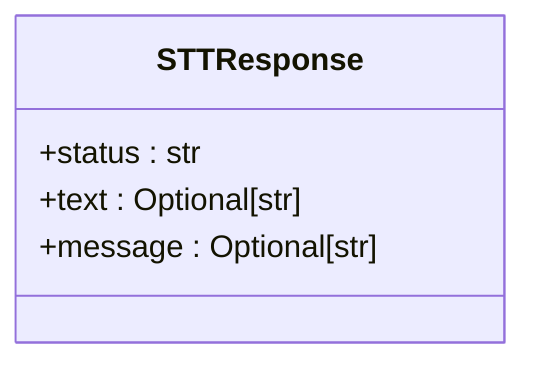

# ElevenLabs语音识别

<cite>
**本文档中引用的文件**   
- [serverV2.py](file://serverV2.py#L2413-L2490)
- [config.json](file://config.json#L42-L44)
- [serverV2.py](file://serverV2.py#L129-L132)
</cite>

## 目录
1. [简介](#简介)
2. [核心功能](#核心功能)
3. [接口详细说明](#接口详细说明)
4. [请求示例](#请求示例)
5. [响应模型](#响应模型)
6. [错误处理与故障排查](#错误处理与故障排查)

## 简介
`/api/stt_elevenlabs` 是一个后端API端点，用于将用户上传的音频文件发送至ElevenLabs的语音识别（Speech-to-Text, STT）服务进行转录。该接口作为外部AI服务集成的典型示例，实现了从文件上传、配置读取、请求转发到结果返回的完整流程。

**Section sources**
- [serverV2.py](file://serverV2.py#L2413-L2490)

## 核心功能
该接口的核心功能是作为本地应用与ElevenLabs云服务之间的代理。它接收前端上传的音频文件，从本地配置文件中获取认证密钥，构造并发送HTTP请求至ElevenLabs的STT API，并将识别出的文本结果以结构化JSON格式返回给前端。

**Section sources**
- [serverV2.py](file://serverV2.py#L2413-L2490)

## 接口详细说明
- **端点**: `/api/stt_elevenlabs`
- **方法**: `POST`
- **功能**: 将上传的音频文件转发至ElevenLabs的语音识别API进行转录。
- **流程**:
  1. 从 `config.json` 文件中读取 `elevenlabs.api_key`。
  2. 构造指向 `https://api.elevenlabs.io/v1/speech-to-text` 的POST请求。
  3. 将上传的音频文件作为 `multipart/form-data` 的一部分发送。
  4. 接收并解析ElevenLabs的响应。
  5. 将转录文本封装在 `STTResponse` 模型中返回。

**Section sources**
- [serverV2.py](file://serverV2.py#L2413-L2490)
- [config.json](file://config.json#L42-L44)

## 请求示例
### 使用curl命令
```bash
curl -X POST "http://localhost:8000/api/stt_elevenlabs" \
  -H "Content-Type: multipart/form-data" \
  -F "file=@/path/to/your/audio.wav" \
  -v
```

### 使用JavaScript fetch
```javascript
const formData = new FormData();
const fileInput = document.getElementById('audioFileInput'); // 假设有一个文件输入元素
formData.append('file', fileInput.files[0]);

fetch('http://localhost:8000/api/stt_elevenlabs', {
  method: 'POST',
  body: formData
})
.then(response => response.json())
.then(data => {
  console.log('识别结果:', data.text);
})
.catch(error => {
  console.error('请求失败:', error);
});
```

**Section sources**
- [serverV2.py](file://serverV2.py#L2413-L2490)

## 响应模型
该接口返回一个符合 `STTResponse` 模型的JSON对象。



**Diagram sources**
- [serverV2.py](file://serverV2.py#L129-L132)

**模型字段说明**:
- **status**: 字符串，表示请求状态。成功时为 `"success"`，失败时为 `"error"` 或其他描述性状态。
- **text**: 字符串（可选），包含从音频中识别出的文本内容。仅在识别成功时存在。
- **message**: 字符串（可选），包含错误信息或额外的状态说明。在失败时提供具体原因。

**Section sources**
- [serverV2.py](file://serverV2.py#L129-L132)

## 错误处理与故障排查
该接口可能因多种原因失败，其错误处理机制会尝试提供具体的错误信息：
- **API密钥无效**: 如果 `config.json` 中的 `elevenlabs.api_key` 为空或无效，ElevenLabs会返回401错误，后端会将其转换为 `"ElevenLabs API Key 无效或未提供。"` 的提示。
- **网络问题**: 无法连接到ElevenLabs服务器或请求超时（设置为120秒）会导致连接错误。
- **音频格式不支持**: ElevenLabs的API可能不支持上传的特定音频格式或编码。
- **服务器配置丢失**: 如果 `config.json` 文件不存在，会返回 `"服务器配置文件丢失。"` 的错误。
- **API返回无效响应**: 如果从ElevenLabs收到的响应缺少预期的 `text` 字段，会被视为内部错误。

**Section sources**
- [serverV2.py](file://serverV2.py#L2413-L2490)