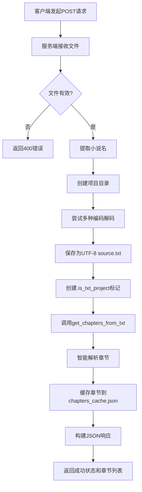

# 上传小说文本

<cite>
**Referenced Files in This Document**   
- [serverV2.py](file://serverV2.py)
</cite>

## 目录
1. [简介](#简介)
2. [API端点详情](#api端点详情)
3. [处理流程](#处理流程)
4. [请求示例](#请求示例)
5. [前置条件与错误处理](#前置条件与错误处理)
6. [调试建议](#调试建议)

## 简介
本文档详细说明了`/api/upload_txt_novel` API端点的使用方法。该接口是AI有声书工具的核心功能之一，用于接收用户上传的TXT格式小说文件，并在服务端进行处理，为后续的文本分析、角色识别和语音合成等步骤准备项目环境。

**Section sources**
- [serverV2.py](file://serverV2.py#L1543-L1607)

## API端点详情
`/api/upload_txt_novel` 是一个HTTP POST端点，专门用于处理TXT小说文件的上传。

- **URL**: `/api/upload_txt_novel`
- **方法**: `POST`
- **请求类型**: `multipart/form-data`
- **请求参数**:
  - `file` (类型: `file`): 必需的文件字段，应包含一个有效的TXT文本文件。

- **成功响应 (200 OK)**:
  - **内容类型**: `application/json`
  - **响应体**:
    ```json
    {
      "status": "success",
      "message": "小说 '{novel_name}' 已成功上传并统一转换为UTF-8。",
      "chapters": [
        {"id": 0, "title": "第一章 风起云涌"},
        {"id": 1, "title": "第二章 初入江湖"},
        // ... 更多章节
      ]
    }
    ```
  - **字段说明**:
    - `status`: 操作状态，成功时为 `"success"`。
    - `message`: 包含操作结果的描述性消息。
    - `chapters`: 一个包含解析出的章节标题和ID的数组，供前端展示。

- **错误响应**:
  - **400 Bad Request**: 通常由无效文件或服务器端验证失败引起。
  - **500 Internal Server Error**: 服务器在处理文件或写入磁盘时发生内部错误。

**Section sources**
- [serverV2.py](file://serverV2.py#L1543-L1607)

## 处理流程
当客户端调用此API时，服务器会执行以下一系列操作：

1.  **文件接收与命名**: 服务端接收上传的文件，并使用文件的原始文件名（不含`.txt`扩展名）作为小说的名称。
2.  **项目目录创建**: 在`projects/`目录下，以小说名称创建一个新的项目文件夹。
3.  **文件解码与编码转换**: 服务端尝试使用多种编码（如`utf-8-sig`, `utf-8`, `gb18030`）来解码上传的文件内容，以确保正确处理各种编码的TXT文件。最终，内容会被统一转换并保存为标准的UTF-8编码。
4.  **源文件保存**: 解码后的文本内容会被保存到项目目录下的`source.txt`文件中。
5.  **项目标记**: 创建一个名为`.is_txt_project`的空文件，作为该项目是通过TXT上传创建的标记。
6.  **章节智能解析**: 调用`get_chapters_from_txt`函数，通过复杂的正则表达式和启发式算法，从文本内容中智能地识别和分割出章节标题。
7.  **章节缓存**: 将解析出的章节列表以JSON格式缓存到项目目录下的`chapters_cache.json`文件中，以便快速加载。
8.  **响应返回**: 将解析出的章节信息和成功消息打包成JSON格式，返回给客户端。



**Diagram sources**
- [serverV2.py](file://serverV2.py#L1543-L1607)
- [serverV2.py](file://serverV2.py#L1234-L1373)

**Section sources**
- [serverV2.py](file://serverV2.py#L1543-L1607)
- [serverV2.py](file://serverV2.py#L1234-L1373)
- [serverV2.py](file://serverV2.py#L40)

## 请求示例
以下是调用此API的几种常用方式：

### 使用curl命令
```bash
curl -X POST \
  -F "file=@/path/to/你的小说.txt" \
  http://localhost:8000/api/upload_txt_novel
```

### 使用JavaScript fetch
```javascript
async function uploadNovel() {
  const fileInput = document.getElementById('fileInput');
  const file = fileInput.files[0];
  
  if (!file) {
    console.error('请选择一个文件');
    return;
  }

  const formData = new FormData();
  formData.append('file', file);

  try {
    const response = await fetch('http://localhost:8000/api/upload_txt_novel', {
      method: 'POST',
      body: formData
    });

    const result = await response.json();
    if (result.status === 'success') {
      console.log('上传成功:', result.message);
      console.log('章节列表:', result.chapters);
    } else {
      console.error('上传失败:', result.message);
    }
  } catch (error) {
    console.error('请求出错:', error);
  }
}

// 调用函数
uploadNovel();
```

**Section sources**
- [serverV2.py](file://serverV2.py#L1543-L1607)

## 前置条件与错误处理
为了确保API调用成功，请注意以下几点：

- **前置条件**:
  - 上传的文件必须是有效的纯文本文件（.txt）。
  - 文件名不能为空，且不应包含操作系统不允许的特殊字符。
  - 文件内容应为可读的文本，避免是二进制文件或损坏的文件。

- **可能的错误码**:
  - **400 Bad Request**: 表示请求无效。可能原因包括上传的文件为空、文件类型不正确，或请求格式不符合`multipart/form-data`。
  - **500 Internal Server Error**: 表示服务器内部处理失败。可能原因包括：
    - 无法将文件内容解码为任何支持的编码。
    - 服务器没有权限在`projects/`目录下创建文件夹或写入文件。
    - 在处理过程中发生了未预期的异常。

**Section sources**
- [serverV2.py](file://serverV2.py#L1543-L1607)

## 调试建议
如果API调用失败，可以按照以下步骤进行排查：

1.  **检查文件**: 确认上传的TXT文件是有效的，并且可以在文本编辑器中正常打开。
2.  **检查目录权限**: 确保运行`serverV2.py`的用户对`projects/`目录具有读、写和执行权限。可以使用`chmod`或`chown`命令修改权限。
3.  **查看日志**: 服务器端的日志（通常在控制台输出）会提供详细的错误信息。例如，`logger.error`语句会记录具体的异常堆栈，这对于定位`500`错误非常有帮助。
4.  **验证端点**: 使用`curl`命令或Postman等工具直接测试端点，排除前端代码可能引入的问题。

**Section sources**
- [serverV2.py](file://serverV2.py#L1543-L1607)