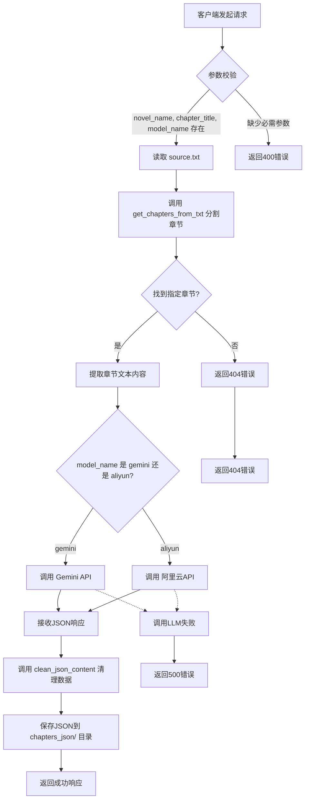

# 处理单个章节

<cite>
**Referenced Files in This Document**   
- [serverV2.py](file://serverV2.py)
- [config.json](file://config.json)
</cite>

## 目录
1. [简介](#简介)
2. [API端点详情](#api端点详情)
3. [请求模型](#请求模型)
4. [处理流程](#处理流程)
5. [成功与错误响应](#成功与错误响应)
6. [调用示例](#调用示例)
7. [调试建议](#调试建议)

## 简介
本API文档详细说明了`/api/process_single_chapter`端点的功能和使用方法。该端点是AI有声书工具的核心功能之一，负责将小说的原始文本章节智能地转换为结构化的JSON对话数据。它利用大型语言模型（LLM）进行智能分割、角色识别和语气分析，为后续的语音合成（TTS）提供精确的指令。

**Section sources**
- [serverV2.py](file://serverV2.py#L1081-L1229)

## API端点详情
- **路径**: `/api/process_single_chapter`
- **方法**: `POST`
- **功能**: 处理指定小说的单个章节，将其从原始TXT文本转换为结构化的JSON格式，并保存结果。

**Section sources**
- [serverV2.py](file://serverV2.py#L1081-L1229)

## 请求模型
该API接收一个名为`ProcessSingleChapterRequest`的JSON对象作为请求体。

```json
{
  "novel_name": "string",
  "chapter_title": "string",
  "model_name": "string",
  "force_regenerate": "boolean"
}
```

**字段说明**:

| 字段名 | 类型 | 是否必需 | 描述 |
| :--- | :--- | :--- | :--- |
| `novel_name` | 字符串 | 是 | 小说项目的名称，对应`projects/`目录下的子文件夹名。 |
| `chapter_title` | 字符串 | 是 | 要处理的章节标题，必须与`source.txt`文件中的章节标题完全匹配。 |
| `model_name` | 字符串 | 是 | 指定用于处理的大型语言模型。目前支持 `"gemini"` 或 `"aliyun"`。 |
| `force_regenerate` | 布尔值 | 否 | 默认为`false`。如果设置为`true`，则会删除该章节已生成的音频文件和JSON文件，强制重新生成。 |

**Section sources**
- [serverV2.py](file://serverV2.py#L107-L112)

## 处理流程
当调用`/api/process_single_chapter`端点时，后端会执行以下核心流程：

1.  **读取原始文本**: 根据`novel_name`定位到`projects/{novel_name}/source.txt`文件，并读取其内容。
2.  **提取章节内容**: 使用`get_chapters_from_txt`函数智能地将`source.txt`文件分割成多个章节，并根据`chapter_title`参数提取出指定章节的完整文本内容。
3.  **调用大模型 (LLM)**: 根据`model_name`参数，从`config.json`中读取对应的API密钥和配置，然后调用Gemini或阿里云（通义千问）的大模型API。
4.  **智能处理**: 大模型会根据预设的提示词（Prompt）对章节文本进行处理，执行以下任务：
    *   **分割**: 将长段落和长对话分割成适合语音合成的短句。
    *   **角色识别**: 判断每句话的说话者是“旁白”还是某个具体角色。
    *   **语气分析**: 为每句话生成语气（如“愤怒”、“开心”）和强度（1-10）。
5.  **生成JSON**: 大模型返回一个符合特定格式的JSON数组，每个数组元素代表一句话，包含`speaker`、`content`、`tone`、`intensity`和`delay`等字段。
6.  **清理与保存**: 对生成的JSON数据进行清理（移除无效条目），然后将其保存到`projects/{novel_name}/chapters_json/`目录下，文件名为`{安全化后的章节标题}.json`。

**Diagram sources**
- [serverV2.py](file://serverV2.py#L1081-L1229)
- [serverV2.py](file://serverV2.py#L560-L591)
- [serverV2.py](file://serverV2.py#L1234-L1373)



## 成功与错误响应
### 成功响应
当处理成功时，API返回一个HTTP 200状态码和以下JSON响应体：
```json
{
  "status": "success",
  "message": "章节 '{title}' 处理成功。"
}
```

### 错误响应
API在以下情况下会返回错误：

| HTTP状态码 | 响应体示例 | 触发条件 |
| :--- | :--- | :--- |
| `400 Bad Request` | `{"detail": "处理章节需要提供 model_name。"}` | 请求中缺少必需的`model_name`参数。 |
| `404 Not Found` | `{"detail": "Chapter '第一章' not found."}` | 在`source.txt`文件中找不到与`chapter_title`匹配的章节。 |
| `500 Internal Server Error` | `{"detail": "Failed to process chapter '第一章': ..."}` | 处理过程中发生内部错误，例如读取文件失败或调用大模型API失败。 |

**Section sources**
- [serverV2.py](file://serverV2.py#L1081-L1229)

## 调用示例
以下是使用`curl`和JavaScript `fetch`调用此API的示例。

### curl 命令示例
```bash
curl -X POST http://127.0.0.1:8000/api/process_single_chapter \
  -H "Content-Type: application/json" \
  -d '{
    "novel_name": "我的修仙日记",
    "chapter_title": "第一章 初入仙门",
    "model_name": "gemini",
    "force_regenerate": false
  }'
```

### JavaScript fetch 调用示例
```javascript
const requestData = {
  novel_name: "我的修仙日记",
  chapter_title: "第一章 初入仙门",
  model_name: "gemini",
  force_regenerate: false
};

fetch('http://127.0.0.1:8000/api/process_single_chapter', {
  method: 'POST',
  headers: {
    'Content-Type': 'application/json',
  },
  body: JSON.stringify(requestData)
})
.then(response => response.json())
.then(data => {
  console.log('Success:', data);
})
.catch((error) => {
  console.error('Error:', error);
});
```

**Section sources**
- [serverV2.py](file://serverV2.py#L1081-L1229)

## 调试建议
如果API调用失败，请检查以下几点：

1.  **检查`config.json`**: 确保`config.json`文件中的`models.gemini.api_key`或`models.aliyun.api_key`字段已正确填写。如果使用代理，还需检查`general.proxy`的配置。
2.  **检查网络连接**: 确保服务器可以访问Gemini或阿里云的API端点。如果使用代理，请确认代理服务正在运行。
3.  **检查文件路径**: 确认`projects/{novel_name}/source.txt`文件存在，并且`chapter_title`与文件中的章节标题完全一致。
4.  **查看日志**: 服务器的日志（通常在控制台输出）会提供详细的错误信息，帮助定位问题。

**Section sources**
- [config.json](file://config.json#L1-L45)
- [serverV2.py](file://serverV2.py#L195-L244)