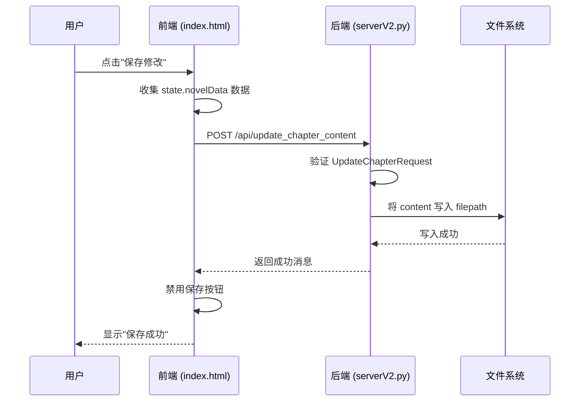

# 内容编辑器

<cite>
**本文档引用的文件**   
- [index.html](file://index.html)
- [style.css](file://style.css)
- [serverV2.py](file://serverV2.py)
</cite>

## 目录
1. [介绍](#介绍)
2. [表格化UI实现](#表格化ui实现)
3. [行内编辑功能](#行内编辑功能)
4. [插入/删除行控件](#插入删除行控件)
5. [保存修改按钮](#保存修改按钮)
6. [数据渲染与事件绑定](#数据渲染与事件绑定)
7. [样式与用户体验](#样式与用户体验)
8. [保存章节数据](#保存章节数据)
9. [性能优化建议](#性能优化建议)
10. [并发编辑冲突处理](#并发编辑冲突处理)

## 介绍
内容编辑器是AI语音工作室Pro的核心功能模块，允许用户对已处理的小说章节进行精细化编辑。该编辑器以表格形式展示章节内容，支持对说话人、音色、内容等字段进行修改，并提供生成、播放音频等交互功能。本文档将系统化地阐述其UI实现、交互逻辑、数据流及性能优化策略。

## 表格化UI实现
内容编辑器的核心UI是一个可编辑的HTML表格，其结构在`index.html`中定义。该表格通过`renderContentTable`函数动态生成，其列结构设计如下：

*   **操作 (操作)**: 位于表格最左侧，包含“删除行”和“插入行”两个按钮，用于管理表格行。
*   **序号 (#)**: 显示行的序号，从1开始递增，为用户提供清晰的定位。
*   **说话人 (角色)**: 显示该行内容的说话者，如“旁白”或具体角色名。此字段为只读，不可编辑。
*   **音色 (音色)**: 一个下拉选择框，允许用户为当前行指定音色。其选项来源于音色库和角色音色配置。
*   **内容 (内容)**: 一个可编辑的单元格，用户可以直接在此输入或修改对话文本。
*   **TTS模型 (TTS模型)**: 一个下拉选择框，用于选择生成该行音频所使用的TTS模型。
*   **操作 (操作)**: 位于表格最右侧，包含“生成音频”、“播放”按钮以及“特效”和“模式”等高级控制。

**Section sources**
- [index.html](file://index.html#L500-L513)

## 行内编辑功能
表格的“内容”列单元格通过设置`contenteditable="true"`属性实现行内编辑。当用户点击单元格时，可以像编辑普通文本一样修改内容。

编辑功能的实现依赖于事件监听器：
1.  **`blur`事件**: 当用户编辑完内容并点击其他地方（失去焦点）时，触发`blur`事件。此时，JavaScript会获取单元格的最新文本内容，并将其更新到内存中的数据模型`state.novelData`中。
2.  **`markChapterAsDirty`函数**: 每次内容更新后，都会调用此函数。该函数会启用“保存修改”按钮，并在状态栏提示用户“内容已修改，请记得保存”，确保用户的修改不会被意外丢失。

**Section sources**
- [index.html](file://index.html#L3827-L3838)

## 插入/删除行控件
表格提供了两种方式来管理行数：

*   **删除行**: 每行左侧的“X”按钮。点击后会弹出确认对话框，确认后将从`state.novelData`数组中移除对应的数据项，并重新渲染表格。
*   **插入行**: 每行左侧的“+”按钮。点击后会在当前行的下方插入一条新的空白行，其默认说话人为“旁白”。此外，还有一个“添加新行到首行”按钮，位于编辑器底部，用于在表格开头插入新行。

这些控件的交互逻辑通过`contentTableBody`元素上的`click`事件监听器实现，通过`event.target.matches()`来判断用户点击的是哪个按钮。

**Section sources**
- [index.html](file://index.html#L3807-L3814)
- [index.html](file://index.html#L3819-L3824)

## 保存修改按钮
“保存对本章节的修改”按钮位于编辑器底部，初始状态为禁用。当用户对表格内容进行任何修改（包括内容编辑、音色选择、插入/删除行等）时，`markChapterAsDirty`函数会被调用，从而启用此按钮。

点击该按钮后，会触发`saveChapterBtn`的`click`事件监听器，执行`saveChapterBtn.addEventListener`中定义的异步函数。该函数负责收集当前表格的所有数据，并通过API请求将修改保存到服务器。

**Section sources**
- [index.html](file://index.html#L522)
- [index.html](file://index.html#L3841-L3857)

## 数据渲染与事件绑定
`renderContentTable`函数是整个内容编辑器的核心，负责将JSON数据渲染为HTML表格并绑定所有交互事件。

1.  **数据来源**: 函数从`state.novelData`数组中获取章节的JSON数据。该数据通过`loadSingleChapterForEditing`函数从服务器API `/api/get_novel_content`获取。
2.  **表格生成**: 函数遍历`state.novelData`数组，为每一项数据生成一个`<tr>`行。在生成过程中，会根据数据动态填充“说话人”和“内容”列，并为“音色”和“TTS模型”列生成相应的`<select>`下拉框。
3.  **事件绑定**: 事件绑定并非在`renderContentTable`函数中直接完成，而是采用**事件委托**的方式。通过为`contentTableBody`元素绑定`click`、`change`和`input`等事件监听器，利用`event.target`来判断具体是哪个子元素被操作，从而执行相应的逻辑。这种方式性能更高，且能自动处理动态添加的行。

**Section sources**
- [index.html](file://index.html#L1857-L1970)
- [index.html](file://index.html#L3211-L3284)

## 样式与用户体验
`style.css`文件中的CSS类为内容编辑器提供了布局和用户体验优化。

*   **`.content-table`**: 定义了表格的整体样式，包括边框、字体和宽度分配。
*   **`.editable-cell`**: 此类在代码中未直接使用，但其设计理念体现在`content-cell`类上。`content-cell`通过`contenteditable="true"`实现可编辑性，并通过`padding`和`border-bottom`优化了视觉体验。
*   **`.action-btn`**: 该类在代码中未直接定义，但类似功能由`.btn`类实现。`.btn`类为所有按钮提供了统一的样式，包括内边距、边框、圆角和悬停效果。在`index.html`的`<style>`标签中，还通过`.content-table .actions-cell .btn`等选择器进一步优化了表格内按钮的尺寸和样式，使其更紧凑。

用户体验优化还包括：
*   **焦点管理**: 当用户在“内容”单元格中编辑时，系统通过`blur`事件精确地捕获编辑结束的时机。
*   **输入验证**: 在删除行或保存章节时，会弹出确认对话框，防止用户误操作。

**Section sources**
- [style.css](file://style.css#L1-L190)
- [index.html](file://index.html#L73-L84)

## 保存章节数据
当用户点击“保存对本章节的修改”按钮时，会执行以下流程：

1.  **数据收集**: 前端JavaScript从`state.novelData`数组中收集所有已编辑的数据。
2.  **API调用**: 通过`fetch`函数向后端API `/api/update_chapter_content`发送一个POST请求。
3.  **请求体**: 请求体是一个JSON对象，包含两个字段：
    *   `filepath`: 要保存的章节文件的路径。
    *   `content`: 包含所有行数据的数组，即`state.novelData`。
4.  **后端处理**: 在`serverV2.py`中，`UpdateChapterRequest`模型定义了该API的请求格式。后端接收到请求后，会将`content`数组写入`filepath`指定的JSON文件中，从而持久化用户的修改。

**Diagram sources **
- [index.html](file://index.html#L3841-L3857)
- [serverV2.py](file://serverV2.py#L90-L93)

## 性能优化建议
对于包含大量对话行的大型章节，当前的实现可能会导致页面卡顿。以下是性能优化建议：

*   **虚拟滚动 (Virtual Scrolling)**: 不渲染所有行，而是只渲染当前视口内可见的行。当用户滚动时，动态更新渲染的行。这可以极大地减少DOM节点数量，提升滚动流畅度。
*   **分页 (Pagination)**: 将长章节的表格内容分页显示，例如每页显示50行。这可以降低单页的复杂度，但会牺牲全局浏览的便利性。
*   **防抖 (Debouncing)**: 对于“内容”单元格的`input`事件，可以添加防抖机制，避免在用户快速输入时频繁触发状态更新。

## 并发编辑冲突的处理策略
当前系统未实现多用户并发编辑的场景，但若未来需要，可采用以下策略：

*   **乐观锁 (Optimistic Locking)**: 在章节JSON文件中增加一个版本号（`version`）字段。用户加载章节时，同时获取当前版本号。保存时，将版本号一同提交。后端在保存前检查文件的当前版本号是否与提交的版本号一致。如果一致，则保存成功并递增版本号；如果不一致，说明文件已被他人修改，返回冲突错误，提示用户刷新页面后重试。
*   **悲观锁 (Pessimistic Locking)**: 当用户开始编辑一个章节时，服务器锁定该文件，阻止其他用户同时编辑。编辑完成后释放锁。此方法简单但会降低协作效率。