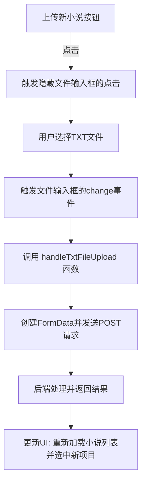
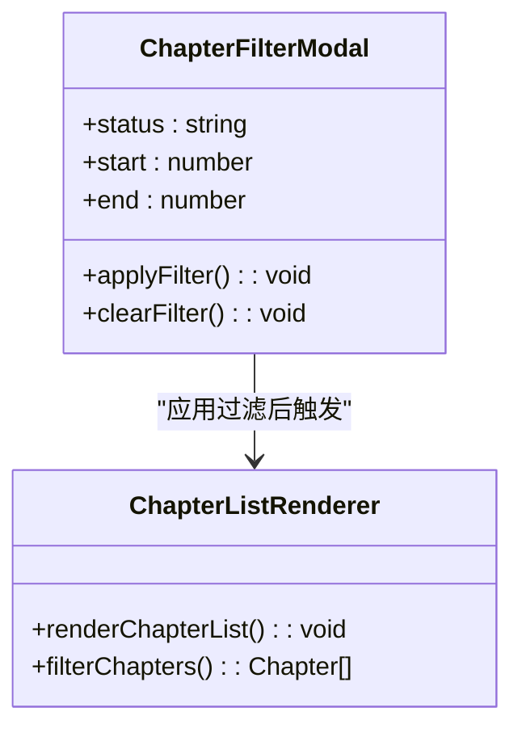
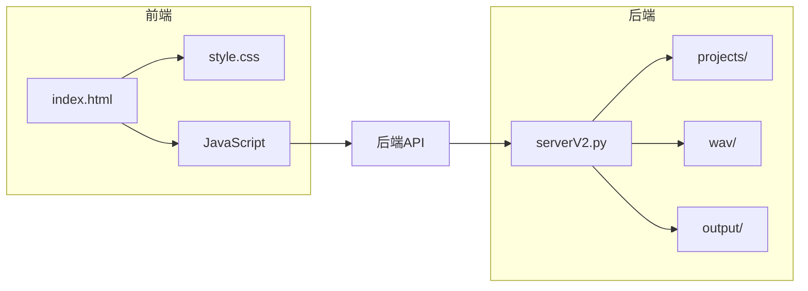

# 小说管理与处理面板

<cite>
**本文档引用的文件**   
- [index.html](file://index.html)
- [style.css](file://style.css)
</cite>

## 目录
1. [介绍](#介绍)
2. [项目结构](#项目结构)
3. [核心组件](#核心组件)
4. [架构概述](#架构概述)
5. [详细组件分析](#详细组件分析)
6. [依赖分析](#依赖分析)
7. [性能考虑](#性能考虑)
8. [故障排除指南](#故障排除指南)
9. [结论](#结论)
10. [附录](#附录) (如有必要)

## 介绍
本项目是一个名为“AI 语音工作室 Pro”的一体化工作台，旨在帮助用户将小说文本转换为有声书。其核心功能之一是“小说管理与处理面板”，该面板提供了一个直观的用户界面，用于上传小说、管理章节、配置角色音色，并最终生成和导出音频文件。本文档将详细阐述该面板的UI设计与实现，重点关注其布局结构、交互逻辑、动态渲染机制以及样式表现。

## 项目结构
项目由一个简单的前端文件结构组成，包含一个主HTML文件、一个CSS样式表、一个Python后端脚本和一个配置文件。前端通过`index.html`构建用户界面，`style.css`定义视觉样式，而`serverV2.py`作为FastAPI后端提供所有数据处理和API服务。`config.json`存储全局配置，如AI模型的API密钥。

**Section sources**
- [index.html](file://index.html#L1-L4203)
- [style.css](file://style.css#L1-L190)

## 核心组件

“小说管理与处理面板”是`index.html`中的第一个内容列（Column 1），其核心功能围绕小说的上传、选择、章节处理和过滤。该面板通过JavaScript与后端API交互，实现动态的数据加载和状态更新。

**Section sources**
- [index.html](file://index.html#L402-L449)

## 架构概述

该面板的架构遵循典型的单页应用（SPA）模式，由HTML定义静态结构，CSS控制视觉呈现，JavaScript处理所有动态逻辑和用户交互。其核心数据流始于用户上传或选择小说，随后通过AJAX请求从后端获取小说的章节列表和处理状态，并动态渲染到DOM中。

```mermaid
graph TD
A[用户操作] --> B{上传或选择小说}
B --> C[JavaScript: handleNovelSelection]
C --> D[调用 fetchFromServer('/api/list_novels')]
D --> E[后端: serverV2.py]
E --> F[读取 projects/ 目录下的数据]
F --> G[返回JSON数据]
G --> H[JavaScript: renderChapterList]
H --> I[动态更新DOM中的章节列表]
I --> J[用户选择章节]
J --> K[触发其他面板的更新]
```

**Diagram sources **
- [index.html](file://index.html#L806-L4155)
- [serverV2.py](file://serverV2.py#L47-L800)

## 详细组件分析

### 上传区域分析
上传区域是用户与系统交互的入口，包含一个模型选择下拉框、一个“上传新小说”按钮和一个隐藏的文件输入框。其布局采用Flexbox，确保了在不同屏幕尺寸下的良好适应性。

#### 布局与交互逻辑
该区域的HTML结构使用`<div style="display: flex; gap: 1rem;">`将模型选择和上传按钮并排排列。模型选择使用`<select>`元素，其选项由JavaScript在初始化时从全局配置中动态填充。上传按钮通过`<button>`元素实现，其`click`事件被监听，用于触发隐藏的`<input type="file">`的`click`事件，从而打开文件选择对话框。



**Diagram sources **
- [index.html](file://index.html#L405-L419)
- [index.html](file://index.html#L806-L4155)

### 小说列表与章节过滤分析
小说列表展示区是一个可滚动的容器，动态显示当前选中小说的所有章节。它支持多选、全选/反选以及基于状态和范围的过滤。

#### 动态渲染与状态管理
章节列表的渲染由`renderChapterList`函数负责。该函数首先从`state.allNovelsData`中获取当前小说的章节数据，然后根据`state.filter`对象中的过滤条件（如“已处理”、“未处理”或章节范围）对数据进行筛选。最终，它遍历筛选后的数据，为每个章节创建一个带有复选框的`<li>`元素，并将其插入到`#chapter-list`的DOM中。章节的处理状态（processed）和拼接状态（spliced）通过CSS类（如`.processed`和`.spliced`）来体现，这些类会改变列表项的文本颜色和添加特定图标。

**Section sources**
- [index.html](file://index.html#L429-L448)
- [index.html](file://index.html#L1309-L1397)

### 章节处理控件分析
该控件包含“全选”、“全不选”和“过滤”按钮，为用户提供批量操作和筛选的便捷方式。

#### 交互逻辑
“全选”和“全不选”按钮的`click`事件监听器会直接操作DOM，将所有章节复选框的状态设置为`checked`或`false`，然后调用`updateGlobalButtons`和`handleChapterSelectionChange`来更新全局按钮状态和触发其他面板的响应。过滤功能通过一个模态框（Modal）实现，用户可以在其中选择过滤条件，点击“应用过滤”后，这些条件会被存储在`state.filter`中，并再次调用`renderChapterList`来刷新列表。



**Diagram sources **
- [index.html](file://index.html#L432-L439)
- [index.html](file://index.html#L674-L705)

## 依赖分析

该面板的正常运行依赖于多个前端和后端组件的协同工作。



**Diagram sources **
- [index.html](file://index.html#L1-L4203)
- [style.css](file://style.css#L1-L190)
- [serverV2.py](file://serverV2.py#L1-L2526)

**Section sources**
- [index.html](file://index.html#L1-L4203)
- [style.css](file://style.css#L1-L190)
- [serverV2.py](file://serverV2.py#L1-L2526)

## 性能考虑

该面板在性能方面主要考虑了以下几点：
1.  **防抖与节流**：虽然代码中未显式实现，但频繁的API调用（如实时搜索）应考虑添加防抖机制。
2.  **内存管理**：在音频播放功能中，使用`URL.revokeObjectURL()`及时释放Blob URL，防止内存泄漏。
3.  **长任务处理**：对于长时间运行的任务（如批量生成音频），实现了“屏幕唤醒锁”（Screen Wake Lock API），防止浏览器自动休眠中断任务。

## 故障排除指南

### 文件上传失败的UI反馈
当文件上传失败时，`handleTxtFileUpload`函数会捕获错误，并通过`setStatus`函数将全局状态栏（`#global-status`）的文本更新为错误信息，并将其颜色设置为红色（`error`类型）。

**Section sources**
- [index.html](file://index.html#L1263-L1307)

### 处理中按钮的禁用状态管理
在执行长时间任务（如处理文本或生成声音）时，相关按钮（如`processTxtBtn`和`processAllBtn`）会被禁用。这通过在任务开始时设置`button.disabled = true`，并在`finally`块中恢复其状态来实现。同时，按钮的文本会变为“停止处理”或“正在停止...”，以提供清晰的用户反馈。

**Section sources**
- [index.html](file://index.html#L1399-L1508)
- [index.html](file://index.html#L2079-L2227)

### 响应式布局适配
该面板通过CSS Grid和Flexbox实现了响应式布局。主容器`.main-container.spa-layout`使用`grid-template-columns: 0.8fr 0.8fr 0.8fr 1.8fr;`来分配四列的宽度。同时，`<meta name="viewport" content="width=device-width, initial-scale=1.0">`确保了页面在移动设备上能正确缩放。内部的Flexbox布局（如上传区域）也确保了子元素在不同屏幕尺寸下能合理排列。

**Section sources**
- [index.html](file://index.html#L10-L11)
- [style.css](file://style.css#L34-L35)

## 结论

“小说管理与处理面板”是一个功能完整、设计合理的用户界面模块。它通过清晰的布局、直观的交互和动态的渲染，为用户提供了一个高效管理小说项目的工作环境。其核心在于JavaScript与后端API的紧密协作，实现了数据的实时加载和状态同步。通过`style.css`中的`.panel`、`.file-upload`等类，确保了视觉上的一致性和美观性。该面板的成功实现为整个“AI 语音工作室 Pro”应用奠定了坚实的基础。