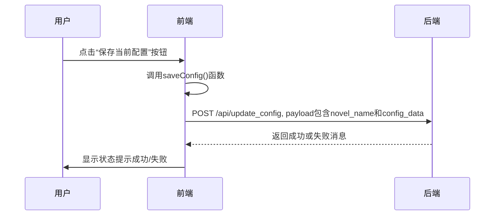

# 角色-音色配置区

<cite>
**本文档引用文件**  
- [index.html](file://index.html)
- [style.css](file://style.css)
</cite>

## 目录
1. [角色-音色配置区概述](#角色-音色配置区概述)  
2. [角色列表表格布局](#角色列表表格布局)  
3. [音色选择与临时覆盖](#音色选择与临时覆盖)  
4. [保存配置按钮](#保存配置按钮)  
5. [角色简介模态框](#角色简介模态框)  
6. [音色配置的动态加载](#音色配置的动态加载)  
7. [核心样式类设计](#核心样式类设计)  
8. [配置初始化与保存](#配置初始化与保存)  
9. [性能优化与错误处理](#性能优化与错误处理)

## 角色-音色配置区概述

角色-音色配置区是AI语音工作室Pro的核心功能模块之一，位于界面的第二列。该区域允许用户为小说中的各个角色分配特定的音色，从而实现个性化的语音合成。其主要功能包括：展示角色列表、提供音色选择下拉菜单、支持临时音色覆盖以及保存最终配置。该区域的UI设计注重直观性和操作效率，通过颜色编码、按钮反馈和模态框提示等方式提升用户体验。

**Section sources**  
- [index.html](file://index.html#L452-L466)

## 角色列表表格布局

角色列表采用`<ul>`元素结合`info-list`类实现，形成一个可滚动的列表容器。每个角色以`<li>`项呈现，内部结构清晰，包含角色名称、当前音色显示和操作按钮。列表项通过`selectable`类实现点击选中效果，并使用`selected`类高亮当前选中项。未分配音色的角色会通过左侧红色边框进行视觉警示，提升配置完整性。

列表项的布局采用Flexbox，左侧为角色名称和简介按钮，右侧为音色信息和播放按钮。这种布局确保了信息的清晰分组和操作的便捷性。此外，系统会根据音色的共享情况，为角色列表项应用不同的背景色（如`.timbre-color-1`），以直观地展示多个角色共用同一音色的情况。

**Section sources**  
- [index.html](file://index.html#L1574-L1596)  
- [style.css](file://style.css#L71-L84)

## 音色选择与临时覆盖

在角色-音色配置区，音色的选择主要通过“音色库”列（第三列）完成。用户可以在音色库中浏览所有可用音色，并通过点击“分配”按钮将音色分配给当前选中的角色。音色库支持按分类筛选，方便用户管理大量音色。

虽然当前UI中未直接提供“临时音色覆盖”的开关，但其功能逻辑已集成在音色分配流程中。当用户为角色分配新音色时，该操作会立即更新`state.characterMapping`对象，并实时反映在角色列表和内容编辑器中。这种即时更新机制等效于一种临时覆盖，用户可以在不保存的情况下反复调整，直到满意后再进行最终保存。

**Section sources**  
- [index.html](file://index.html#L2541-L2584)  
- [index.html](file://index.html#L2429-L2456)

## 保存配置按钮

“保存当前配置”按钮（`#saveConfigBtn`）位于角色-音色配置区的底部，是将用户配置持久化到服务器的关键入口。该按钮初始状态为禁用，只有在用户成功加载小说项目后才会被激活。

当用户点击此按钮时，会触发`saveConfig()`函数。该函数将当前的`state.characterMapping`对象（包含所有角色到音色的映射）通过POST请求发送到`/api/update_config`后端接口。操作成功后，系统会显示“保存成功”的状态提示；若失败，则会弹出错误信息。此设计确保了用户操作的可追溯性和数据的安全性。



**Diagram sources**  
- [index.html](file://index.html#L1655-L1677)

**Section sources**  
- [index.html](file://index.html#L462-L465)  
- [index.html](file://index.html#L1655-L1677)

## 角色简介模态框

角色简介模态框（`characterProfileModal`）是一个用于展示角色详细信息的弹出式窗口。其显示机制由JavaScript控制，当用户点击角色列表中的“i”按钮时触发。

模态框的显示流程如下：
1.  点击事件被监听，获取目标角色名称。
2.  通过`fetchFromServer`函数从后端获取该角色的详细信息（如性别、年龄等）。
3.  将获取到的数据动态填充到`#profileModalBody`的HTML中，通常以`<dl>`（定义列表）的形式展示。
4.  将`#profileModal`的CSS `display`属性设置为`flex`，使其从隐藏状态变为可见。

数据绑定是动态的，每次打开模态框都会重新请求最新数据，确保信息的实时性。模态框的关闭通过点击“关闭”按钮实现，该按钮会将`display`属性重新设为`none`。

**Section sources**  
- [index.html](file://index.html#L560-L565)  
- [index.html](file://index.html#L40-L77)

## 音色配置的动态加载

音色配置的动态加载是通过`loadAndApplyConfig`函数实现的。该函数在用户选择小说项目后被调用，其核心逻辑是：

1.  **构建请求URL**：根据当前小说名称（`state.novelName`）构造一个用于获取配置的API端点。
2.  **发起网络请求**：使用`fetchFromServer`函数向后端发起GET请求。
3.  **处理响应**：如果请求成功，将返回的JSON数据（一个角色到音色的映射字典）赋值给`state.characterMapping`全局状态对象。如果请求失败（例如配置文件不存在），则将`state.characterMapping`初始化为空对象，并给出用户提示。
4.  **更新UI**：调用`loadCharacters()`函数，该函数会根据`state.characterMapping`中的数据重新渲染角色列表，从而将配置应用到UI上。

此过程确保了用户每次打开一个小说项目时，都能加载其上次保存的音色配置，实现了配置的持久化。

**Section sources**  
- [index.html](file://index.html#L1655-L1677)

## 核心样式类设计

`style.css`文件中定义了多个关键样式类，它们共同构建了角色-音色配置区的视觉层次和交互体验。

-   **`.character-table`**: 虽然角色列表本身是`<ul>`而非`<table>`，但其设计原则与表格类似。`.info-list`类提供了基础的列表样式，包括分隔线、内边距和悬停效果，模拟了表格的行与列。
-   **`.timbre-select`**: 在当前代码中，音色选择是通过按钮而非下拉菜单实现的。相关的样式主要由`.btn-assign`类控制，它定义了“分配”按钮的尺寸、内边距和字体大小，确保其在列表项中大小适中且易于点击。
-   **`.modal`**: 模态框的样式由`.modal-overlay`和`.modal-content`两个类共同定义。`.modal-overlay`创建了一个半透明的黑色遮罩层，将用户的注意力集中在模态框上。`.modal-content`则定义了模态框本身的外观，包括白色背景、圆角边框、阴影和合适的内边距，使其在视觉上突出且美观。

这些样式类遵循了模块化和可复用的设计原则，例如`--primary-color`等CSS变量的使用，使得整个应用的主题风格保持一致。

**Section sources**  
- [style.css](file://style.css#L71-L84)  
- [style.css](file://style.css#L38-L47)  
- [style.css](file://style.css#L40-L47)

## 配置初始化与保存

`loadAndApplyConfig`和`saveConfig`是管理音色配置生命周期的两个核心函数。

`loadAndApplyConfig`函数的实现如前所述，负责从服务器获取配置并初始化UI状态。它通过异步请求处理网络延迟，并通过`try-catch`块优雅地处理可能的错误（如文件不存在），为用户提供清晰的反馈。

`saveConfig`函数则负责将用户的修改持久化。它将`state.characterMapping`作为`config_data`，连同`novel_name`一起打包成JSON payload，通过POST请求发送。该函数同样包含错误处理，确保在保存失败时不会丢失用户数据，并能及时通知用户。

```mermaid
flowchart TD
A[开始] --> B{用户点击保存}
B --> C[调用 saveConfig()]
C --> D[准备 payload: {novel_name, config_data}]
D --> E[发送 POST /api/update_config]
E --> F{请求成功?}
F --> |是| G[显示“保存成功”]
F --> |否| H[显示“保存失败”]
G --> I[结束]
H --> I
```

**Diagram sources**  
- [index.html](file://index.html#L1655-L1677)

**Section sources**  
- [index.html](file://index.html#L1655-L1677)

## 性能优化与错误处理

对于多角色并发配置的UI性能，当前设计已进行优化。角色列表的渲染是批量进行的，通过`innerHTML`一次性插入所有`<li>`元素，避免了频繁的DOM操作。此外，列表的滚动容器（`scrollable-content`）被正确设置，确保了在角色数量较多时的流畅滚动。

在错误处理方面，系统对音色文件缺失有明确的用户提示机制。当`loadTimbreDetails`函数尝试加载音色的音频和文本文件时，会检查`fetch`请求的`ok`状态。如果任一文件不存在（HTTP状态码非200），函数会抛出一个包含音色名称的错误，并通过`setStatus`函数在全局状态栏显示“加载音色'XXX'详情失败”的错误信息，帮助用户快速定位问题。

**Section sources**  
- [index.html](file://index.html#L2026-L2039)  
- [index.html](file://index.html#L2368-L2409)