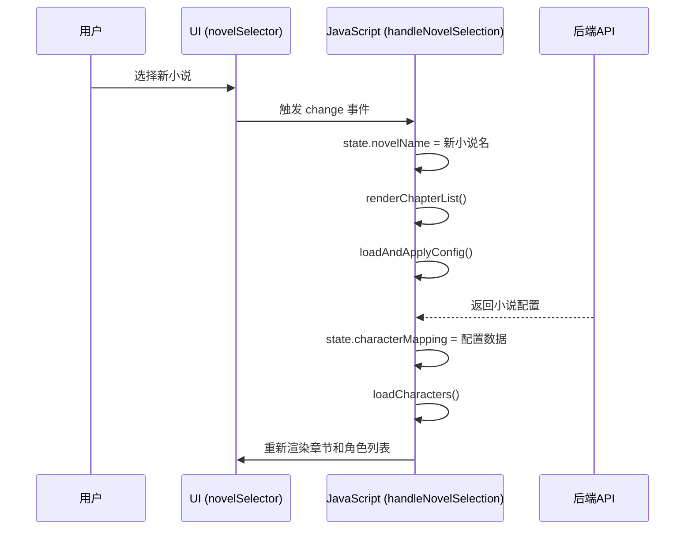

# 状态管理

<cite>
**本文档引用的文件**   
- [index.html](file://index.html)
</cite>

## 目录
1. [引言](#引言)
2. [全局状态对象设计](#全局状态对象设计)
3. [状态变更与UI更新机制](#状态变更与ui更新机制)
4. [状态管理最佳实践](#状态管理最佳实践)
5. [核心功能代码示例](#核心功能代码示例)

## 引言
本项目是一个AI有声书制作工具，其前端应用通过一个全局的JavaScript `state` 对象来集中管理应用的核心状态。该状态管理机制是整个应用数据流和用户交互的基础，确保了不同组件之间的数据一致性与响应性。本文档将深入分析该状态管理机制的设计、作用、变更驱动UI更新的流程以及相关的最佳实践。

## 全局状态对象设计
前端应用通过一个名为 `state` 的全局JavaScript对象来存储和管理应用的核心状态。该对象在DOM内容加载完成后被初始化，并贯穿整个应用的生命周期。

### 核心状态属性
`state` 对象包含了应用运行所需的关键数据，其主要属性如下：

- **`novelName`**: 存储当前选中的小说项目名称。
- **`allNovelsData`**: 一个对象，存储从后端获取的所有小说项目的详细信息，包括章节列表、处理状态等。
- **`characterMapping`**: 一个映射对象，用于存储角色到音色的配置关系，即 `{ "角色名": "音色名" }`。
- **`selectedChapterPaths`**: 一个数组，存储当前在章节列表中被选中的章节文件路径。
- **`selectedLLM`**: 存储当前选中的用于文本处理的AI大模型。
- **`globalConfig`**: 存储从后端获取的全局配置，包括模型设置、代理配置、音频导出格式等。
- **`replaceDict`**: 存储当前小说项目的专属替换词典规则。

**Section sources**
- [index.html](file://index.html#L809-L831)

## 状态变更与UI更新机制
应用的状态管理遵循“状态驱动视图”的原则。当 `state` 对象中的数据发生变化时，会触发一系列函数来重新渲染UI，确保用户界面始终与当前状态保持同步。

### 小说选择驱动的UI更新
当用户在下拉菜单中选择不同的小说时，会触发 `handleNovelSelection` 函数。该函数是状态变更驱动UI更新的核心流程。

1.  **更新状态**: 函数首先将 `state.novelName` 更新为用户选择的小说名称。
2.  **重置UI**: 清空章节列表、角色列表等区域的显示内容。
3.  **重新渲染**: 调用 `renderChapterList()` 函数，该函数会根据 `state.novelName` 从 `state.allNovelsData` 中查找对应的小说数据，并重新生成章节列表的DOM元素。
4.  **加载配置**: 调用 `loadAndApplyConfig()` 函数，该函数会向后端发起请求，根据 `state.novelName` 获取该小说的音色配置，并将其赋值给 `state.characterMapping`。
5.  **刷新角色列表**: 最后调用 `loadCharacters()` 函数，该函数会根据当前选中的章节和 `state.characterMapping` 中的配置，重新渲染角色列表，展示角色及其分配的音色。



**Diagram sources **
- [index.html](file://index.html#L2980-L3008)
- [index.html](file://index.html#L1309-L1338)
- [index.html](file://index.html#L1647-L1665)
- [index.html](file://index.html#L1505-L1526)

## 状态管理最佳实践
该应用的状态管理实现遵循了多项前端开发的最佳实践，确保了代码的可维护性和健壮性。

### 状态初始化
应用在 `DOMContentLoaded` 事件触发后，会立即执行 `initialize()` 函数。该函数负责：
1.  从后端获取全局配置并存储到 `state.globalConfig`。
2.  调用 `loadNovels()` 函数，获取所有小说项目的数据并填充到 `state.allNovelsData`。
3.  调用 `loadTimbres()` 函数，加载音色库信息。
这一系列操作确保了应用在用户开始交互前，核心状态已经完成初始化。

### 同步更新与事件通知
状态的更新是同步的。当一个函数修改了 `state` 对象后，会立即调用相关的渲染函数来更新UI。例如，在 `handleTxtFileUpload` 函数成功上传新小说后，它会：
1.  调用 `loadNovels()` 来更新 `state.allNovelsData`。
2.  手动设置 `dom.novelSelector.value` 来选中新上传的小说。
3.  **关键步骤**: 手动调用 `handleNovelSelection(true)`，从而触发整个UI更新流程，加载新小说的内容。

这种设计避免了依赖DOM事件的不确定性，确保了状态变更后UI能够可靠地得到更新。

### 防止循环更新
在处理程序化更新（如代码自动设置下拉框值）时，应用使用了一个名为 `isProgrammaticChange` 的标志位来防止事件循环。当代码需要以编程方式改变 `novelSelector` 的值时，会先设置 `state.isProgrammaticChange = true`，然后在 `handleNovelSelection` 函数的开头检查这个标志。如果为 `true`，则立即返回，不执行后续的UI更新逻辑，从而避免了因状态更新而再次触发事件的无限循环。

**Section sources**
- [index.html](file://index.html#L4085-L4154)
- [index.html](file://index.html#L1263-L1307)
- [index.html](file://index.html#L2980-L3008)

## 核心功能代码示例
以下代码示例展示了 `handleTxtFileUpload` 函数如何在上传新小说后更新状态并刷新UI。

该函数首先禁用相关UI控件以防止用户重复操作。然后，它通过 `FormData` 将用户上传的TXT文件发送到后端 `/api/upload_txt_novel` 接口。上传成功后，它会：
1.  调用 `loadNovels()` 函数，从后端重新获取所有小说的最新列表，从而更新 `state.allNovelsData`。
2.  以编程方式将新上传的小说名称设置为 `novelSelector` 的选中值。
3.  手动调用 `handleNovelSelection(true)` 函数，传入一个参数表示这是由上传触发的，从而启动加载新小说内容、配置和章节列表的完整流程。

```mermaid
flowchart TD
A[用户上传TXT小说] --> B[handleTxtFileUpload]
B --> C[禁用UI控件]
C --> D[通过FormData上传文件]
D --> E{上传成功?}
E --> |是| F[调用loadNovels()]
F --> G[更新state.allNovelsData]
G --> H[编程方式选中新小说]
H --> I[调用handleNovelSelection(true)]
I --> J[触发UI更新流程]
J --> K[重新渲染章节/角色列表]
E --> |否| L[显示错误信息]
L --> M[恢复UI控件]
K --> M
M --> N[完成]
```

**Diagram sources **
- [index.html](file://index.html#L1263-L1307)
- [index.html](file://index.html#L1238-L1261)

**Section sources**
- [index.html](file://index.html#L1263-L1307)