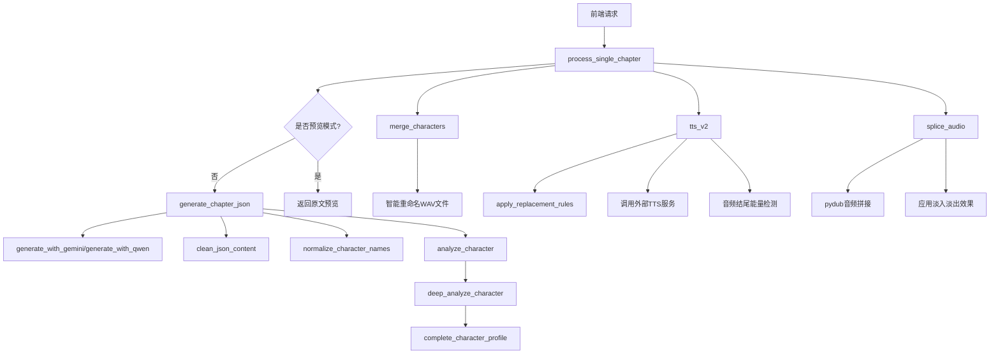

# 业务逻辑层

<cite>
**Referenced Files in This Document**   
- [serverV2.py](file://serverV2.py)
</cite>

## 目录
1. [核心业务函数调用链](#核心业务函数调用链)
2. [process_single_chapter 函数流程](#process_single_chapter-函数流程)
3. [tts_v2 函数实现机制](#tts_v2-函数实现机制)
4. [splice_audio 音频拼接逻辑](#splice_audio-音频拼接逻辑)
5. [merge_characters 智能重命名机制](#merge_characters-智能重命名机制)
6. [deep_analyze_character 深度分析流程](#deep_analyze_character-深度分析流程)
7. [异常处理与性能优化](#异常处理与性能优化)

## 核心业务函数调用链

**Diagram sources**
- [serverV2.py](file://serverV2.py#L1081-L1229)
- [serverV2.py](file://serverV2.py#L1728-L1861)
- [serverV2.py](file://serverV2.py#L1864-L1956)
- [serverV2.py](file://serverV2.py#L358-L478)
- [serverV2.py](file://serverV2.py#L767-L813)

## process_single_chapter 函数流程

`process_single_chapter` 函数是处理单个章节的核心入口，协调了LLM调用、文本分块、JSON解析和文件存储的完整流程。

1.  **预览模式处理**：当 `preview_only` 参数为 `True` 时，函数直接返回章节的原始文本内容，用于前端预览。
2.  **强制重生成清理**：当 `force_regenerate` 参数为 `True` 时，函数会删除该章节对应的所有旧音频文件（包括单句WAV和最终拼接的音频），确保重新生成。
3.  **LLM驱动的JSON生成**：调用 `generate_chapter_json` 函数，该函数根据配置选择 `gemini` 或 `aliyun` (Qwen) 模型。它会将章节内容按最大字符数（`max_chars`）进行智能分块（`smart_chunk_text`），然后异步或顺序地向LLM API发送请求。
4.  **文本分块与重试**：`generate_with_gemini` 和 `generate_with_qwen` 函数实现了分块处理和重试机制。它们会将大文本分割成小块，逐个发送给LLM，并在失败时进行最多 `MAX_RETRIES` 次重试。
5.  **JSON解析与清洗**：LLM返回的响应经过 `validate_and_parse_json_array` 函数解析。生成的JSON数组会通过 `clean_json_content` 函数进行清洗，移除仅包含标点符号的无效条目。
6.  **角色名归一化**：通过 `normalize_character_names` 函数，利用LLM分析新出现的角色名是否是已有角色的别名，并返回一个映射字典，自动将别名替换为标准名称。
7.  **文件存储**：最终处理好的JSON内容会被保存到 `projects/{novel_name}/chapters_json/` 目录下的 `{chapter_title}.json` 文件中。

**Section sources**
- [serverV2.py](file://serverV2.py#L1081-L1229)
- [serverV2.py](file://serverV2.py#L560-L591)
- [serverV2.py](file://serverV2.py#L480-L509)
- [serverV2.py](file://serverV2.py#L986-L1078)

## tts_v2 函数实现机制

`tts_v2` 函数负责集成外部TTS服务（如CosyVoice2、IndexTTS2），处理音色映射、替换词典应用和音频生成重试机制。

1.  **配置加载与模型选择**：函数首先加载 `config.json` 文件，根据请求中的 `tts_model` 参数或默认配置，确定要使用的TTS模型及其API端点（`endpoint`）。
2.  **替换词典应用**：调用 `apply_replacement_rules` 函数，加载小说专属的 `replace_dict.json` 文件。该函数会按规则中原始词的长度从长到短排序，以避免短词替换影响长词，然后对 `tts_text` 进行批量替换。
3.  **构建请求负载**：将处理后的文本、提示音频（`prompt_audio`）、提示文本（`prompt_text`）、推理模式（`inference_mode`）和指令文本（`instruct_text`）构建成一个JSON `payload`。
4.  **重试机制与质量检测**：
    *   函数内部实现了 `TTS_GENERATION_MAX_RETRIES` 次的重试循环。
    *   每次生成音频后，使用 `pydub` 库分析音频结尾 `TTS_TAIL_ANALYSIS_DURATION_MS` 毫秒的平均能量（`dBFS`）。
    *   如果结尾能量高于 `TTS_TAIL_ENERGY_THRESHOLD_DBFS`，则认为音频可能被截断，会进行重试。
    *   在所有重试中，函数会记录并保存“结尾能量最低”（即最不戛然而止）的音频作为最佳结果。
5.  **文件存储**：将最终选定的音频数据（Base64解码后）保存到 `output/{novel_name}/wavs/{chapter_name}/` 目录下，文件名格式为 `{行号}-{角色名}-{音色名}.wav`。

**Section sources**
- [serverV2.py](file://serverV2.py#L1728-L1861)
- [serverV2.py](file://serverV2.py#L520-L558)

## splice_audio 音频拼接逻辑

`splice_audio` 函数使用 `pydub` 库进行音频拼接，并应用淡入淡出效果。

1.  **路径构建与验证**：根据请求的 `novel_name` 和 `chapter_name` 构建章节JSON文件和WAV文件目录的路径，并验证JSON文件是否存在。
2.  **数据加载**：读取 `character_timbres.json` 配置文件和章节的JSON数据。
3.  **权威文件列表构建**：函数不依赖前端传来的 `wav_files` 列表，而是根据JSON数据中的 `speaker` 和 `timbre_override` 字段，结合 `character_timbres` 配置，自行构建一个权威的、按顺序排列的WAV文件名列表。
4.  **音频拼接**：使用 `AudioSegment.empty()` 创建一个空的音频片段，然后遍历文件列表，将每个存在的WAV文件通过 `+=` 操作符追加到空片段上，实现无缝拼接。
5.  **导出与格式化**：根据 `config.json` 中的 `audio_export` 配置（格式和质量），将拼接后的音频导出为最终文件（如MP3、M4A等）。

**Section sources**
- [serverV2.py](file://serverV2.py#L1864-L1956)

## merge_characters 智能重命名机制

`merge_characters` 函数实现了角色合并时的智能重命名机制，避免重复生成音频。

1.  **参数验证**：检查请求参数的完整性，并确保目标角色名不在源角色名列表中。
2.  **音色配置加载**：加载 `character_timbres.json` 文件，获取角色与音色的映射关系。
3.  **智能重命名条件**：核心逻辑在于，**只有当源角色的音色存在，且与目标角色的音色完全相同时**，才会执行WAV文件的重命名操作。
4.  **文件重命名**：遍历所有指定的章节JSON文件，对于每个需要合并的角色，构建旧的WAV文件名（包含源角色名）和新的WAV文件名（包含目标角色名），然后使用 `os.rename` 进行重命名。
5.  **JSON内容更新**：在重命名文件的同时，将JSON数据中该角色的 `speaker` 字段更新为目标角色名。
6.  **配置清理**：最后，从 `character_profiles.json` 和 `character_timbres.json` 配置文件中移除被合并的源角色。

**Section sources**
- [serverV2.py](file://serverV2.py#L358-L478)

## deep_analyze_character 深度分析流程

`deep_analyze_character` 函数通过聚合角色上下文并调用LLM进行深度分析。

1.  **上下文聚合**：函数遍历 `projects/{novel_name}/chapters_json/` 目录下的所有JSON文件，提取出目标角色（`character_name`）的所有对话内容，并将这些对话按章节聚合，形成一个完整的上下文字符串。
2.  **调用补全函数**：将聚合后的上下文、角色的现有简介（`existing_profile`）和指定的LLM模型名传递给 `complete_character_profile` 函数。
3.  **LLM补全分析**：`complete_character_profile` 函数会构造一个提示词（prompt），要求LLM根据上下文补全简介中缺失的字段（如性别、年龄段、身份）。它会调用与 `analyze_character` 相同的API接口，但任务是补全而非创建。
4.  **结果保存**：如果LLM成功返回了补全后的简介，函数会将其更新到 `character_profiles.json` 文件中。

**Section sources**
- [serverV2.py](file://serverV2.py#L767-L813)
- [serverV2.py](file://serverV2.py#L680-L763)

## 异常处理与性能优化

本系统在业务逻辑层实现了全面的异常处理和性能优化措施。

1.  **异常处理**：
    *   **HTTP异常**：广泛使用 `HTTPException` 抛出不同状态码的错误（如400, 404, 500），并提供清晰的错误信息。
    *   **文件操作异常**：在文件读写、重命名、删除等操作中，使用 `try-except` 捕获 `OSError`、`FileNotFoundError` 等异常，记录日志但不中断主流程。
    *   **API调用异常**：在调用LLM和TTS微服务时，捕获 `requests.exceptions.RequestException` 和通用 `Exception`，记录详细的错误日志，并进行重试或返回用户友好的错误信息。
2.  **性能优化**：
    *   **异步处理**：`generate_with_gemini` 函数使用 `asyncio.gather` 并行处理所有文本块，显著提高了处理速度。
    *   **重试机制**：在LLM和TTS调用中都实现了指数退避或固定间隔的重试机制，提高了系统的鲁棒性。
    *   **缓存与预加载**：在 `process_single_chapter` 中，提前加载了 `source.txt` 和 `character_profiles.json` 文件，减少了重复I/O操作。
    *   **资源清理**：在 `tts_v2` 的合声效果生成中，使用 `try-finally` 确保临时目录在使用后被彻底删除，防止磁盘空间耗尽。

**Section sources**
- [serverV2.py](file://serverV2.py#L1081-L1229)
- [serverV2.py](file://serverV2.py#L1728-L1861)
- [serverV2.py](file://serverV2.py#L316-L355)
- [serverV2.py](file://serverV2.py#L264-L314)