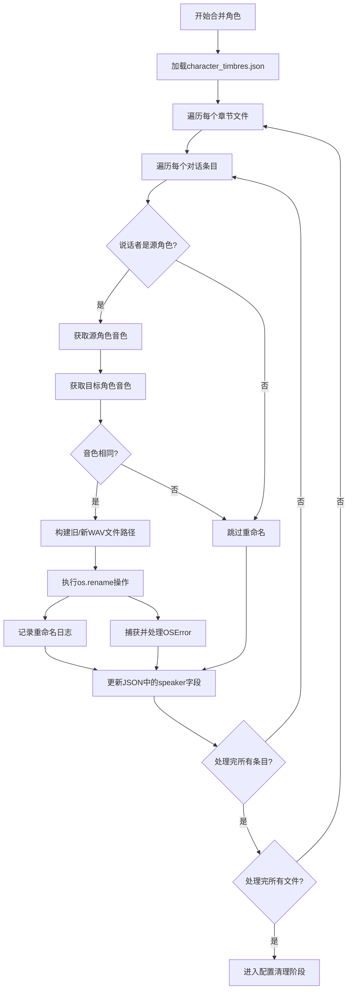

# 角色合并与音色继承

<cite>
**本文档引用的文件**   
- [serverV2.py](file://serverV2.py#L358-L479)
- [serverV2.py](file://serverV2.py#L59-L63)
</cite>

## 目录
1. [角色合并与音色继承](#角色合并与音色继承)
2. [智能合并流程详解](#智能合并流程详解)
3. [核心优化机制：智能WAV文件重命名](#核心优化机制：智能wav文件重命名)
4. [配置文件清理逻辑](#配置文件清理逻辑)

## 智能合并流程详解

`/api/merge_characters`端点是系统中用于合并角色的核心功能。该端点接收一个`MergeCharactersRequest`请求，该请求包含小说项目名称（`novel_name`）、目标角色名（`target_name`）、一个或多个源角色名（`source_names`）以及需要处理的章节JSON文件列表（`chapter_files`）。

当接收到请求后，后端首先进行参数校验，确保所有必要字段都已提供，并且目标角色名不包含在源角色名列表中。随后，系统会定位到指定小说项目的目录，准备对`chapters_json`文件夹下的所有章节文件进行操作。

**Section sources**
- [serverV2.py](file://serverV2.py#L358-L384)

## 核心优化机制：智能WAV文件重命名

该端点的核心优化机制在于其“智能WAV文件重命名”功能，旨在避免重复的TTS（文本转语音）调用，从而显著提升处理效率。

其工作流程如下：
1.  **加载音色配置**：系统首先加载项目根目录下的`character_timbres.json`文件，该文件存储了每个角色所关联的音色名称（timbre）。
2.  **遍历章节文件**：对于请求中指定的每一个章节JSON文件，系统会读取其内容。
3.  **遍历对话条目**：在每个章节文件中，系统会遍历每一个对话或旁白条目。
4.  **条件判断与重命名**：当发现条目的说话者（`speaker`）是源角色之一时，系统会执行关键的条件判断：
    *   获取该源角色的音色（`source_timbre`）。
    *   获取目标角色的音色（`target_timbre`）。
    *   **核心条件**：仅当源角色的音色存在，且与目标角色的音色完全相同时，系统才会执行文件重命名操作。
5.  **执行重命名**：如果满足上述条件，系统会根据章节的音频输出目录，构建旧的WAV文件路径（如`0001-张三-男声.wav`）和新的WAV文件路径（如`0001-李四-男声.wav`）。然后，系统使用`os.rename`操作尝试将旧文件重命名为新文件名。此操作成功后，该音频文件即可被直接使用，无需再次调用TTS服务生成。
6.  **异常处理**：在执行`os.rename`时，系统通过`try-except`块捕获`OSError`等异常，以防止因文件不存在或权限问题导致整个合并流程中断，并将错误信息记录到日志中。
7.  **更新JSON内容**：无论是否执行了文件重命名，系统都会将JSON条目中的`speaker`字段从源角色名更新为目标角色名。

此机制通过复用已生成的音频文件，极大地优化了资源利用和处理速度。

**Diagram sources**
- [serverV2.py](file://serverV2.py#L385-L443)

## 配置文件清理逻辑

在完成所有章节文件的遍历和修改后，系统会进入配置文件的清理阶段。

1.  **清理角色简介**：系统会检查并加载`character_profiles.json`文件。对于每一个被合并的源角色名，如果其在简介文件中存在，则将其从JSON对象中删除。更新后的简介文件会被重新写入磁盘。
2.  **清理音色配置**：系统会处理`character_timbres.json`文件。首先，它会检查目标角色是否已有音色配置。如果没有，系统会遍历源角色列表，将第一个存在的音色配置继承给目标角色。随后，所有源角色的音色配置都会从文件中删除。最后，更新后的音色配置文件会被保存。

通过这一系列操作，系统不仅完成了角色名的统一，还确保了配置文件的整洁，并实现了音色的平滑继承。

**Section sources**
- [serverV2.py](file://serverV2.py#L452-L470)