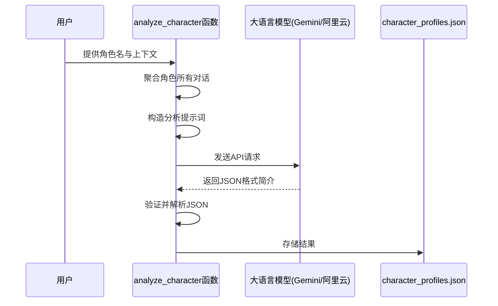
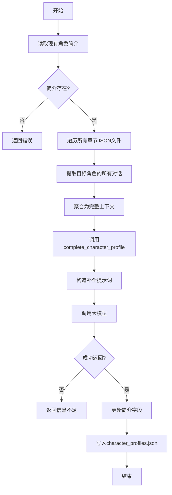
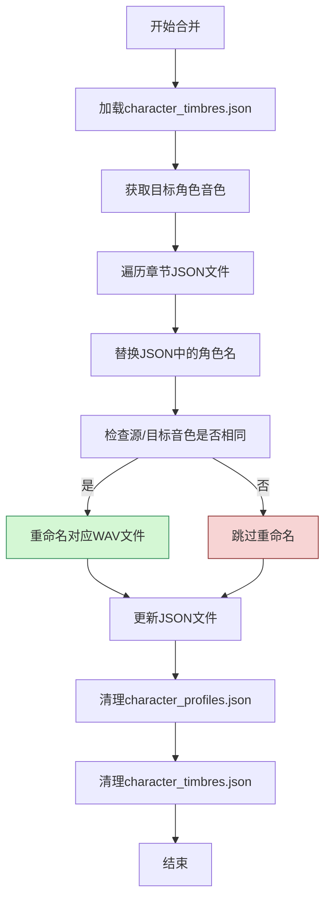

# 角色管理

<cite>
**Referenced Files in This Document**   
- [serverV2.py](file://serverV2.py)
- [config.json](file://config.json)
</cite>

## 目录
1. [简介](#简介)
2. [核心业务逻辑](#核心业务逻辑)
3. [角色简介生成](#角色简介生成)
4. [角色信息补全](#角色信息补全)
5. [角色智能合并](#角色智能合并)
6. [配置文件](#配置文件)

## 简介
本文档深入解析了AI有声书工具中关于角色识别、分析与合并的核心业务逻辑。系统通过调用大语言模型（如Gemini或阿里云平台）来自动化处理角色信息，实现了从原始文本到结构化角色数据的转换。核心功能包括：基于角色对话内容生成初始简介、利用更广泛的上下文对已有简介进行深度补全，以及通过智能重命名机制高效合并重复角色。这些功能共同确保了角色数据的一致性与准确性，同时极大提升了音频生成的效率。

## 核心业务逻辑
系统的核心业务逻辑围绕角色数据的全生命周期管理展开，从最初的识别与分析，到后续的深度补全，再到最终的合并与清理。整个流程高度自动化，依赖于大语言模型的强大语义理解能力。角色信息被持久化存储于`character_profiles.json`文件中，而角色与音色的映射关系则存储于`character_timbres.json`。当用户执行角色合并操作时，系统不仅会更新所有章节的JSON文件，还会智能地重命名已生成的WAV音频文件，避免了昂贵的重复TTS（文本转语音）生成过程，从而显著优化了工作流。

**Section sources**
- [serverV2.py](file://serverV2.py#L358-L479)

## 角色简介生成
角色简介的生成由`analyze_character`函数驱动，该函数是自动化角色分析流程的起点。

### 数据聚合与提示词构造
该函数首先接收一个角色名和一段包含该角色对话的上下文文本。为了构造有效的分析提示词，系统会聚合该角色在所有已处理章节中的对话内容。此聚合过程确保了分析模型能够基于最全面的语料进行判断。构造的提示词明确要求模型返回一个包含`gender`（性别）、`ageGroup`（年龄段）和`identity`（身份背景）三个字段的JSON对象。

### 大模型调用与结果存储
根据`config.json`中的配置，`analyze_character`函数会选择指定的大模型（如Gemini或阿里云）进行调用。函数会读取配置文件中的API密钥、模型名称和代理设置，构建相应的HTTP请求。请求成功后，系统会从模型的响应中提取JSON格式的输出，并进行严格验证。一旦验证通过，生成的角色简介将被写入项目目录下的`character_profiles.json`文件中，为后续的TTS合成提供关键的元数据。

**Diagram sources**
- [serverV2.py](file://serverV2.py#L594-L678)

**Section sources**
- [serverV2.py](file://serverV2.py#L594-L678)

## 角色信息补全
在已有角色简介的基础上，`deep_analyze_character`端点提供了更深层次的信息补全能力。

### 上下文聚合
此功能的核心在于其更广泛的上下文聚合策略。与`analyze_character`可能只使用局部上下文不同，`deep_analyze_character`会遍历项目`chapters_json`目录下的所有章节JSON文件。它会提取目标角色在每一个章节中的所有对话内容，并将这些内容聚合为一个庞大的上下文文本。

### 信息补全流程
该端点首先从`character_profiles.json`中读取该角色的现有简介。然后，它会调用`complete_character_profile`函数，传入现有简介和聚合后的完整上下文。`complete_character_profile`函数会分析现有简介，识别出`gender`、`ageGroup`或`identity`等字段中值为“未知”或为空的缺失项。接着，它会构造一个专门的补全提示词，指示大模型基于完整的上下文去推断这些缺失的信息。补全成功后，更新后的简介会覆盖`character_profiles.json`中的旧数据。

**Diagram sources**
- [serverV2.py](file://serverV2.py#L767-L813)
- [serverV2.py](file://serverV2.py#L680-L763)

**Section sources**
- [serverV2.py](file://serverV2.py#L767-L813)
- [serverV2.py](file://serverV2.py#L680-L763)

## 角色智能合并
`/api/merge_characters`端点实现了角色的智能合并，这是确保角色数据一致性的关键操作。

### 文件遍历与名称替换
该端点接收目标角色名、源角色名列表以及需要处理的章节文件列表。其首要任务是遍历所有指定的章节JSON文件。对于每一个文件，它会加载其内容，查找所有`speaker`字段与源角色名匹配的条目，并将其统一替换为目标角色名。修改后的JSON文件会被保存，确保了文本层面的角色统一。

### 智能重命名策略
该功能的核心亮点是其智能重命名策略。系统会检查`character_timbres.json`文件，获取目标角色和源角色所关联的音色名。**只有当源角色的音色与目标角色的音色完全相同时**，系统才会执行WAV文件的重命名操作。例如，如果源角色“张三”和目标角色“李四”都使用“男声”音色，那么系统会将`0001-张三-男声.wav`自动重命名为`0001-李四-男声.wav`。这一策略避免了不必要的音频重新生成，极大地提升了效率。

### 冗余数据清理
合并操作的最后一步是清理冗余数据。系统会从`character_profiles.json`中删除所有被合并的源角色的简介条目。同时，它也会从`character_timbres.json`中移除这些源角色的音色映射。如果目标角色本身没有音色配置，系统会继承第一个源角色的音色配置，确保目标角色的完整性。

**Diagram sources**
- [serverV2.py](file://serverV2.py#L358-L479)

**Section sources**
- [serverV2.py](file://serverV2.py#L358-L479)

## 配置文件
系统的运行依赖于`config.json`配置文件，该文件定义了所有外部服务的连接参数。

### 模型配置
`config.json`中的`models`字段是角色分析功能的核心。它为Gemini和阿里云（aliyun）两个平台分别配置了`display_name`（显示名称）、`model_name`（实际模型ID）、`api_key`（API密钥）以及`max_chars`（单次请求最大字符数）。`analyze_character`和`deep_analyze_character`函数正是通过读取这里的配置来确定使用哪个模型以及如何进行API调用。

### 代理与TTS设置
`general`字段下的`proxy`配置允许系统通过代理访问外部API，这对于某些网络环境是必需的。`default_tts_model`则指定了默认的文本转语音模型。`tts_models`字段定义了可用的TTS后端及其访问端点，虽然不直接参与角色分析，但与整个有声书生成流程紧密相关。

**Section sources**
- [config.json](file://config.json#L1-L45)
- [serverV2.py](file://serverV2.py#L196-L245)