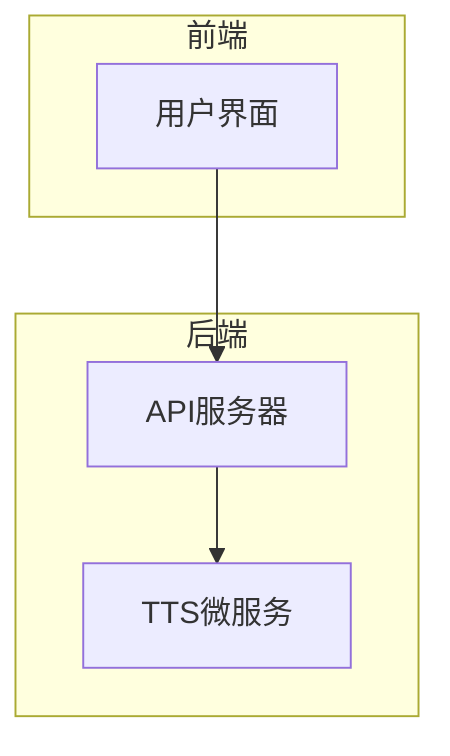
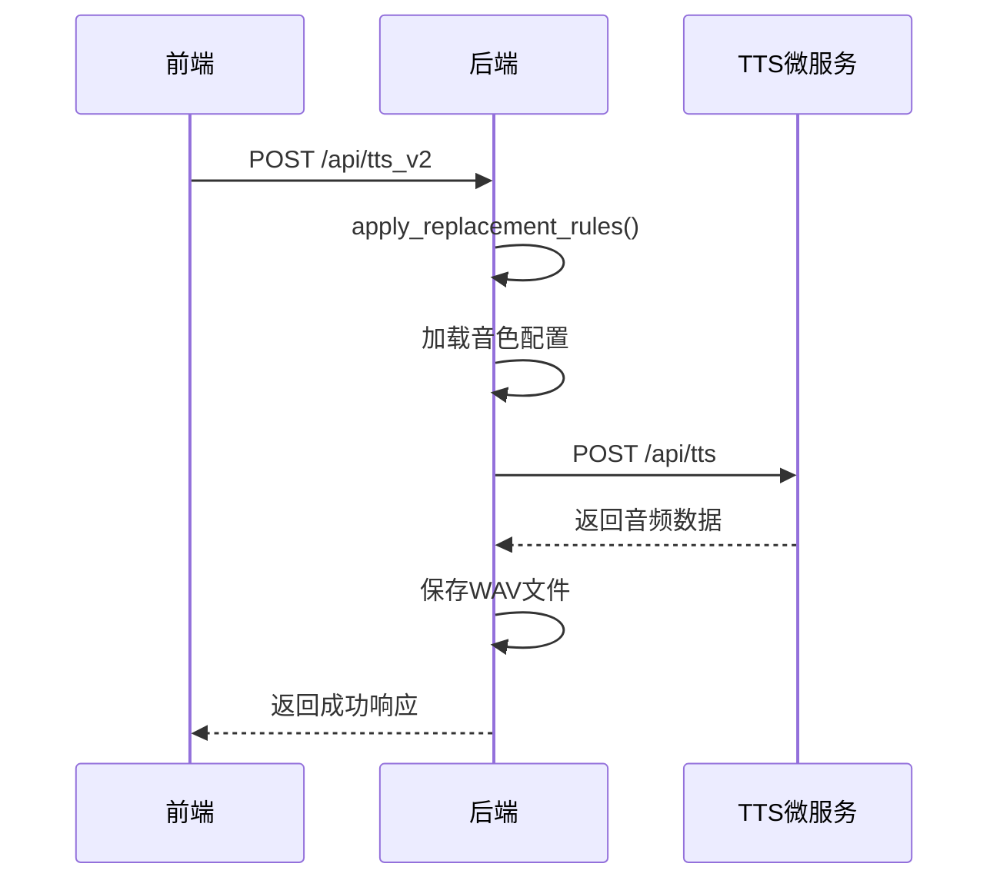
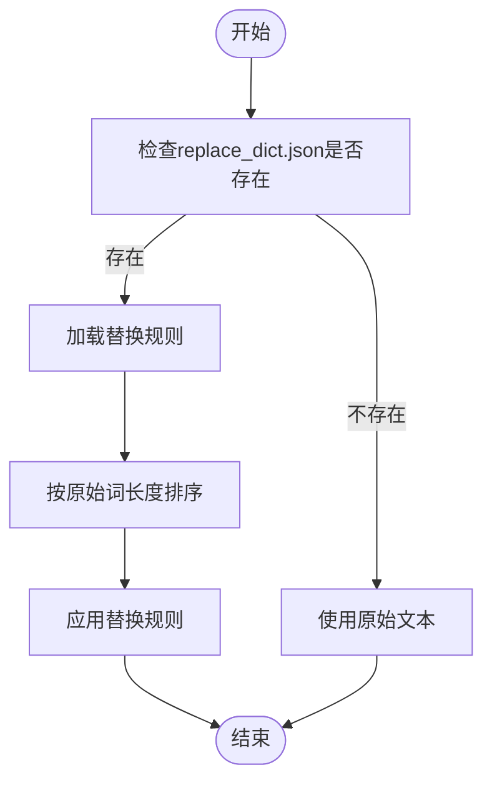
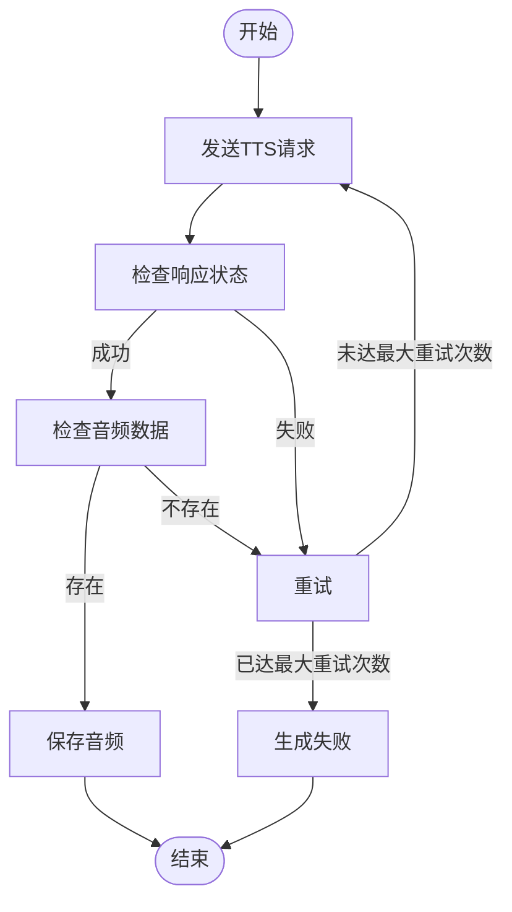
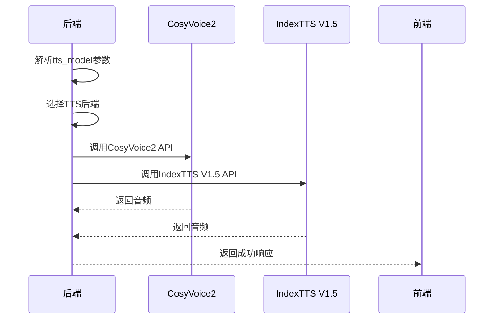
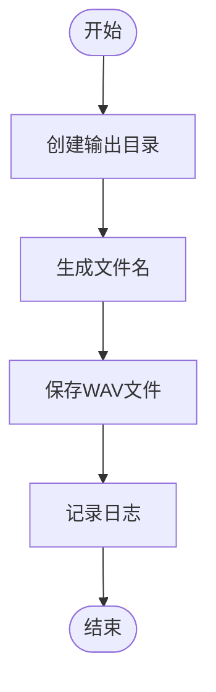
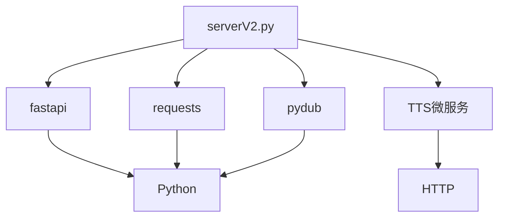

# 语音生成核心流程

<cite>
**本文档中引用的文件**   
- [serverV2.py](file://serverV2.py)
- [config.json](file://config.json)
</cite>

## 目录
1. [简介](#简介)
2. [项目结构](#项目结构)
3. [核心组件](#核心组件)
4. [架构概述](#架构概述)
5. [详细组件分析](#详细组件分析)
6. [依赖分析](#依赖分析)
7. [性能考虑](#性能考虑)
8. [故障排除指南](#故障排除指南)
9. [结论](#结论)
10. [附录](#附录)（如有必要）

## 简介
本文档全面解析了文本到语音（TTS）的生成机制，重点阐述了`tts_v2` API端点如何接收前端请求，并根据`TTSRequestV2`模型中的参数定位生成任务。文档详细说明了音色映射逻辑、文本预处理规则、TTS重试机制以及如何根据配置选择不同的TTS后端。最后，描述了生成的音频文件的保存路径和日志记录方式。

## 项目结构
项目包含一个基于FastAPI的后端服务，用于处理文本到语音的转换任务。主要文件包括`serverV2.py`作为主服务脚本，`config.json`用于存储系统配置，以及前端相关的`index.html`和`style.css`。

**Section sources**
- [serverV2.py](file://serverV2.py#L1-L50)

## 核心组件

`serverV2.py`是整个系统的核心，负责处理所有API请求，包括文本处理、TTS生成、音频拼接等。`config.json`文件存储了TTS模型的配置信息，如显示名称和API端点。

**Section sources**
- [serverV2.py](file://serverV2.py#L1-L100)
- [config.json](file://config.json#L1-L45)

## 架构概述

系统采用微服务架构，后端服务通过HTTP请求与TTS微服务通信。前端通过API与后端交互，后端负责协调各个组件，包括文本预处理、TTS生成和音频拼接。

**Diagram sources **
- [serverV2.py](file://serverV2.py#L1728-L1862)

## 详细组件分析

### TTS生成流程分析
`tts_v2` API端点接收前端请求，根据`TTSRequestV2`模型中的`novel_name`、`chapter_name`、`row_index`等参数定位生成任务。系统首先从`character_timbres.json`读取角色-音色配置，并将音色名映射到TTS微服务所需的音色ID。

#### 对于API/服务组件：

**Diagram sources **
- [serverV2.py](file://serverV2.py#L1728-L1862)

### 文本预处理分析
`apply_replacement_rules`函数负责加载并应用`replace_dict.json`中的替换规则。该函数首先检查小说专属的替换词典是否存在，如果存在，则加载规则并按原始词长度排序，以避免短词影响长词的替换。

#### 对于复杂逻辑组件：

**Diagram sources **
- [serverV2.py](file://serverV2.py#L520-L558)

### TTS重试机制分析
系统实现了TTS生成的内部最大重试次数`TTS_GENERATION_MAX_RETRIES`。在生成失败时，系统会自动重试，以提高成功率。重试逻辑包括检查TTS服务的响应状态和音频数据的完整性。

#### 对于复杂逻辑组件：

**Diagram sources **
- [serverV2.py](file://serverV2.py#L1764-L1843)

### TTS后端选择分析
系统根据`inference_mode`和`tts_model`参数选择不同的TTS后端。`config.json`文件中定义了`cosyvoice_v2`和`indextts_v1.5`两个模型的配置，包括显示名称和API端点。

#### 对于API/服务组件：

**Diagram sources **
- [serverV2.py](file://serverV2.py#L1735-L1762)
- [config.json](file://config.json#L16-L24)

### 音频文件保存分析
生成的WAV文件被保存到`output/{novel_name}/wavs/{chapter_name}/`目录下。系统会根据`novel_name`和`chapter_name`创建相应的目录，并将音频文件以`{row_index:04d}-{safe_speaker}-{safe_timbre}.wav`的格式命名。

#### 对于复杂逻辑组件：

**Diagram sources **
- [serverV2.py](file://serverV2.py#L1844-L1862)

**Section sources**
- [serverV2.py](file://serverV2.py#L1728-L1862)

## 依赖分析

系统依赖于多个外部库，包括`fastapi`用于构建API，`requests`用于HTTP请求，`pydub`用于音频处理。此外，系统还依赖于TTS微服务，通过HTTP请求与之通信。

**Diagram sources **
- [serverV2.py](file://serverV2.py#L1-L33)

**Section sources**
- [serverV2.py](file://serverV2.py#L1-L33)

## 性能考虑

系统在处理大量文本时可能会遇到性能瓶颈。建议优化文本分块策略，以减少API调用次数。此外，可以考虑使用异步处理来提高并发性能。

## 故障排除指南

如果TTS生成失败，请检查以下几点：
1. 确认TTS微服务是否正常运行。
2. 检查`config.json`中的API端点配置是否正确。
3. 确认`replace_dict.json`文件是否存在且格式正确。
4. 检查网络连接是否正常。

**Section sources**
- [serverV2.py](file://serverV2.py#L1857-L1862)

## 结论

本文档详细解析了文本到语音的生成机制，涵盖了从请求接收、文本预处理、TTS生成到音频保存的完整流程。通过理解这些组件和流程，可以更好地维护和优化系统性能。