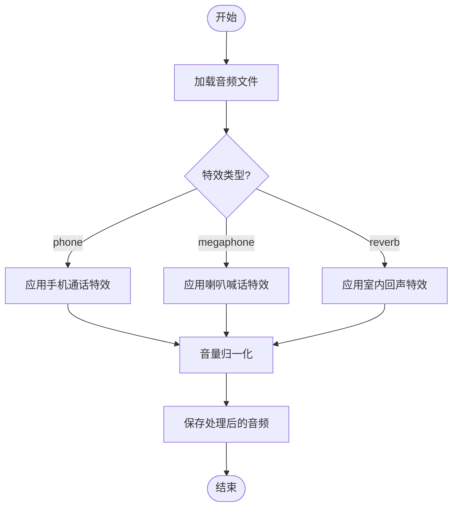
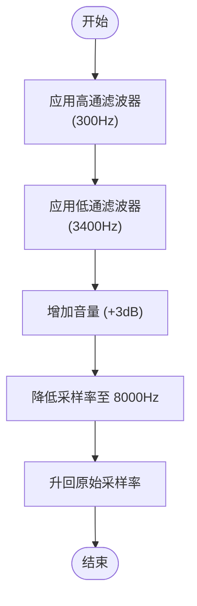
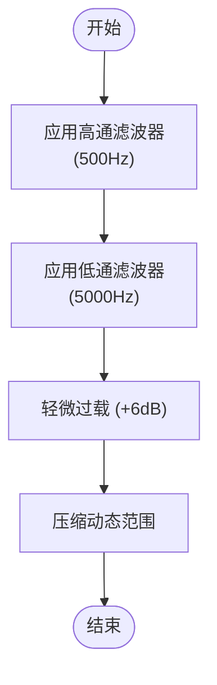
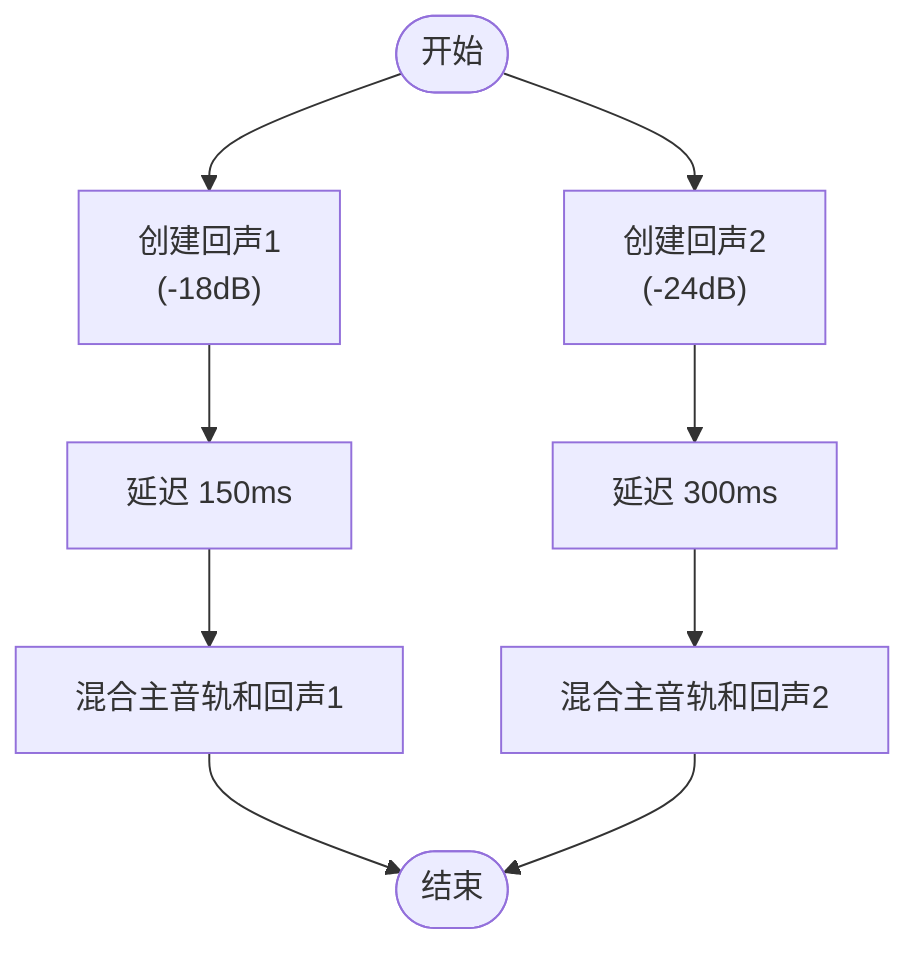

# 音频特效应用

<cite>
**Referenced Files in This Document**   
- [serverV2.py](file://serverV2.py)
</cite>

## 目录
1. [简介](#简介)
2. [核心功能分析](#核心功能分析)
3. [音频特效处理流程](#音频特效处理流程)
4. [信号处理算法详解](#信号处理算法详解)
5. [辅助功能与优化](#辅助功能与优化)
6. [结论](#结论)

## 简介
本文档旨在全面解析`/api/apply_effect`端点如何实现手机通话、喇叭喊话和室内回声三种音频特效。文档将深入阐述`apply_audio_effect`函数的内部工作流程，包括音频文件的加载、不同特效类型的信号处理算法、音量归一化以及文件保存等环节。通过结合代码分析，本文将详细说明`pydub.effects`和`pydub.scipy_effects`模块的具体应用，并解释`trim_leading_silence`等辅助函数在优化音频体验中的作用。

## 核心功能分析
`apply_audio_effect`函数是实现音频特效的核心，它接收一个`EffectRequest`对象作为参数，该对象包含了小说名称、章节名称、文件名以及特效类型。函数首先根据请求参数构建音频文件的完整路径，并验证文件是否存在。如果文件存在，则使用`pydub`库的`AudioSegment.from_wav`方法加载音频文件。

**Section sources**
- [serverV2.py](file://serverV2.py#L1376-L1385)

## 音频特效处理流程
`apply_audio_effect`函数根据`effect_type`参数的值来决定应用哪种特效。处理流程主要包括以下几个步骤：

1.  **加载音频**：从`output/wavs/`目录下加载指定的WAV音频文件。
2.  **应用特效**：根据不同的`effect_type`，调用相应的信号处理算法。
3.  **音量归一化**：在处理完成后，调用`normalize`函数对音频进行音量归一化，以防止削波。
4.  **保存文件**：将处理后的音频覆盖保存到原文件路径。

**Diagram sources**
- [serverV2.py](file://serverV2.py#L1376-L1433)

**Section sources**
- [serverV2.py](file://serverV2.py#L1376-L1433)

## 信号处理算法详解
### 手机通话特效
当`effect_type`为`phone`时，函数会应用手机通话特效。该特效通过以下三个步骤模拟电话的数码感：

1.  **频率限制**：使用`high_pass_filter`和`low_pass_filter`将音频频率限制在300-3400Hz的电话语音频段。这模拟了电话麦克风和扬声器的物理限制。
2.  **增加音量**：通过`processed_audio = processed_audio + 3`轻微增加音量，模拟压缩效果。
3.  **降低采样率**：将音频的采样率降至8000Hz，这是电话语音的标准采样率。然后，再将采样率升回原始值。这个过程会带来独特的数码感。

**Diagram sources**
- [serverV2.py](file://serverV2.py#L1386-L1400)

**Section sources**
- [serverV2.py](file://serverV2.py#L1386-L1400)

### 喇叭喊话特效
当`effect_type`为`megaphone`时，函数会应用喇叭喊话特效。该特效通过结合高通滤波、低通滤波以及`compress_dynamic_range`来模拟喇叭的失真效果。

1.  **滤波**：使用`high_pass_filter`和`low_pass_filter`分别设置500Hz和5000Hz的截止频率，以模拟喇叭的频率响应。
2.  **增加失真感**：通过`apply_gain_stereo(+6)`轻微过载，然后使用`compress_dynamic_range`压缩动态范围，从而增加失真感。

**Diagram sources**
- [serverV2.py](file://serverV2.py#L1401-L1407)

**Section sources**
- [serverV2.py](file://serverV2.py#L1401-L1407)

### 室内回声特效
当`effect_type`为`reverb`时，函数会应用室内回声特效。该特效通过`overlay`方法将原始音频与两个延迟且音量衰减的副本混合，从而创造出空间感。

1.  **创建回声**：创建两个原始音频的副本，并分别降低18dB和24dB的音量。
2.  **混合音频**：使用`overlay`方法将原始音频与两个延迟的回声副本混合，延迟时间分别为150ms和300ms。

**Diagram sources**
- [serverV2.py](file://serverV2.py#L1408-L1417)

**Section sources**
- [serverV2.py](file://serverV2.py#L1408-L1417)

## 辅助功能与优化
### 音量归一化
在所有特效处理完成后，函数会调用`normalize`函数对音频进行音量归一化。这一步骤至关重要，因为它可以防止音频在处理过程中出现削波，确保输出音频的音量稳定。

**Section sources**
- [serverV2.py](file://serverV2.py#L1421-L1423)

### 辅助函数
`trim_leading_silence`是一个辅助函数，用于修剪音频开头的静音部分。它通过`detect_leading_silence`函数检测静音的持续时间，然后返回从该时间点开始的音频片段。

**Section sources**
- [serverV2.py](file://serverV2.py#L1434-L1443)

## 结论
`apply_audio_effect`函数通过一系列精心设计的信号处理算法，成功实现了手机通话、喇叭喊话和室内回声三种音频特效。这些特效不仅提升了音频的趣味性，还为用户提供了更加丰富的音频体验。通过深入分析该函数的实现，我们可以更好地理解音频处理的基本原理和技术。