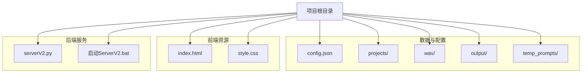
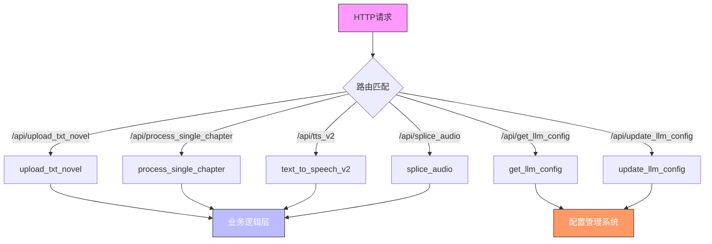
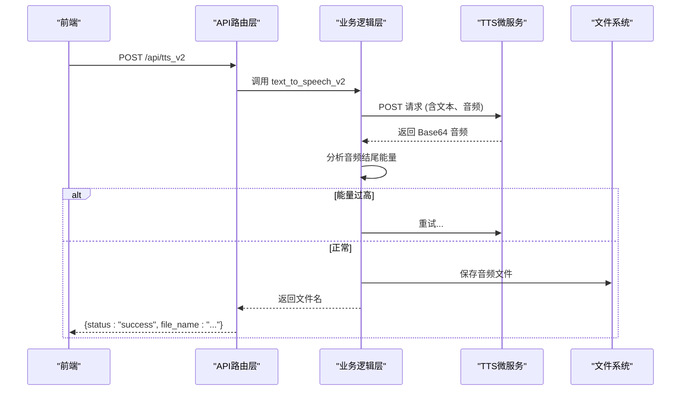

# 后端架构

<cite>
**Referenced Files in This Document**   
- [serverV2.py](file://serverV2.py)
- [config.json](file://config.json)
</cite>

## 目录
1. [项目结构](#项目结构)
2. [分层架构设计](#分层架构设计)
3. [API路由层](#apiroute)
4. [业务逻辑层](#业务逻辑层)
5. [数据访问层](#数据访问层)
6. [Pydantic模型与数据验证](#pydantic)
7. [核心API端点工作机制](#核心api)
8. [配置管理系统](#配置管理系统)
9. [外部AI服务集成](#外部ai)
10. [日志记录与错误处理](#日志记录)
11. [性能优化建议](#性能优化)

## 项目结构
项目采用清晰的目录结构来组织不同类型的文件和资源，确保了代码的可维护性和可扩展性。

**Diagram sources**
- [serverV2.py](file://serverV2.py#L36-L45)
- [启动ServerV2.bat](file://启动ServerV2.bat)

**Section sources**
- [serverV2.py](file://serverV2.py#L36-L45)

## 分层架构设计
该后端服务采用基于FastAPI的分层架构设计，将系统划分为清晰的层次，以实现关注点分离和高内聚低耦合。整体架构分为三层：API路由层、业务逻辑层和数据访问层。

- **API路由层**：由FastAPI框架驱动，通过`@app`装饰器定义的路由函数处理HTTP请求，负责请求的接收、响应的发送以及与前端的交互。
- **业务逻辑层**：包含核心的业务处理函数，如`process_single_chapter`、`tts_v2`和`splice_audio`，这些函数实现了应用的核心功能，如章节处理、TTS生成和音频拼接。
- **数据访问层**：负责与文件系统进行交互，执行文件的读取、写入和目录管理等操作，为上层业务逻辑提供数据支持。

这种分层设计使得代码结构清晰，便于维护和扩展。

**Section sources**
- [serverV2.py](file://serverV2.py#L47-L48)

## API路由层
API路由层是系统的入口点，负责处理所有HTTP请求。它使用FastAPI的`@app`装饰器来定义路由，将不同的URL路径映射到相应的处理函数。

**Diagram sources**
- [serverV2.py](file://serverV2.py#L1543-L1864)

**Section sources**
- [serverV2.py](file://serverV2.py#L1543-L1864)

## 业务逻辑层
业务逻辑层封装了应用的核心功能，是系统中最复杂的部分。它由一系列异步函数组成，每个函数负责一个特定的业务流程。

### 核心业务函数
- `process_single_chapter`: 处理单个小说章节，包括调用LLM进行文本分析、生成JSON结构、清理无效内容和保存结果。
- `text_to_speech_v2`: 调用TTS微服务生成语音，包含重试机制和音频结尾能量分析。
- `splice_audio`: 将多个单句音频文件按顺序拼接成完整的章节音频。

这些函数通过调用下层的数据访问和外部服务来完成复杂的业务逻辑。

**Section sources**
- [serverV2.py](file://serverV2.py#L1081-L1229)
- [serverV2.py](file://serverV2.py#L1728-L1862)
- [serverV2.py](file://serverV2.py#L1864-L1956)

## 数据访问层
数据访问层主要通过Python的`os`和`json`模块实现，负责与文件系统进行交互。其主要职责包括：

- **目录管理**：在服务启动时创建必要的目录（如`projects`、`output`等）。
- **文件操作**：读取和写入配置文件（`config.json`）、小说源文件（`source.txt`）和处理后的JSON文件。
- **路径构建**：根据小说名称和章节标题动态构建文件路径。

该层为上层业务逻辑提供了稳定的数据存取接口。

**Section sources**
- [serverV2.py](file://serverV2.py#L36-L45)
- [serverV2.py](file://serverV2.py#L1088-L1091)

## Pydantic模型与数据验证
Pydantic模型在系统中扮演着至关重要的角色，用于定义API的请求和响应数据结构，并提供自动的数据验证。

### 核心Pydantic模型
- `ProcessSingleChapterRequest`: 定义了处理章节请求的输入结构，包含`novel_name`、`chapter_title`等字段。
- `TTSRequestV2`: 定义了TTS生成请求的输入结构，包含文本、角色、音色等信息。
- `SpliceRequest`: 定义了音频拼接请求的输入结构。

当客户端发送请求时，FastAPI会自动使用这些模型对传入的数据进行验证，确保数据的完整性和正确性，从而提高了系统的健壮性。

**Section sources**
- [serverV2.py](file://serverV2.py#L60-L149)

## 核心API端点工作机制
### 小说上传与章节处理
1. **上传**：客户端通过`/api/upload_txt_novel`端点上传小说TXT文件。
2. **解码**：服务端尝试多种编码（UTF-8, GB18030等）解码文件内容。
3. **分章**：使用`get_chapters_from_txt`函数智能识别章节标题并分割内容。
4. **处理**：调用`process_single_chapter`函数处理每个章节，生成结构化JSON。

### TTS生成与音频拼接
1. **TTS生成**：`text_to_speech_v2`函数调用外部TTS微服务，生成单句音频，并通过重试机制确保生成质量。
2. **音频拼接**：`splice_audio`函数读取所有单句音频文件，按顺序拼接，并根据配置导出为指定格式（MP3, M4A等）。

**Diagram sources**
- [serverV2.py](file://serverV2.py#L1728-L1862)
- [serverV2.py](file://serverV2.py#L1864-L1956)

**Section sources**
- [serverV2.py](file://serverV2.py#L1728-L1862)
- [serverV2.py](file://serverV2.py#L1864-L1956)

## 配置管理系统
配置管理系统通过`initialize_llm_config`函数和`config.json`文件实现。

### 初始化与加载
- **初始化**：服务启动时，`initialize_llm_config`函数检查`config.json`是否存在，若不存在则创建包含默认配置的新文件。
- **加载**：各API端点通过读取`config.json`来获取配置，如LLM的API Key、代理设置和音频导出格式。

### 运行时更新
系统支持运行时更新配置。`/api/update_llm_config`端点允许前端修改配置并持久化到`config.json`文件，使得用户无需重启服务即可调整设置。

**Section sources**
- [serverV2.py](file://serverV2.py#L195-L244)
- [config.json](file://config.json)

## 外部AI服务集成
系统通过HTTP请求与外部AI服务进行集成。

### LLM API集成
- **调用方式**：`generate_with_gemini`和`generate_with_qwen`函数使用`requests.post`调用Gemini和阿里云的LLM API。
- **参数传递**：将章节内容作为提示词（prompt）发送，并根据模型要求设置请求头和参数。

### TTS微服务集成
- **调用方式**：`text_to_speech_v2`函数向配置中指定的TTS微服务端点（如`http://127.0.0.1:5010/api/tts`）发送POST请求。
- **数据格式**：请求体包含Base64编码的参考音频和待转换的文本。

**Section sources**
- [serverV2.py](file://serverV2.py#L265-L356)
- [serverV2.py](file://serverV2.py#L1728-L1862)

## 日志记录与错误处理
### 日志记录
系统使用Python的`logging`模块进行日志记录。`logger`对象被定义在全局作用域，所有关键操作（如API调用、文件操作）都会记录日志，便于问题追踪和系统监控。

### 错误处理
- **HTTP异常**：使用`HTTPException`抛出标准的HTTP错误码和消息。
- **异常捕获**：在`try...except`块中捕获各种异常（如`FileNotFoundError`、`json.JSONDecodeError`），并返回有意义的错误信息。
- **安全检查**：对文件路径进行校验，防止目录遍历攻击。

**Section sources**
- [serverV2.py](file://serverV2.py#L37)
- [serverV2.py](file://serverV2.py#L898-L946)

## 性能优化建议
1. **异步处理**：所有核心API端点均使用`async/await`，可以高效处理I/O密集型任务，如网络请求和文件读写。
2. **缓存机制**：对于频繁访问的数据（如音色列表、角色简介），可以考虑引入内存缓存（如Redis）以减少文件I/O。
3. **批量处理**：对于需要处理多个章节的场景，可以设计批量处理API，减少网络往返次数。
4. **资源复用**：对于TTS微服务的连接，可以使用连接池来复用HTTP连接，降低开销。

**Section sources**
- [serverV2.py](file://serverV2.py#L27-L28)
- [serverV2.py](file://serverV2.py#L1728-L1862)