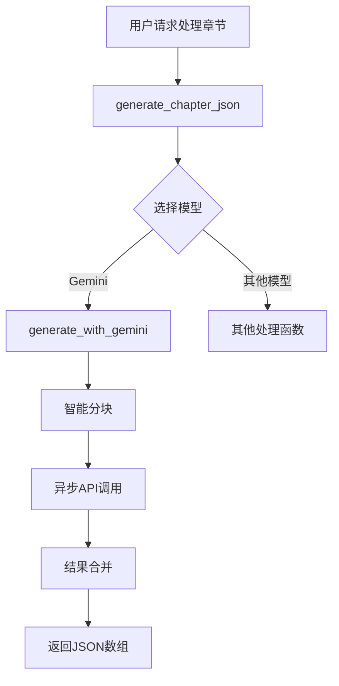
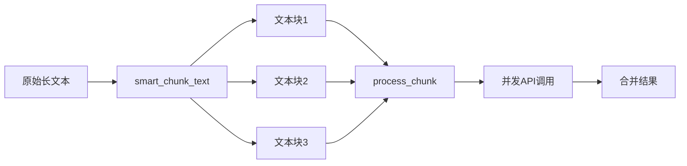
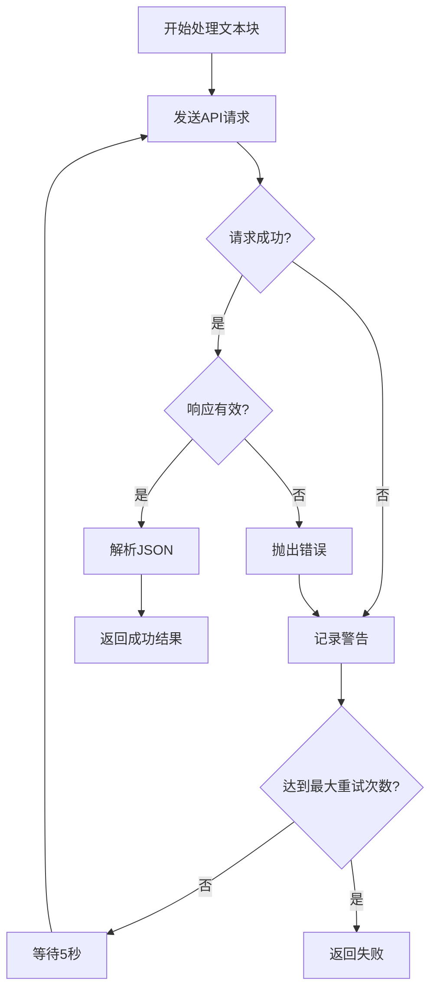

# Gemini集成

<cite>
**Referenced Files in This Document**   
- [serverV2.py](file://serverV2.py)
- [config.json](file://config.json)
</cite>

## Table of Contents
1. [简介](#简介)
2. [核心功能分析](#核心功能分析)
3. [Gemini API请求构造](#gemini-api请求构造)
4. [文本分块与异步处理](#文本分块与异步处理)
5. [安全设置与错误处理](#安全设置与错误处理)
6. [配置文件详解](#配置文件详解)

## 简介
本文档详细记录了系统与Google Gemini大语言模型的集成实现。核心功能是通过`serverV2.py`中的`generate_with_gemini`函数，将小说文本转换为有声书所需的JSON格式。该函数根据`config.json`中的配置，动态构造API请求，利用Gemini模型的强大能力进行文本分析和结构化输出。

**Section sources**
- [serverV2.py](file://serverV2.py#L316-L355)
- [config.json](file://config.json#L1-L45)

## 核心功能分析
系统的文本处理流程始于`generate_chapter_json`函数，该函数作为统一的入口，负责协调不同大语言模型的调用。当用户选择Gemini模型时，此函数会从`config.json`中读取相应的配置，包括API密钥、模型名称、代理设置和最大字符数限制。随后，它会调用`generate_with_gemini`函数，并将从配置文件中获取的参数传递给它，从而启动与Gemini API的交互。

**Diagram sources**
- [serverV2.py](file://serverV2.py#L560-L591)
- [serverV2.py](file://serverV2.py#L316-L355)

**Section sources**
- [serverV2.py](file://serverV2.py#L560-L591)

## Gemini API请求构造
`generate_with_gemini`函数的核心任务是构造并发送符合Gemini API规范的HTTP请求。该请求的构造过程严格遵循以下步骤：

1.  **API端点**: 请求发送至`https://generativelanguage.googleapis.com/v1beta/models/{model_id}:generateContent`，其中`{model_id}`由`config.json`中的`model_name`字段动态填充。
2.  **认证**: 使用`x-goog-api-key`请求头进行认证，其值为`config.json`中`models.gemini.api_key`所配置的密钥。
3.  **请求头**: 除了认证头，还设置了`Content-Type: application/json`以确保服务器正确解析请求体。
4.  **请求体**: JSON格式的请求体包含三个关键部分：
    *   `contents`: 包含一个`parts`数组，其中的`text`字段是拼接了系统提示词`PROMPT_TEMPLATE`和待处理章节文本的完整内容。
    *   `safetySettings`: 一个包含多个危害类别及其阈值的列表，用于控制内容生成的安全性。
    *   `generationConfig`: 配置生成选项，此处指定了`response_mime_type`为`application/json`，要求API返回JSON格式的响应。
5.  **超时**: 整个请求设置了300秒的超时时间，以应对网络延迟或模型处理长文本的耗时。

**Section sources**
- [serverV2.py](file://serverV2.py#L323-L325)

## 文本分块与异步处理
为了处理可能超过Gemini模型输入限制的长章节，系统实现了智能的文本分块机制。

1.  **分块逻辑**: `smart_chunk_text`函数负责将长文本分割成多个块。它会优先在自然停顿点（如换行符、句号、感叹号、问号等）进行分割，以确保每个文本块的语义完整性。分割的最大长度由`config.json`中`models.gemini.max_chars`的值决定，默认为8000个字符。
2.  **异步并发**: `generate_with_gemini`函数利用Python的`asyncio`库，为每个文本块创建一个异步任务`process_chunk`。通过`asyncio.gather(*tasks)`，所有任务被并发执行，极大地提高了处理效率，避免了因顺序等待API响应而导致的性能瓶颈。

**Diagram sources**
- [serverV2.py](file://serverV2.py#L947-L984)
- [serverV2.py](file://serverV2.py#L316-L355)

**Section sources**
- [serverV2.py](file://serverV2.py#L947-L984)
- [serverV2.py](file://serverV2.py#L316-L355)

## 安全设置与错误处理
系统在与Gemini API交互时，具备完善的错误处理和安全配置机制。

1.  **安全设置**: `SAFETY_SETTINGS`是一个全局常量，它将所有危害类别（如骚扰、仇恨言论、性暴露内容、危险内容）的阈值都设置为`BLOCK_NONE`。这意味着Gemini模型在生成内容时不会因为内容敏感而被阻止，从而确保了内容生成的自由度和完整性。
2.  **重试机制**: 每个文本块的处理都包含一个最多3次（由`MAX_RETRIES`常量定义）的重试循环。如果API调用因网络问题或临时错误而失败，系统会等待5秒后自动重试，提高了整体处理的鲁棒性。
3.  **响应解析**: API返回的响应文本会经过`validate_and_parse_json_array`函数的严格校验。该函数会检查文本是否以`[`开头并以`]`结尾，然后尝试将其解析为JSON数组。只有通过校验的响应才会被接受，确保了返回数据的格式正确性。
4.  **日志记录**: 整个处理过程，包括分块、API调用、成功或失败，都会被详细记录到日志中，便于问题排查和系统监控。

**Diagram sources**
- [serverV2.py](file://serverV2.py#L188-L193)
- [serverV2.py](file://serverV2.py#L186-L186)
- [serverV2.py](file://serverV2.py#L511-L518)

**Section sources**
- [serverV2.py](file://serverV2.py#L188-L193)
- [serverV2.py](file://serverV2.py#L186-L186)
- [serverV2.py](file://serverV2.py#L511-L518)

## 配置文件详解
`config.json`文件是整个系统的核心配置中心，它定义了与Gemini集成的所有关键参数。

| 配置项 | 路径 | 说明 | 示例值 |
| :--- | :--- | :--- | :--- |
| **默认模型** | `general.default_model` | 系统启动时默认使用的LLM模型。 | `"gemini"` |
| **代理启用** | `general.proxy.enabled` | 是否启用网络代理。 | `true` |
| **代理协议** | `general.proxy.protocol` | 代理协议类型。 | `"socks5h"` |
| **代理地址** | `general.proxy.address` | 代理服务器的IP地址。 | `"127.0.0.1"` |
| **代理端口** | `general.proxy.port` | 代理服务器的端口号。 | `"1080"` |
| **Gemini显示名** | `models.gemini.display_name` | 在前端界面显示的模型名称。 | `"Gemini"` |
| **Gemini模型ID** | `models.gemini.model_name` | 发送给Gemini API的实际模型名称。 | `"gemini-2.5-flash"` |
| **Gemini API密钥** | `models.gemini.api_key` | 用于认证的Google API密钥。 | `""` (需用户填写) |
| **最大字符数** | `models.gemini.max_chars` | 单次发送给API的最大字符数，用于文本分块。 | `8000` |
| **使用代理** | `models.gemini.use_proxy` | 该模型是否使用`general.proxy`中定义的代理。 | `true` |

**重要提示**: 用户必须在`config.json`文件的`models.gemini.api_key`字段中正确填写自己的Google API密钥，否则`generate_with_gemini`函数将无法成功调用API。

**Section sources**
- [config.json](file://config.json#L1-L45)