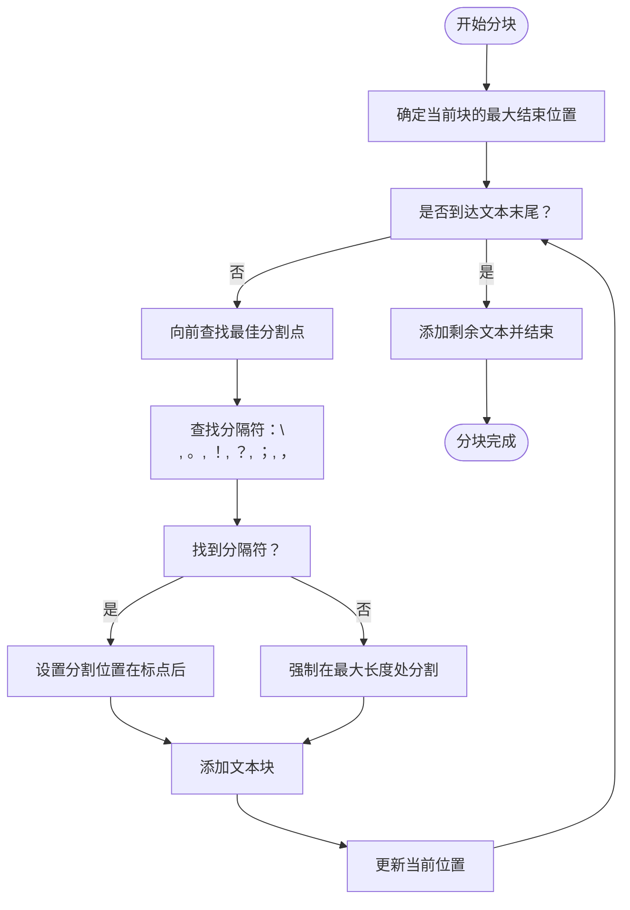

# 大语言模型集成

<cite>
**本文档引用的文件**
- [serverV2.py](file://serverV2.py)
- [config.json](file://config.json)
</cite>

## 目录
1. [系统集成概述](#系统集成概述)
2. [配置文件详解](#配置文件详解)
3. [核心处理流程](#核心处理流程)
4. [文本分块逻辑](#文本分块逻辑)
5. [Gemini集成实现](#gemini集成实现)
6. [阿里云通义千问集成实现](#阿里云通义千问集成实现)
7. [错误处理与重试机制](#错误处理与重试机制)
8. [响应解析与验证](#响应解析与验证)
9. [配额与限制配置](#配额与限制配置)

## 系统集成概述

本系统实现了与Google Gemini和阿里云通义千问大语言模型的深度集成，通过`serverV2.py`中的`generate_with_gemini`和`generate_with_qwen`函数，为有声书制作提供智能化的文本到JSON转换服务。系统能够根据`config.json`中的配置动态构造API请求，处理超长章节内容，并通过异步HTTP请求与LLM服务进行交互。

**Section sources**
- [serverV2.py](file://serverV2.py#L265-L355)

## 配置文件详解

`config.json`文件是系统的核心配置文件，定义了与大语言模型交互的所有参数。配置文件采用分层结构，主要包含以下部分：

- **general**: 通用配置，包括默认模型、代理设置和TTS模型
- **models**: 大语言模型的具体配置，包括Gemini和阿里云平台
- **tts_models**: TTS模型配置
- **elevenlabs**: ElevenLabs API配置

代理配置支持SOCKS5H协议，允许通过本地代理服务器访问外部API服务。

**Section sources**
- [config.json](file://config.json#L1-L45)
- [serverV2.py](file://serverV2.py#L196-L245)

## 核心处理流程

系统通过`generate_chapter_json`函数协调整个处理流程。该函数首先从`config.json`读取模型配置，然后根据指定的模型名称调用相应的处理函数（`generate_with_gemini`或`generate_with_qwen`）。处理流程包括：

1. 读取并验证配置
2. 构造API请求所需的参数
3. 根据代理配置设置网络代理
4. 调用相应的LLM处理函数
5. 返回处理结果

**Section sources**
- [serverV2.py](file://serverV2.py#L561-L592)

## 文本分块逻辑

系统通过`smart_chunk_text`函数实现智能文本分块，以处理超过单次API调用限制的超长章节内容。该函数采用以下策略：

- 优先在自然语言停顿处分割，分割点优先级为：换行符 > 句号 > 感叹号 > 问号 > 分号 > 逗号
- 如果在指定范围内找不到合适的标点符号，则强制在最大长度处分割
- 确保分割不会破坏句子完整性

这种智能分块策略保证了文本在语义上的完整性，避免了在词语中间或句子中间进行分割。



**Diagram sources**
- [serverV2.py](file://serverV2.py#L947-L984)

## Gemini集成实现

`generate_with_gemini`函数实现了与Google Gemini API的集成，其主要特点包括：

- **API请求构造**: 使用`x-goog-api-key`头部进行认证，请求URL为`https://generativelanguage.googleapis.com/v1beta/models/{model_id}:generateContent`
- **安全设置**: 通过`SAFETY_SETTINGS`配置，将所有内容安全类别的阈值设置为`BLOCK_NONE`，确保内容生成不受限制
- **异步并发处理**: 使用`asyncio.gather`并发处理所有文本块，提高处理效率
- **请求体结构**: 包含`contents`、`safetySettings`和`generationConfig`三个主要部分，其中`response_mime_type`设置为`application/json`

**Section sources**
- [serverV2.py](file://serverV2.py#L316-L355)

## 阿里云通义千问集成实现

`generate_with_qwen`函数实现了与阿里云通义千问API的集成，其主要特点包括：

- **API请求构造**: 使用`Bearer`令牌进行认证，请求URL为`https://dashscope.aliyuncs.com/api/v1/services/aigc/text-generation/generation`
- **消息格式**: 采用对话式消息格式，包含系统角色和用户角色的消息
- **结果格式**: 通过`result_format`参数设置为`message`，确保返回消息格式
- **响应处理**: 特殊处理了响应中可能包含的Markdown代码块标记（```json）

**Section sources**
- [serverV2.py](file://serverV2.py#L264-L314)

## 错误处理与重试机制

系统实现了完善的错误处理与重试机制，确保在网络不稳定或API服务暂时不可用时仍能可靠运行：

- **最大重试次数**: `MAX_RETRIES`设置为3次
- **指数退避**: 每次重试前等待5秒，避免对API服务造成过大压力
- **详细日志**: 记录每次尝试的详细信息，便于问题排查
- **异常分类处理**: 区分网络异常、API响应无效、内容格式错误等不同类型的异常

对于Gemini集成，还特别检查了`finishReason`是否为`STOP`，以确保模型正常完成生成。

**Section sources**
- [serverV2.py](file://serverV2.py#L187)
- [serverV2.py](file://serverV2.py#L280-L302)
- [serverV2.py](file://serverV2.py#L327-L347)

## 响应解析与验证

系统通过`validate_and_parse_json_array`函数对LLM返回的响应进行严格验证和解析：

- **格式验证**: 检查响应文本是否以方括号`[`开头并以`]`结尾，确保是有效的JSON数组
- **JSON解析**: 使用`json.loads`尝试解析JSON内容
- **异常处理**: 捕获`JSONDecodeError`异常，返回`None`表示解析失败

对于阿里云API返回的可能包含Markdown代码块的响应，系统会先去除` ```json `和` ``` `标记，然后再进行解析。

**Section sources**
- [serverV2.py](file://serverV2.py#L511-L518)

## 配额与限制配置

`config.json`文件中为每个大语言模型配置了相应的限制参数：

- **Gemini**: `max_chars`设置为8000，`model_name`为`gemini-2.5-flash`
- **阿里云**: `max_chars`设置为6000，`model_name`为`deepseek-r1`

这些配置决定了文本分块的最大长度，确保每个API请求不会超过服务的字符限制。用户可以在配置界面中根据实际需求调整这些参数。

API密钥应在`config.json`文件中正确填写，系统会在调用API前验证密钥是否存在。对于Gemini，使用`api_key`字段；对于阿里云，同样使用`api_key`字段进行认证。

**Section sources**
- [config.json](file://config.json#L27-L40)
- [serverV2.py](file://serverV2.py#L571-L572)