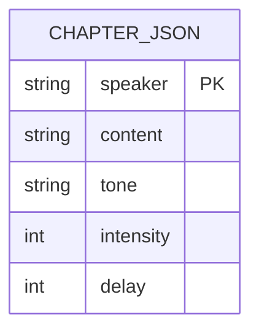
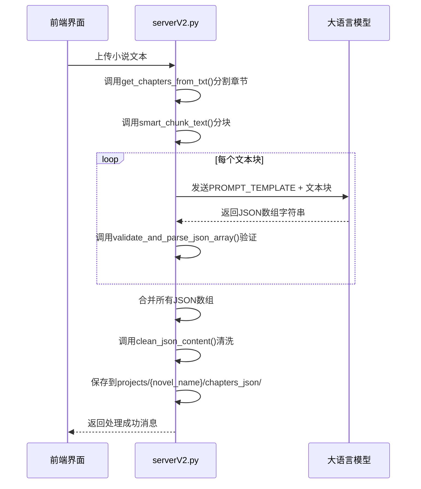

# 章节内容数据模型

<cite>
**本文档引用的文件**   
- [serverV2.py](file://serverV2.py#L153-L185)
- [serverV2.py](file://serverV2.py#L480-L509)
- [serverV2.py](file://serverV2.py#L511-L518)
- [serverV2.py](file://serverV2.py#L1167-L1168)
- [serverV2.py](file://serverV2.py#L377-L379)
</cite>

## 目录
1. [引言](#引言)
2. [核心数据结构](#核心数据结构)
3. [AI生成机制](#ai生成机制)
4. [数据验证与清洗](#数据验证与清洗)
5. [文件存储与路径](#文件存储与路径)
6. [关联数据模型](#关联数据模型)
7. [实际应用](#实际应用)

## 引言
本文件旨在权威性地定义由LLM（大语言模型）生成的章节内容JSON数据模型。该模型是AI有声书制作流程中的核心中间产物，它将原始小说文本结构化为包含说话者、内容、语气、强度和停顿等信息的数组，为后续的语音合成、音效处理和内容编辑提供精确的指令。本文档将深入解析其结构、生成逻辑、验证清洗机制以及在整个系统中的作用。

## 核心数据结构
章节内容数据模型的核心是一个JSON数组，其结构为`[{speaker, content, tone, intensity, delay}]`。数组中的每个对象代表一个独立的对话或旁白片段。

- **speaker**: 字符串类型，用于标识说话者。当内容为旁白时，该字段值为"旁白"；当内容为角色对话时，该字段值为角色的姓名。系统会通过角色名归一化功能，将同一角色的不同称谓（如“张真人”、“三丰道长”）统一为一个标准名称。
- **content**: 字符串类型，存储原始的对话或旁白文本。该字段是语音合成的直接输入源，要求保持原文的语意完整性，不进行修改或遗漏。
- **tone**: 字符串类型，描述说话时的语气和情感。例如“正常”、“愤怒”、“开心”、“伤心”、“低声念叨”、“惊讶”等。此信息指导TTS（文本转语音）引擎生成符合情境的语音。
- **intensity**: 整数类型，表示语气的强度，取值范围为1-10。数值越大，表示情感越强烈。例如，愤怒的语气可能对应强度8-10，而平静的叙述可能对应强度4-6。
- **delay**: 整数类型，表示与上一句话之间的停顿时间，单位为毫秒（ms）。该值根据对话节奏和内容长度动态设置，旁白的停顿通常在300-800ms之间，角色对话的停顿则在100-1500ms之间。



**Diagram sources**
- [serverV2.py](file://serverV2.py#L153-L185)

**Section sources**
- [serverV2.py](file://serverV2.py#L153-L185)

## AI生成机制
章节内容JSON的生成并非由程序代码直接构造，而是通过一个精心设计的AI提示词（Prompt）强制大语言模型（LLM）输出符合规范的JSON数组。

### 提示词模板（PROMPT_TEMPLATE）
在`serverV2.py`文件中定义了名为`PROMPT_TEMPLATE`的全局变量，它是一个详细的指令集，要求LLM：
1.  **严格遵循JSON数组格式**：输出必须是有效的JSON数组，不包含任何额外的解释性文字或Markdown标记。
2.  **包含规定字段**：每个数组元素必须包含`speaker`、`content`、`tone`、`intensity`和`delay`五个字段。
3.  **区分旁白与对话**：明确指导如何处理旁白（speaker为"旁白"）和角色对话（判断并使用最合适的角色名）。
4.  **处理长文本**：对于超过100字的段落，要求将其拆分为约50字的片段，并保持相同的`speaker`、`tone`和`intensity`。
5.  **特殊要求**：包括正确转义引号、保持原文顺序、不输出仅含标点符号的内容等。

该提示词是确保生成结果标准化和结构化的关键。当用户上传小说文本后，后端会将`PROMPT_TEMPLATE`与小说内容拼接，发送给配置的LLM（如Gemini或阿里云通义千问）进行处理。

### 生成流程
1.  **文本分块**：由于LLM有输入长度限制，过长的章节文本会被`smart_chunk_text`函数智能地分割成多个块。
2.  **调用LLM**：对于每个文本块，系统会调用`generate_with_gemini`或`generate_with_qwen`等异步函数，将拼接好的提示词发送给LLM。
3.  **获取响应**：LLM返回一个包含JSON数组的文本响应。
4.  **合并结果**：所有文本块的处理结果会被合并成一个完整的JSON数组。



**Diagram sources**
- [serverV2.py](file://serverV2.py#L153-L185)
- [serverV2.py](file://serverV2.py#L948-L985)
- [serverV2.py](file://serverV2.py#L265-L356)

**Section sources**
- [serverV2.py](file://serverV2.py#L153-L185)
- [serverV2.py](file://serverV2.py#L265-L356)

## 数据验证与清洗
为了确保生成的JSON数据的完整性和有效性，系统在保存前会进行两道关键处理：验证和清洗。

### JSON格式验证
`validate_and_parse_json_array(text)`函数负责验证LLM返回的文本是否为一个有效的JSON数组。
- **检查边界**：首先检查字符串是否以`[`开头并以`]`结尾。
- **解析尝试**：如果边界正确，则尝试使用`json.loads()`进行解析。
- **返回结果**：如果解析成功，返回解析后的Python列表；否则返回`None`。这确保了只有格式正确的JSON才能进入后续流程。

**Section sources**
- [serverV2.py](file://serverV2.py#L511-L518)

### 内容清洗
`clean_json_content(json_content)`函数负责过滤掉无效的条目，特别是那些`content`字段只包含标点符号和空白字符的条目。
- **定义标点集**：函数内部定义了一个包含中英文常用标点符号的集合。
- **逐项检查**：遍历JSON数组中的每个对象。
- **移除标点**：对于每个`content`，移除所有定义的标点符号。
- **判断有效性**：如果移除标点和空白后，`content`为空，则认为该条目无效，将其丢弃。
- **日志记录**：系统会记录被清理的无效语句，便于调试。

此清洗步骤至关重要，因为它能有效防止因LLM错误生成或原文中存在无意义的标点行而导致的无效语音合成请求。

**Section sources**
- [serverV2.py](file://serverV2.py#L480-L509)

## 文件存储与路径
生成并清洗后的章节JSON文件有固定的存储位置，遵循清晰的项目目录结构。

- **存储路径**：`projects/{novel_name}/chapters_json/`
- **文件命名**：文件名由章节标题安全化后生成，格式为`{safe_title}.json`。安全化过程会移除文件名中不允许的字符（如`/`, `\`, `:`, `*`, `?`, `"`, `<`, `>`, `|`），并用连字符或下划线替换。

例如，一个名为“第一章：风起云涌”的章节，其JSON文件将被保存为`projects/我的小说/chapters_json/第一章风起云涌.json`。

该路径在`serverV2.py`的多个函数中被引用，如`process_single_chapter`用于保存，`get_novel_content`用于读取，确保了数据的集中管理和访问。

**Section sources**
- [serverV2.py](file://serverV2.py#L377-L379)
- [serverV2.py](file://serverV2.py#L1187-L1191)

## 关联数据模型
章节内容JSON并非孤立存在，它与项目中的其他数据模型紧密关联，共同构成完整的有声书制作系统。

### character_timbres.json
这是另一个关键的JSON文件，存储在`projects/{novel_name}/`目录下，其结构为一个从`speaker`（说话者）到`timbre`（音色）的映射字典，例如：
```json
{
  "张三丰": "deep_male_voice",
  "郭襄": "young_female_voice",
  "旁白": "narrator_voice"
}
```
在语音合成（TTS）阶段，系统会读取`character_timbres.json`，根据章节JSON中每条记录的`speaker`字段，查找并应用对应的音色进行语音生成。这实现了不同角色使用不同声音的目标。

### 其他关联文件
- **source.txt**：原始小说文本文件，是生成章节JSON的源头。
- **character_profiles.json**：存储角色的性别、年龄段、身份等简介信息，用于角色分析和归一化。
- **replace_dict.json**：替换词典，用于在TTS前对文本进行预处理，例如将“叶赫那拉”替换为“ye hē nà lā”以确保正确发音。

这些文件共同构成了一个以`novel_name`为根目录的项目生态系统。

**Section sources**
- [serverV2.py](file://serverV2.py#L379)
- [serverV2.py](file://serverV2.py#L1710-L1713)

## 实际应用
章节内容JSON在AI有声书工具中扮演着核心角色，其主要应用场景包括：

- **语音生成（TTS）**：这是最直接的应用。系统遍历JSON数组，为每一条记录调用TTS服务，使用`content`作为文本输入，`speaker`和`character_timbres.json`来确定音色，`tone`和`intensity`来调整语音风格。
- **音频拼接**：所有生成的单句音频文件会根据JSON数组的顺序和`delay`字段指定的停顿时间，被精确地拼接成完整的章节音频。
- **内容编辑**：前端界面可以直接加载和显示章节JSON内容，允许用户手动修改`content`、`tone`、`intensity`等字段，然后通过`update_chapter_content`接口将修改后的JSON保存回服务器，实现对有声书内容的精细编辑。
- **角色分析**：系统可以聚合所有章节JSON中特定角色的`content`，形成该角色的完整语料库，用于后续的深度角色分析。

综上所述，章节内容JSON数据模型是连接原始文本与最终有声书成品的桥梁，其结构化、标准化的设计是整个自动化流程得以实现的基础。

**Section sources**
- [serverV2.py](file://serverV2.py#L1729-L1855)
- [serverV2.py](file://serverV2.py#L1864-L1957)
- [serverV2.py](file://serverV2.py#L2009-L2046)