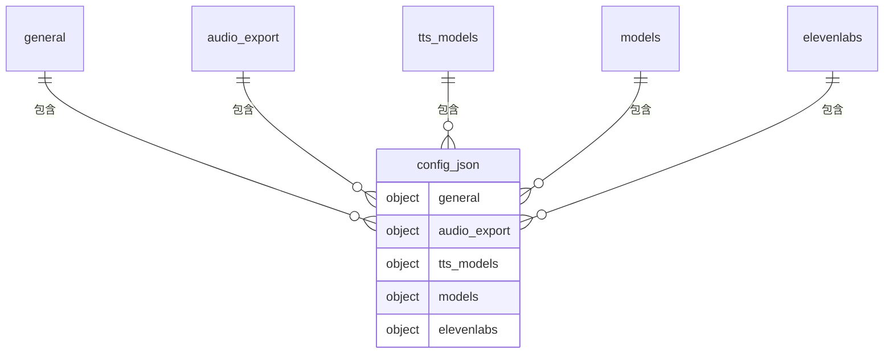
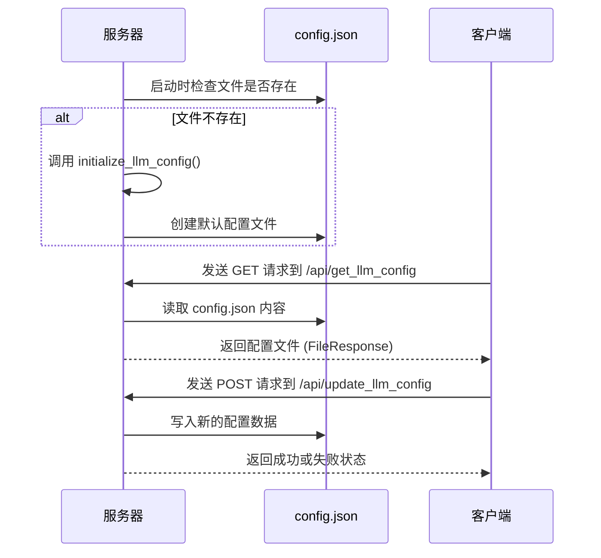

# 配置数据模型

<cite>
**Referenced Files in This Document**   
- [config.json](file://config.json)
- [serverV2.py](file://serverV2.py#L195-L244)
- [serverV2.py](file://serverV2.py#L247-L252)
- [serverV2.py](file://serverV2.py#L561-L593)
</cite>

## 目录
1. [简介](#简介)
2. [配置文件结构](#配置文件结构)
3. [初始化与加载机制](#初始化与加载机制)
4. [配置项详解](#配置项详解)
5. [实际配置示例](#实际配置示例)
6. [安全实践](#安全实践)
7. [常见配置错误排查](#常见配置错误排查)

## 简介
本文档旨在构建一个全面的配置数据模型，详细描述 `config.json` 文件的结构与作用。该文件是AI有声书工具的核心配置文件，定义了系统运行所需的各种参数，包括大语言模型（LLM）和文本转语音（TTS）服务的连接信息、代理设置、音频导出格式等。通过分析 `serverV2.py` 中的 `initialize_llm_config()` 函数和 `/api/get_llm_config` 端点，本文将阐明该配置文件的初始化逻辑和运行时加载机制。

## 配置文件结构
`config.json` 文件采用分层的JSON结构，主要包含五个顶级字段：`general`、`audio_export`、`tts_models`、`models` 和 `elevenlabs`。这种结构化的设计使得配置项逻辑清晰，易于维护和扩展。



**Diagram sources**
- [config.json](file://config.json)

## 初始化与加载机制
系统的配置管理遵循“创建-读取-更新”的生命周期。当系统首次启动时，会检查 `config.json` 文件是否存在。如果文件不存在，系统将调用 `initialize_llm_config()` 函数创建一个包含默认值的配置文件。一旦文件存在，系统便通过 `/api/get_llm_config` API端点在运行时动态加载配置。



**Diagram sources**
- [serverV2.py](file://serverV2.py#L195-L244)
- [serverV2.py](file://serverV2.py#L247-L252)

**Section sources**
- [serverV2.py](file://serverV2.py#L195-L244)
- [serverV2.py](file://serverV2.py#L247-L252)

## 配置项详解
本节将详细解释 `config.json` 文件中每个顶级字段及其子字段的含义和作用。

### general（通用设置）
`general` 字段定义了系统的全局默认行为。
- **default_model**: 指定默认使用的LLM模型。例如，`"gemini"` 表示系统将优先使用Gemini模型进行文本分析和处理。
- **proxy**: 包含代理服务器的配置。当 `enabled` 为 `true` 时，系统会通过指定的 `protocol`、`address` 和 `port` 连接代理，这对于访问被网络限制的API（如Gemini）至关重要。
- **default_tts_model**: 指定默认使用的TTS模型，如 `"cosyvoice_v2"`。

### audio_export（音频导出设置）
`audio_export` 字段控制最终生成的有声书文件的格式和质量。
- **format**: 导出的音频文件格式，如 `"mp3"`。
- **quality**: 音频质量，如 `"256k"` 表示256kbps的比特率。

### tts_models（TTS模型配置）
`tts_models` 是一个对象，其键为TTS模型的内部标识符，值为包含该模型详细信息的对象。
- **display_name**: 在用户界面中显示的名称。
- **endpoint**: TTS服务的API端点URL。系统通过向此URL发送请求来生成语音。

### models（LLM模型配置）
`models` 字段是配置的核心，为每个支持的LLM定义了详细的连接参数。
- **display_name**: 在用户界面中显示的名称。
- **model_name**: LLM服务提供商使用的具体模型名称（例如，`gemini-2.5-flash`）。
- **api_key**: 访问LLM服务所需的API密钥，是身份验证的关键。
- **max_chars**: 控制文本分块的最大字符数。当处理长篇小说时，系统会将文本分割成不超过此长度的块，以适应LLM的输入限制。
- **use_proxy**: 布尔值，决定该特定LLM模型是否使用 `general` 字段中定义的代理设置。

### elevenlabs（语音识别服务）
`elevenlabs` 字段用于存储与ElevenLabs语音识别服务相关的密钥。
- **api_key**: ElevenLabs服务的API密钥。

## 实际配置示例
以下是一个 `config.json` 文件的完整示例，展示了所有配置项的实际应用。

```json
{
    "general": {
        "default_model": "gemini",
        "proxy": {
            "enabled": true,
            "protocol": "socks5h",
            "address": "127.0.0.1",
            "port": "1080"
        },
        "default_tts_model": "cosyvoice_v2"
    },
    "audio_export": {
        "format": "mp3",
        "quality": "256k"
    },
    "tts_models": {
        "cosyvoice_v2": {
            "display_name": "CosyVoice2",
            "endpoint": "http://127.0.0.1:5010/api/tts"
        },
        "indextts_v1.5": {
            "display_name": "IndexTTS V1.5",
            "endpoint": "http://127.0.0.1:5020/api/tts"
        }
    },
    "models": {
        "gemini": {
            "display_name": "Gemini",
            "model_name": "gemini-2.5-flash",
            "api_key": "your_gemini_api_key_here",
            "max_chars": 8000,
            "use_proxy": true
        },
        "aliyun": {
            "display_name": "阿里云平台",
            "model_name": "deepseek-r1",
            "api_key": "your_aliyun_api_key_here",
            "max_chars": 6000,
            "use_proxy": false
        }
    },
    "elevenlabs": {
        "api_key": "your_elevenlabs_api_key_here"
    }
}
```

**Section sources**
- [config.json](file://config.json)

## 安全实践
API密钥是访问云服务的凭证，必须妥善保管。
- **切勿提交到版本控制**：`config.json` 文件应被添加到 `.gitignore` 文件中，以防止密钥意外泄露。
- **使用环境变量**：更安全的做法是将API密钥存储在环境变量中，并在代码中读取，而不是直接写在配置文件里。
- **定期轮换密钥**：定期更换API密钥可以降低密钥泄露后带来的风险。

## 常见配置错误排查
- **LLM调用失败**：首先检查 `api_key` 是否正确且未过期。其次，确认 `use_proxy` 和 `general.proxy.enabled` 的设置是否与网络环境匹配。如果使用代理，确保代理服务器正在运行且地址端口正确。
- **TTS生成失败**：检查 `tts_models` 中的 `endpoint` 是否正确，并确认对应的TTS服务（如CosyVoice）已启动并监听在指定端口。
- **配置无法保存**：确保运行服务器的用户对 `config.json` 文件有写入权限。
- **文本分块异常**：如果生成的JSON出现不完整或错误，检查 `max_chars` 设置是否过大，超出了LLM的上下文窗口限制。

**Section sources**
- [serverV2.py](file://serverV2.py#L561-L593)