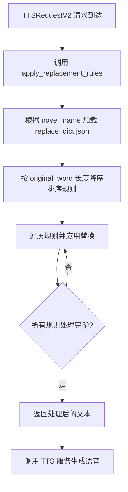

# 音色与替换数据模型

<cite>
**本文档引用的文件**   
- [serverV2.py](file://serverV2.py)
- [index.html](file://index.html)
</cite>

## 目录
1. [音色映射数据模型](#音色映射数据模型)
2. [替换规则数据模型](#替换规则数据模型)
3. [配置管理与生命周期](#配置管理与生命周期)
4. [数据处理流程](#数据处理流程)

## 音色映射数据模型

`character_timbres.json` 文件是音色映射的核心数据模型，其结构为一个简单的键值对字典。其中，**键（Key）** 为小说中的角色名称（如 "张三"、"李四"），**值（Value）** 为分配给该角色的音色名称（如 "男声_沉稳"、"女声_清脆"）。该文件存储在每个小说项目的根目录下（例如 `projects/我的小说/character_timbres.json`）。

在语音生成流程中，当 `TTSRequestV2` API 接收到一个文本生成请求时，它会携带 `speaker`（说话者）和 `timbre`（音色）字段。系统会利用 `character_timbres.json` 中的映射关系来验证或确定最终使用的音色。例如，如果 `TTSRequestV2` 指定了 `speaker="张三"`，系统会查询 `character_timbres.json` 以获取与 "张三" 关联的音色名，并将其用于 TTS 服务的调用。这种设计实现了角色名与具体音色文件的解耦，允许用户在不修改原始文本的情况下灵活地更换角色音色。

**Section sources**
- [serverV2.py](file://serverV2.py#L74-L78)
- [serverV2.py](file://serverV2.py#L385-L392)

## 替换规则数据模型

`replace_dict.json` 文件定义了文本替换规则，其结构是一个包含 `rules` 数组的 JSON 对象。`rules` 数组中的每个元素是一个规则对象，包含以下三个字段：
- **original_word**: 需要被替换的原始文本。
- **replacement_word**: 用于替换原始文本的新文本。
- **description**: 对该替换规则的可选描述，用于说明替换原因。

该文件同样存储在每个小说项目的根目录下（例如 `projects/我的小说/replace_dict.json`）。此模型允许用户定义特定的文本替换，例如将小说中的专有名词、易读错的字词或特殊符号进行预处理，以确保 TTS 生成的语音更加准确和自然。

**Section sources**
- [serverV2.py](file://serverV2.py#L142-L149)
- [serverV2.py](file://serverV2.py#L1959-L1980)

## 配置管理与生命周期

`character_timbres.json` 和 `replace_dict.json` 两个配置文件的生命周期与所属的小说项目紧密绑定。当一个新小说项目通过前端界面创建时，系统会自动在该项目目录下初始化这两个文件（如果不存在）。当项目被删除时，这两个文件及其所在目录也会被一并清除。

用户可以通过两种方式管理这些配置：
1.  **前端界面管理**：用户可以在前端界面中，通过“音色库”和“替换词典”等模块，直观地为角色分配音色或增删替换规则。这些操作会通过 `/api/update_config` 和 `/api/novel/{novel_name}/replace_dict` 等 API 接口，将变更持久化到对应的 JSON 文件中。
2.  **直接编辑文件**：高级用户也可以直接在文件系统中找到并编辑 `character_timbres.json` 和 `replace_dict.json` 文件。下次系统读取这些文件时，新的配置将生效。

**Section sources**
- [serverV2.py](file://serverV2.py#L87-L88)
- [serverV2.py](file://serverV2.py#L1982-L1997)
- [index.html](file://index.html#L3840-L3869)
- [index.html](file://index.html#L4029-L4061)

## 数据处理流程

文本替换规则的应用发生在 TTS 生成之前的关键环节。`apply_replacement_rules` 函数负责此流程。当 `TTSRequestV2` 请求到达后，系统会调用此函数，传入待处理的文本和小说名称。

处理流程如下：
1.  **加载规则**：函数根据小说名称，定位并加载其项目目录下的 `replace_dict.json` 文件。
2.  **规则排序**：为避免规则冲突（例如，"张" 被替换为 "zhang"，而 "张三" 被替换为 "zhangsan"），系统会按照 `original_word` 的长度进行**降序排序**。这确保了更长的、更具体的词组（如 "张三"）会优先于其子串（如 "张"）被替换，从而保证替换的准确性。
3.  **应用替换**：函数遍历排序后的规则列表，使用正则表达式对原始文本进行逐条替换。
4.  **返回结果**：经过所有规则处理后的文本将被返回，并作为最终输入传递给 TTS 服务。

此流程确保了在语音合成前，文本已经过用户自定义的规范化处理，提升了最终音频的质量。

**Diagram sources **
- [serverV2.py](file://serverV2.py#L521-L550)
- [serverV2.py](file://serverV2.py#L1728-L1861)

**Section sources**
- [serverV2.py](file://serverV2.py#L521-L550)
- [serverV2.py](file://serverV2.py#L1728-L1861)