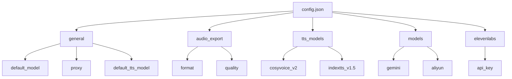
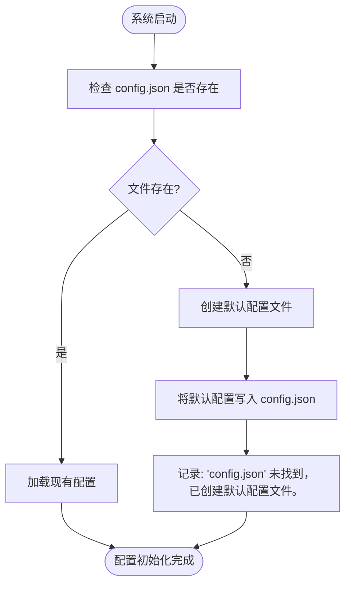
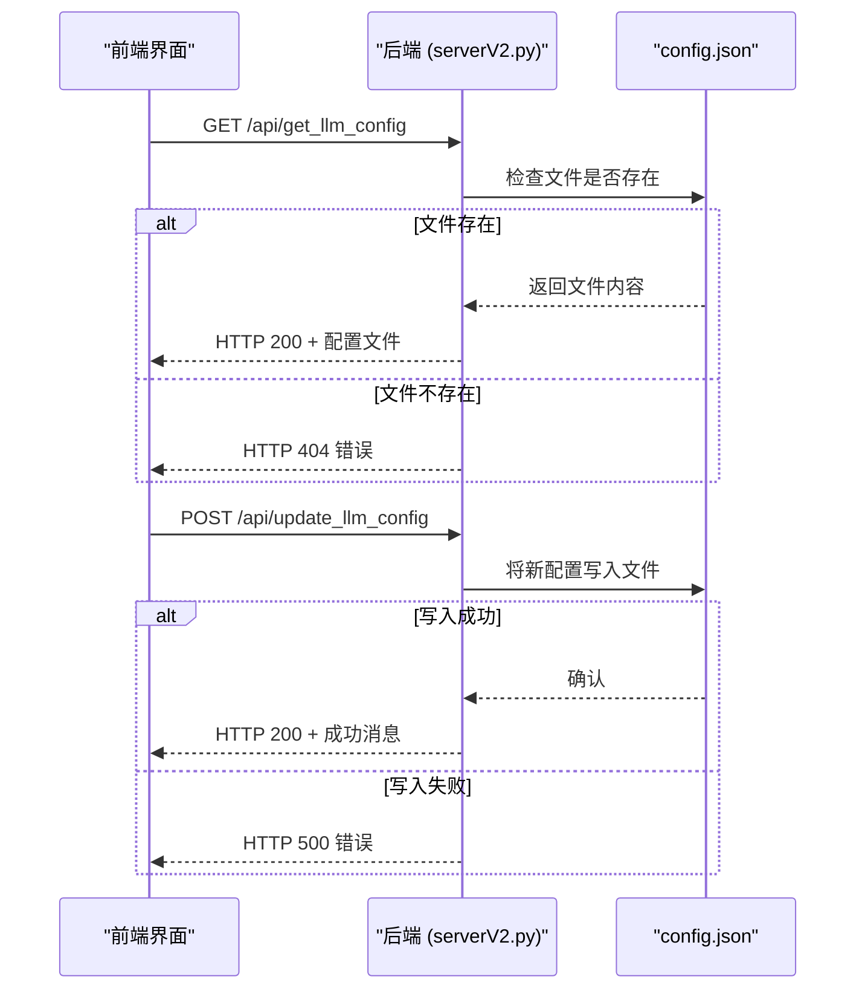

# 配置管理系统

<cite>
**Referenced Files in This Document**   
- [config.json](file://config.json)
- [serverV2.py](file://serverV2.py)
</cite>

## 目录
1. [简介](#简介)
2. [配置文件结构](#配置文件结构)
3. [配置初始化](#配置初始化)
4. [配置的运行时管理](#配置的运行时管理)
5. [配置项详解](#配置项详解)
6. [配置对系统行为的影响](#配置对系统行为的影响)
7. [安全考虑与最佳实践](#安全考虑与最佳实践)

## 简介
本系统通过 `config.json` 文件和 `serverV2.py` 中的配置管理函数，实现了一套完整的配置管理系统。该系统负责定义和管理文本转语音（TTS）及大语言模型（LLM）服务的各项参数。系统在启动时会检查并创建默认配置，并通过API端点支持运行时的配置读取与更新，确保了系统的灵活性和可维护性。

**Section sources**
- [config.json](file://config.json)
- [serverV2.py](file://serverV2.py#L195-L244)

## 配置文件结构
`config.json` 文件采用分层的JSON结构，将不同功能的配置项组织在独立的顶级键下。这种结构清晰地分离了关注点，便于用户理解和维护。

**Diagram sources**
- [config.json](file://config.json)

**Section sources**
- [config.json](file://config.json)

## 配置初始化
系统通过 `initialize_llm_config` 函数在启动时进行配置初始化。该函数定义了一个包含所有必要配置项的默认配置字典。当系统检测到 `config.json` 文件不存在时，会自动调用此函数，将默认配置写入文件并创建该文件。这确保了系统在首次运行或配置文件丢失时仍能正常启动。

**Diagram sources**
- [serverV2.py](file://serverV2.py#L195-L244)

**Section sources**
- [serverV2.py](file://serverV2.py#L195-L244)

## 配置的运行时管理
系统提供了两个API端点来实现配置的运行时管理，允许前端界面动态地读取和更新配置。

### 读取配置
`/api/get_llm_config` 端点用于获取当前的配置。当被调用时，它会检查 `config.json` 文件是否存在。如果文件存在，则通过 `FileResponse` 将其内容作为JSON文件返回给客户端；如果文件不存在，则抛出404错误。

### 更新配置
`/api/update_llm_config` 端点用于更新配置。它接收一个包含新配置数据的 `LLMConfigRequest` 对象。接收到请求后，服务器会将新的配置数据以格式化的方式（`indent=4`）写回 `config.json` 文件。操作成功后返回成功消息，失败则抛出500错误。

**Diagram sources**
- [serverV2.py](file://serverV2.py#L247-L262)

**Section sources**
- [serverV2.py](file://serverV2.py#L247-L262)

## 配置项详解
以下是 `config.json` 文件中各配置项的详细说明。

### general (通用设置)
- **default_model**: 字符串，指定系统默认使用的LLM模型ID（如 `gemini` 或 `aliyun`）。
- **proxy**: 对象，包含代理服务器的配置。
  - `enabled`: 布尔值，是否启用代理。
  - `protocol`: 字符串，代理协议（如 `socks5h`）。
  - `address`: 字符串，代理服务器地址。
  - `port`: 字符串，代理服务器端口。
- **default_tts_model**: 字符串，指定系统默认使用的TTS模型ID（如 `cosyvoice_v2`）。

### audio_export (音频导出设置)
- **format**: 字符串，指定最终导出的音频文件格式（如 `mp3`）。
- **quality**: 字符串，指定导出音频的质量（如 `256k`）。

### tts_models (TTS模型配置)
一个对象，其键为TTS模型ID，值为包含该模型信息的对象。
- **display_name**: 字符串，模型在界面上显示的名称。
- **endpoint**: 字符串，该TTS服务的API端点URL。

### models (LLM模型配置)
一个对象，其键为LLM模型ID，值为包含该模型信息的对象。
- **display_name**: 字符串，模型在界面上显示的名称。
- **model_name**: 字符串，传递给API的实际模型名称。
- **api_key**: 字符串，该模型服务的API密钥。
- **max_chars**: 整数，单次API调用处理的最大字符数。
- **use_proxy**: 布尔值，该模型是否使用代理。

### elevenlabs (ElevenLabs服务配置)
- **api_key**: 字符串，ElevenLabs服务的API密钥。

**Section sources**
- [config.json](file://config.json)

## 配置对系统行为的影响
配置文件中的各项设置直接决定了系统的核心行为。

- **代理设置**: 当某个LLM模型的 `use_proxy` 设置为 `true`，且 `general.proxy.enabled` 为 `true` 时，系统在调用该模型的API时会使用配置的代理。这在 `generate_with_gemini` 和 `generate_with_qwen` 等函数中通过构建 `proxies` 字典来实现。
- **默认TTS模型**: `general.default_tts_model` 的值决定了在没有明确指定TTS模型时，系统将调用哪个TTS服务的端点。前端界面会根据此配置初始化TTS模型选择器。

**Section sources**
- [serverV2.py](file://serverV2.py#L574-L580)
- [serverV2.py](file://serverV2.py#L768-L800)

## 安全考虑与最佳实践
- **API密钥保护**: 所有API密钥（如 `models.gemini.api_key` 和 `elevenlabs.api_key`）都应被视为敏感信息。`config.json` 文件不应被提交到版本控制系统（如Git）。建议在部署时通过环境变量注入密钥，或确保配置文件的访问权限受到严格限制。
- **配置验证**: 在更新配置时，系统应验证关键字段（如 `api_key`、`endpoint`）的有效性，避免因配置错误导致服务中断。
- **备份**: 在修改 `config.json` 文件前，建议先进行备份，以防止意外的配置丢失。

**Section sources**
- [config.json](file://config.json)
- [serverV2.py](file://serverV2.py#L256-L262)