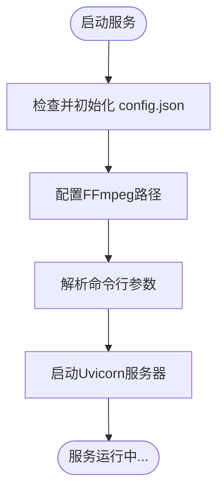

# 开发者指南

<cite>
**Referenced Files in This Document**   
- [README.md](file://README.md)
- [config.json](file://config.json)
- [serverV2.py](file://serverV2.py)
- [index.html](file://index.html)
- [style.css](file://style.css)
- [启动ServerV2.bat](file://启动ServerV2.bat)
</cite>

## 目录
1. [简介](#简介)
2. [项目结构](#项目结构)
3. [本地开发环境搭建](#本地开发环境搭建)
4. [服务运行与调试](#服务运行与调试)
5. [前端开发调试](#前端开发调试)
6. [代码贡献流程](#代码贡献流程)
7. [编码规范](#编码规范)
8. [扩展点机制](#扩展点机制)
9. [常见开发问题解决方案](#常见开发问题解决方案)
10. [结论](#结论)

## 简介

本《开发者指南》旨在为希望参与AI有声书制作工具开发或进行二次开发的用户提供全面的技术指导。该工具是一个集成了AI大语言模型（LLM）和文本转语音（TTS）技术的一体化工作台，支持使用Gemini或Deepseek等模型进行文章角色和对话分析，并能批量自动化生成小说章节的语音文件。本指南将详细介绍从环境搭建、服务运行、代码调试到贡献代码的完整开发流程。

**Section sources**
- [README.md](file://README.md#L1-L5)

## 项目结构

本项目的文件结构简洁明了，主要包含以下几个核心文件和目录：

```
.
├── README.md          # 项目说明文档
├── config.json        # 全局配置文件，定义了LLM、TTS模型等配置
├── index.html         # 前端主页面，包含所有用户界面和交互逻辑
├── serverV2.py        # 后端核心服务，基于FastAPI框架
├── style.css          # 前端样式表
└── 启动ServerV2.bat   # Windows平台的启动脚本
```

项目采用前后端分离的架构，`serverV2.py`作为后端API服务，通过FastAPI提供RESTful接口，而`index.html`和`style.css`则构成了完整的单页应用（SPA）前端，通过JavaScript与后端进行通信。

**Section sources**
- [README.md](file://README.md#L1-L5)
- [serverV2.py](file://serverV2.py#L35-L45)

## 本地开发环境搭建

为了顺利进行开发，您需要搭建一个完整的本地开发环境。

### 1. 安装Python 3.9+

本项目后端使用Python开发，需要Python 3.9或更高版本。请访问[Python官方网站](https://www.python.org/)下载并安装最新版本的Python。安装完成后，通过命令行验证安装是否成功：
```bash
python --version
```

### 2. 创建虚拟环境

强烈建议使用Python虚拟环境来隔离项目依赖，避免与其他项目产生冲突。
```bash
# 在项目根目录下创建虚拟环境
python -m venv venv

# 激活虚拟环境
# Windows:
venv\Scripts\activate
# macOS/Linux:
source venv/bin/activate
```

### 3. 安装Python依赖

项目依赖通过`pip`管理。在激活的虚拟环境中，安装以下核心依赖：
```bash
pip install fastapi uvicorn pydub requests
```
- `fastapi`: 用于构建后端API服务。
- `uvicorn`: 作为ASGI服务器，运行FastAPI应用。
- `pydub`: 用于音频处理，依赖于FFmpeg。
- `requests`: 用于发送HTTP请求，与外部API（如Gemini）通信。

### 4. 确保FFmpeg可用

`pydub`库需要FFmpeg来处理音频格式转换（如将WAV转换为MP3）。项目中已包含`ffmpeg-8.0-full_build`目录，启动脚本会自动将其添加到系统PATH中。如果您需要手动配置，请确保FFmpeg的`bin`目录路径已添加到您的系统环境变量中。

**Section sources**
- [serverV2.py](file://serverV2.py#L2508-L2515)
- [启动ServerV2.bat](file://启动ServerV2.bat#L2)

## 服务运行与调试

### 如何运行服务

服务可以通过两种方式启动：

1.  **使用启动脚本 (Windows)**：双击`启动ServerV2.bat`文件。该脚本会自动配置环境变量并启动Python服务。
2.  **使用命令行**：在项目根目录下，执行以下命令：
    ```bash
    python serverV2.py --host 127.0.0.1 --port 8000
    ```
    您可以通过`--host`和`--port`参数指定服务监听的地址和端口。

服务启动后，您可以在浏览器中访问`http://127.0.0.1:8000`来使用该工具。



**Diagram sources**
- [serverV2.py](file://serverV2.py#L2503-L2526)
- [启动ServerV2.bat](file://启动ServerV2.bat#L3)

**Section sources**
- [serverV2.py](file://serverV2.py#L2517-L2526)
- [启动ServerV2.bat](file://启动ServerV2.bat#L3)

### 调试后端代码

调试后端代码是开发过程中的重要环节。

1.  **添加日志**：项目中已使用Python的`logging`模块。您可以在`serverV2.py`中的任何位置添加`logger.info()`, `logger.warning()`或`logger.error()`语句来输出调试信息。这些信息会显示在控制台中。
    ```python
    logger.info(f"正在处理章节: {chapter_title}")
    ```

2.  **使用断点调试API端点**：您可以使用IDE（如PyCharm或VS Code）的调试功能。在您想要调试的API函数（如`text_to_speech_v2`）内部设置断点，然后以调试模式运行`serverV2.py`。当前端调用该API时，程序会在断点处暂停，您可以检查变量状态、调用栈等。

**Section sources**
- [serverV2.py](file://serverV2.py#L37-L38)

## 前端开发调试

前端代码主要由`index.html`和`style.css`构成，调试方法非常直接。

1.  **修改代码**：您可以直接使用文本编辑器打开`index.html`和`style.css`文件进行修改。例如，修改`index.html`中的按钮文字或`style.css`中的颜色变量。
2.  **刷新浏览器**：完成修改后，只需在浏览器中按`F5`或`Ctrl+R`刷新页面，即可立即看到更改效果。由于前端是静态文件，无需重启后端服务。

**Section sources**
- [index.html](file://index.html#L1-L800)
- [style.css](file://style.css#L1-L190)

## 代码贡献流程

我们欢迎社区贡献！请遵循以下流程：

1.  **Fork仓库**：在GitHub上Fork本项目仓库到您的个人账户。
2.  **创建特性分支**：在您的本地仓库中，基于`main`分支创建一个新的特性分支，例如`feature/add-new-tts-model`。
3.  **提交更改**：在该分支上进行代码修改和测试，然后提交您的更改。
4.  **推送分支**：将您的特性分支推送到您Fork的远程仓库。
5.  **提交Pull Request (PR)**：在GitHub上，从您的特性分支向原仓库的`main`分支提交一个PR。请在PR描述中清晰地说明您所做的更改和原因。

**Section sources**
- [README.md](file://README.md#L1-L5)

## 编码规范

为了保持代码库的整洁和一致性，请遵守以下编码规范：

- **Python (PEP8)**：遵循[PEP8](https://peps.python.org/pep-0008/)规范。使用4个空格进行缩进，函数和变量名使用小写下划线命名法（`snake_case`），类名使用驼峰命名法（`CamelCase`）。
- **JavaScript**：遵循一致的命名约定。变量和函数名使用小驼峰命名法（`camelCase`），常量使用大写下划线命名法（`UPPER_CASE`）。确保代码格式化良好，使用有意义的变量名。
- **HTML/CSS**：保持标签的语义化，CSS类名使用小写下划线命名法（`kebab-case`）。

**Section sources**
- [serverV2.py](file://serverV2.py#L1-L2526)
- [index.html](file://index.html#L1-L4203)
- [style.css](file://style.css#L1-L190)

## 扩展点机制

本项目设计了良好的扩展性，方便集成新功能。

### 如何添加新的LLM或TTS模型

1.  **修改 `config.json`**：
    - **LLM模型**：在`models`对象下添加一个新的模型配置，包含`display_name`、`model_name`、`api_key`等字段。
    - **TTS模型**：在`tts_models`对象下添加一个新的模型配置，包含`display_name`和`endpoint`（TTS服务的API地址）。
    ```json
    "models": {
        "my_new_model": {
            "display_name": "我的新模型",
            "model_name": "my-model-v1",
            "api_key": "",
            "max_chars": 5000,
            "use_proxy": false
        }
    }
    ```

2.  **修改 `serverV2.py` 中的调用逻辑**：
    - 找到`generate_chapter_json`函数，根据新的模型名称添加调用逻辑。
    - 找到`text_to_speech_v2`函数，确保新的TTS模型ID能被正确识别和调用。

### 如何集成新的音频特效

1.  **后端**：在`serverV2.py`中添加一个新的API端点，例如`/api/apply_effect`，接收音频文件和特效类型，使用`pydub`库应用相应的音频效果（如回声、变声等），然后返回处理后的音频。
2.  **前端**：在`index.html`的JavaScript代码中，为新的特效添加一个按钮或菜单项，并实现调用新API端点的逻辑。

**Section sources**
- [config.json](file://config.json#L16-L44)
- [serverV2.py](file://serverV2.py#L560-L591)
- [serverV2.py](file://serverV2.py#L1728-L1861)

## 常见开发问题解决方案

### CORS错误

如果前端与后端不在同一域名或端口下运行，可能会遇到CORS（跨域资源共享）错误。本项目已在`serverV2.py`中通过`CORSMiddleware`允许所有来源的请求，通常不会出现此问题。如果仍有问题，请检查`app.add_middleware`的配置。

### 文件路径问题

确保所有文件路径使用相对路径或通过`os.path.join()`构建，以保证在不同操作系统上的兼容性。例如，使用`os.path.join(ROOT_DIR, "ffmpeg-8.0-full_build", "bin", "ffmpeg.exe")`来定位FFmpeg。

### 依赖冲突

使用虚拟环境可以有效避免依赖冲突。如果遇到`pip`安装问题，可以尝试更新`pip`本身：
```bash
python -m pip install --upgrade pip
```
然后重新安装依赖。

**Section sources**
- [serverV2.py](file://serverV2.py#L48)
- [serverV2.py](file://serverV2.py#L36)
- [serverV2.py](file://serverV2.py#L40-L45)

## 结论

本指南为开发者提供了参与AI有声书制作工具开发的完整路线图。从搭建环境到贡献代码，每一步都已详细说明。该项目结构清晰，扩展性强，非常适合进行二次开发。遵循编码规范并利用好扩展点机制，您可以轻松地为项目添加新功能，共同推动工具的完善。