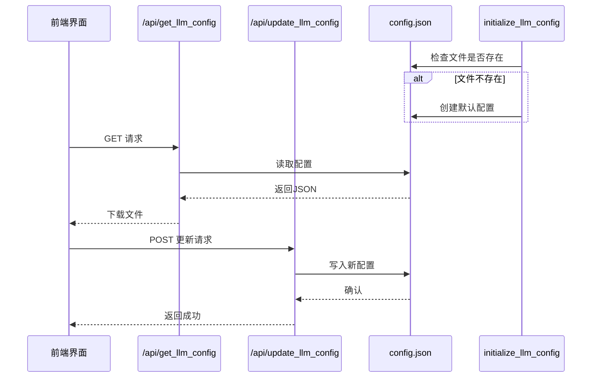

# 全局配置模型

<cite>
**Referenced Files in This Document**   
- [config.json](file://config.json)
- [serverV2.py](file://serverV2.py#L195-L262)
</cite>

## 目录
1. [简介](#简介)
2. [配置文件结构](#配置文件结构)
3. [核心字段详解](#核心字段详解)
4. [配置初始化与管理机制](#配置初始化与管理机制)
5. [JSON Schema 定义](#json-schema-定义)
6. [多模型配置示例](#多模型配置示例)
7. [前端安全管理](#前端安全管理)
8. [安全性与兼容性](#安全性与兼容性)

## 简介
`config.json` 是本应用的全局配置文件，位于项目根目录，负责控制整个系统的AI模型、TTS服务、音频导出等核心行为。该文件通过 `serverV2.py` 中的API进行读取和更新，是系统运行的基石。

## 配置文件结构
`config.json` 采用分层结构，主要包含以下顶级对象：
- **general**: 通用设置，如默认模型
- **audio_export**: 音频导出参数
- **tts_models**: TTS服务配置
- **models**: LLM模型配置
- **elevenlabs**: ElevenLabs服务密钥

**Section sources**
- [config.json](file://config.json#L1-L45)

## 核心字段详解

### models (LLM模型数组)
定义可用的大型语言模型，每个模型包含：
- **display_name**: 模型显示名称
- **model_name**: API实际调用的模型ID
- **api_key**: 访问API的密钥
- **max_chars**: 单次请求最大字符数
- **use_proxy**: 是否通过代理访问

### tts_models (TTS模型数组)
定义可用的文本转语音服务，每个服务包含：
- **display_name**: 服务显示名称
- **endpoint**: TTS服务的API端点URL

### default_model (默认LLM)
字符串字段，指定系统默认使用的LLM模型名称，如 "gemini" 或 "aliyun"。

### default_tts_model (默认TTS)
字符串字段，指定系统默认使用的TTS服务名称。

### audio_export_settings (音频导出设置)
对象字段，控制最终音频文件的导出质量：
- **format**: 导出格式（如 "mp3"）
- **quality**: 音频质量（如 "256k"）

**Section sources**
- [config.json](file://config.json#L1-L45)

## 配置初始化与管理机制



**Diagram sources**
- [serverV2.py](file://serverV2.py#L195-L262)

**Section sources**
- [serverV2.py](file://serverV2.py#L195-L262)

## JSON Schema 定义
```json
{
  "type": "object",
  "properties": {
    "general": {
      "type": "object",
      "properties": {
        "default_model": {"type": "string", "default": "gemini"},
        "proxy": {
          "type": "object",
          "properties": {
            "enabled": {"type": "boolean", "default": false},
            "protocol": {"type": "string", "default": "socks5h"},
            "address": {"type": "string", "default": "127.0.0.1"},
            "port": {"type": "string", "default": "1080"}
          },
          "required": ["enabled", "protocol", "address", "port"]
        },
        "default_tts_model": {"type": "string", "default": "cosyvoice_v2"}
      },
      "required": ["default_model", "proxy", "default_tts_model"]
    },
    "audio_export": {
      "type": "object",
      "properties": {
        "format": {"type": "string", "enum": ["mp3", "wav"], "default": "mp3"},
        "quality": {"type": "string", "enum": ["128k", "256k", "320k"], "default": "256k"}
      },
      "required": ["format", "quality"]
    },
    "tts_models": {
      "type": "object",
      "additionalProperties": {
        "type": "object",
        "properties": {
          "display_name": {"type": "string"},
          "endpoint": {"type": "string", "format": "uri"}
        },
        "required": ["display_name", "endpoint"]
      }
    },
    "models": {
      "type": "object",
      "additionalProperties": {
        "type": "object",
        "properties": {
          "display_name": {"type": "string"},
          "model_name": {"type": "string"},
          "api_key": {"type": "string"},
          "max_chars": {"type": "integer", "minimum": 1000},
          "use_proxy": {"type": "boolean"}
        },
        "required": ["display_name", "model_name", "api_key", "max_chars", "use_proxy"]
      }
    },
    "elevenlabs": {
      "type": "object",
      "properties": {
        "api_key": {"type": "string"}
      },
      "required": ["api_key"]
    }
  },
  "required": ["general", "audio_export", "tts_models", "models", "elevenlabs"]
}
```

## 多模型配置示例
```json
{
  "models": {
    "gemini": {
      "display_name": "Gemini",
      "model_name": "gemini-2.5-flash",
      "api_key": "your_gemini_key_here",
      "max_chars": 8000,
      "use_proxy": true
    },
    "aliyun": {
      "display_name": "阿里云平台",
      "model_name": "deepseek-r1",
      "api_key": "your_aliyun_key_here",
      "max_chars": 6000,
      "use_proxy": false
    }
  },
  "tts_models": {
    "cosyvoice_v2": {
      "display_name": "CosyVoice2",
      "endpoint": "http://127.0.0.1:5010/api/tts"
    }
  },
  "general": {
    "default_model": "gemini",
    "default_tts_model": "cosyvoice_v2"
  }
}
```

## 前端安全管理
前端全局设置界面通过以下方式安全地管理API密钥：
1. 使用 `/api/get_llm_config` API获取配置（密钥在传输中受HTTPS保护）
2. 在界面上提供输入框供用户填写或更新密钥
3. 通过 `/api/update_llm_config` API将更新后的配置写回服务器
4. 所有操作均需用户身份验证

**Section sources**
- [serverV2.py](file://serverV2.py#L247-L262)

## 安全性与兼容性
- **安全性**: `config.json` 文件不应被版本控制系统（如Git）追踪，以防止API密钥泄露。建议在部署时通过环境变量或安全密钥管理服务注入敏感信息。
- **版本兼容性**: 配置文件设计具有向后兼容性。新增字段应为可选，系统应能处理缺失的非关键字段。`initialize_llm_config` 函数确保在配置文件缺失时创建符合当前版本要求的默认配置。

**Section sources**
- [serverV2.py](file://serverV2.py#L195-L244)