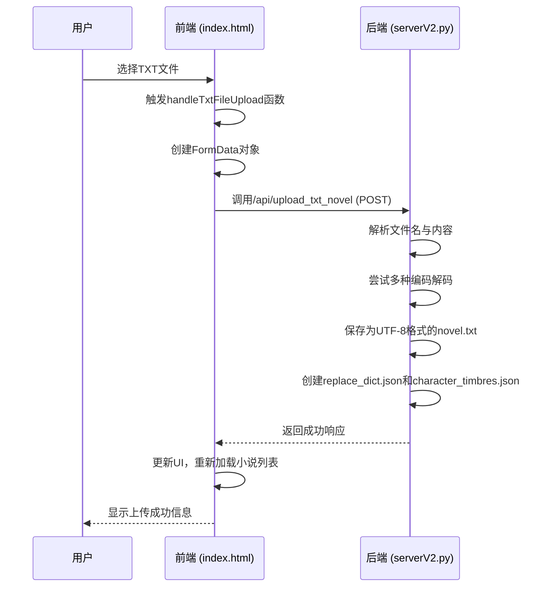

# 小说上传流程

<cite>
**本文档引用的文件**   
- [index.html](file://index.html)
- [serverV2.py](file://serverV2.py)
</cite>

## 目录
1. [小说上传流程](#小说上传流程)
2. [数据流详细说明](#数据流详细说明)
3. [文件处理与配置生成](#文件处理与配置生成)
4. [错误处理与反馈](#错误处理与反馈)
5. [潜在问题与优化建议](#潜在问题与优化建议)
6. [序列图](#序列图)

## 小说上传流程

用户在前端界面选择一个TXT文件进行上传。该操作触发前端JavaScript函数`handleTxtFileUpload`，该函数负责构建上传请求并调用后端API。后端使用FastAPI框架接收请求，处理文件并创建相应的项目目录和配置文件。

**Section sources**
- [index.html](file://index.html#L416-L417)
- [serverV2.py](file://serverV2.py#L1543-L1608)

## 数据流详细说明

当用户点击“上传新小说”按钮时，前端的事件监听器会触发`handleTxtFileUpload`函数。该函数首先禁用相关UI元素以防止用户重复操作，然后创建一个`FormData`对象，并将用户选择的TXT文件添加到该对象中。

接下来，函数使用`fetch` API向后端的`/api/upload_txt_novel`端点发起POST请求。请求体为包含文件的`FormData`对象。后端接收到请求后，解析文件名和内容，并开始后续的处理流程。

**Section sources**
- [index.html](file://index.html#L1263-L1307)
- [serverV2.py](file://serverV2.py#L1543-L1608)

## 文件处理与配置生成

后端接收到文件后，首先读取文件的二进制内容。为了确保文件能够正确解码，后端会尝试多种编码格式，包括`utf-8-sig`、`utf-8`、`gb18030`和`big5`。解码成功后，内容将被统一以UTF-8格式保存到`projects/`目录下的相应小说项目文件夹中，文件名为`source.txt`。

同时，系统会创建一个标记文件`.is_txt_project`，用于标识该项目为TXT上传项目。此外，系统还会调用`get_chapters_from_txt`函数解析文本内容，提取章节信息，并将章节列表缓存到`chapters_cache.json`文件中。最后，系统会生成两个初始配置文件：`replace_dict.json`和`character_timbres.json`，分别用于存储替换词典和角色音色配置。

**Section sources**
- [serverV2.py](file://serverV2.py#L1551-L1595)

## 错误处理与反馈

在文件上传和处理过程中，系统会进行多种错误处理。如果文件解码失败，系统会记录错误日志，并向用户反馈“所有编码尝试均失败，已为文件强制替换未知字符”的信息。如果文件保存或处理过程中出现异常，系统会返回500错误，并提供详细的错误信息。

前端在接收到后端的响应后，会根据响应状态更新UI。如果上传成功，前端会重新加载小说列表，并选中新上传的小说项目。如果上传失败，前端会显示错误信息，并恢复被禁用的UI元素。

**Section sources**
- [serverV2.py](file://serverV2.py#L1601-L1608)
- [index.html](file://index.html#L1300-L1306)

## 潜在问题与优化建议

在处理大文件上传时，可能会遇到超时问题。建议调整Uvicorn服务器的请求体大小限制和超时设置，以支持更大的文件上传。此外，可以考虑在前端增加文件大小验证，防止用户上传过大的文件。

另一个潜在问题是重复文件名的处理。当前系统会直接覆盖同名文件，建议增加文件名冲突检测机制，提示用户是否覆盖或重命名文件。

**Section sources**
- [serverV2.py](file://serverV2.py#L1547-L1548)

## 序列图

**Diagram sources **
- [index.html](file://index.html#L1263-L1307)
- [serverV2.py](file://serverV2.py#L1543-L1608)