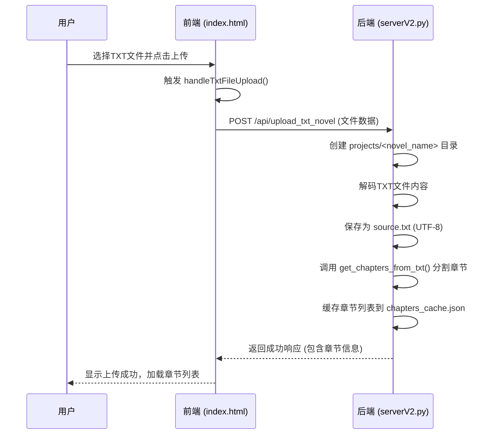
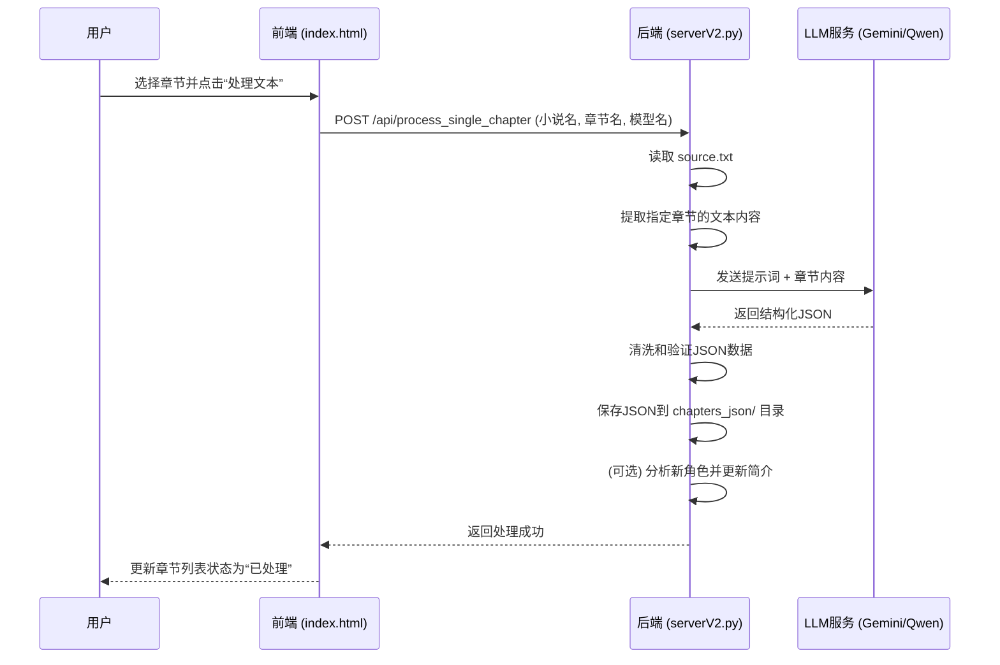
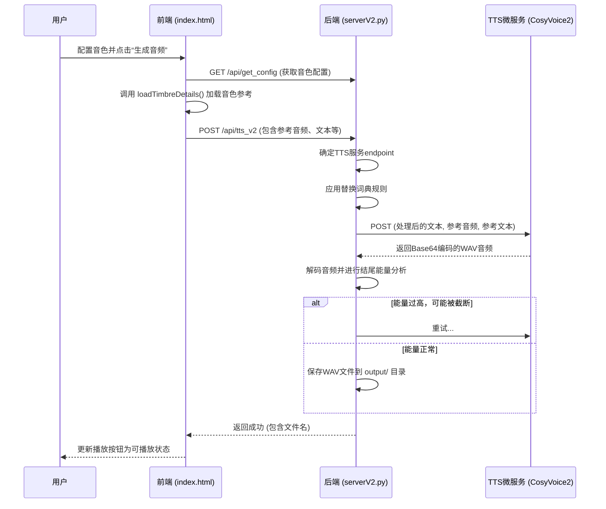
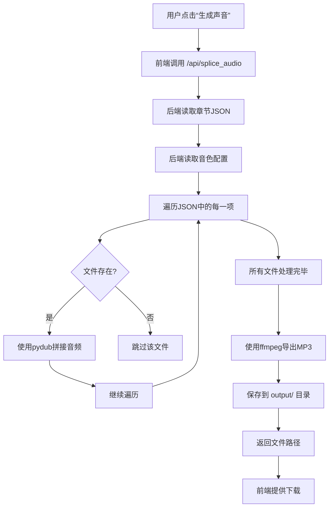

# 数据流与工作流

<cite>
**本文档引用的文件**   
- [serverV2.py](file://serverV2.py)
- [index.html](file://index.html)
- [config.json](file://config.json)
</cite>

## 目录
1. [小说上传流程](#小说上传流程)
2. [章节处理流程](#章节处理流程)
3. [语音生成流程](#语音生成流程)
4. [音频导出流程](#音频导出流程)
5. [用户工作流模式](#用户工作流模式)
6. [潜在瓶颈与优化策略](#潜在瓶颈与优化策略)

## 小说上传流程

该流程描述了用户如何将一个TXT格式的小说文件上传至系统，并由后端进行初步处理。

**前端流程**:
1.  用户在前端界面点击“上传新小说”按钮。
2.  前端触发 `handleTxtFileUpload` 函数，该函数通过 `FormData` 对象封装用户选择的TXT文件。
3.  前端通过 `fetch` API 向后端发起 `POST` 请求，调用 `/api/upload_txt_novel` 接口，并将文件数据作为请求体发送。

**后端流程**:
1.  后端接收到 `/api/upload_txt_novel` 请求，从 `FormData` 中提取文件。
2.  后端根据文件名（去除 `.txt` 后缀）创建一个以小说名称命名的项目目录，路径为 `projects/<novel_name>`。
3.  后端使用一个预定义的编码列表（`utf-8-sig`, `utf-8`, `gb18030`, `big5`）尝试解码文件内容，以兼容不同编码格式的TXT文件。
4.  解码成功后，后端将内容统一以 `UTF-8` 编码格式保存到项目目录下的 `source.txt` 文件中。
5.  后端调用 `get_chapters_from_txt` 函数，使用启发式规则智能地从 `source.txt` 中分割出章节列表。
6.  后端将分割出的章节标题缓存到 `chapters_cache.json` 文件中，以便前端快速加载。
7.  后端返回成功响应，包含处理后的章节信息。

**Diagram sources**
- [index.html](file://index.html#L1263-L1307)
- [serverV2.py](file://serverV2.py#L1543-L1599)

## 章节处理流程

该流程描述了用户如何将一个未处理的文本章节转换为结构化的JSON数据，为后续的语音生成做准备。

**前端流程**:
1.  用户在章节列表中选择一个或多个未处理的TXT章节。
2.  用户点击“处理文本”按钮。
3.  前端收集选中章节的信息，并向后端发起 `POST` 请求，调用 `/api/process_single_chapter` 接口。请求体中包含小说名称、章节标题和用户选择的LLM模型名称。

**后端流程**:
1.  后端接收到 `/api/process_single_chapter` 请求，根据小说名称和章节标题定位到 `source.txt` 文件。
2.  后端读取 `source.txt` 文件内容，并使用 `get_chapters_from_txt` 函数获取所有章节的映射。
3.  后端根据请求中的 `chapter_title` 提取出该章节的原始文本内容。
4.  后端调用 `generate_chapter_json` 函数，该函数会根据配置的LLM模型（如Gemini或Qwen）生成结构化JSON。
5.  `generate_chapter_json` 函数会将章节内容和一个预定义的提示词模板（`PROMPT_TEMPLATE`）发送给LLM API。
6.  LLM API返回一个JSON格式的响应，其中包含对话的说话者、内容、语气、强度和延迟等信息。
7.  后端对返回的JSON进行清洗和验证，移除无效内容。
8.  后端将处理后的JSON数据保存到 `projects/<novel_name>/chapters_json/<safe_title>.json` 文件中。
9.  后端还会分析新出现的角色，并更新 `character_profiles.json` 文件。

**Diagram sources**
- [index.html](file://index.html#L1399-L1508)
- [serverV2.py](file://serverV2.py#L1081-L1231)

## 语音生成流程

该流程描述了系统如何根据结构化的JSON数据，利用TTS服务为每一句对话生成对应的WAV音频文件。

**前端流程**:
1.  用户在角色配置界面为每个角色分配了音色。
2.  用户在内容编辑器中，可以为单个句子选择不同的音色、TTS模型和生成模式（如“普通”、“精细”、“指令”）。
3.  用户点击“生成音频”按钮。
4.  前端首先调用 `/api/get_config` 获取角色与音色的全局映射。
5.  前端根据当前行的配置，调用 `loadTimbreDetails` 函数，从 `/wav/<timbre_name>/1.wav` 和 `/wav/<timbre_name>/1.txt` 加载该音色的参考音频和参考文本。
6.  前端将参考音频（Base64编码）、参考文本、待生成的文本、角色名、音色名等信息打包成一个 `payload`。
7.  前端向后端发起 `POST` 请求，调用 `/api/tts_v2` 接口。

**后端流程**:
1.  后端接收到 `/api/tts_v2` 请求，解析 `payload`。
2.  后端根据 `tts_model` 参数或全局配置，确定要调用的TTS微服务的 `endpoint`。
3.  后端应用 `apply_replacement_rules` 函数，根据小说专属的替换词典对 `tts_text` 进行替换。
4.  后端将处理后的文本、参考音频、参考文本、推理模式和指令文本等信息，作为 `payload` 发送给指定的TTS微服务。
5.  TTS微服务（如CosyVoice2）接收到请求，生成对应的WAV音频数据，并以Base64编码返回。
6.  后端接收到TTS微服务的响应，解码Base64音频数据。
7.  后端对生成的音频进行结尾能量分析，判断是否可能被截断。如果能量过高，后端会自动进行重试。
8.  后端将最终的音频数据保存到 `output/<novel_name>/wavs/<chapter_name>/<index>-<speaker>-<timbre>.wav` 文件中。

**Diagram sources**
- [index.html](file://index.html#L2041-L2077)
- [serverV2.py](file://serverV2.py#L1728-L1855)

## 音频导出流程

该流程描述了系统如何将已生成的单句WAV音频文件按时间顺序拼接成完整的章节音频，并导出为MP3等格式。

**前端流程**:
1.  用户在章节列表中选择一个或多个已处理且已生成声音的章节。
2.  用户点击“生成声音”按钮。
3.  前端向后端发起 `POST` 请求，调用 `/api/splice_audio` 接口。请求体中包含小说名称和章节名称。

**后端流程**:
1.  后端接收到 `/api/splice_audio` 请求，根据小说名称和章节名称定位到 `chapters_json/<chapter_name>.json` 文件。
2.  后端读取该JSON文件，获取章节内所有句子的顺序和信息。
3.  后端读取 `character_timbres.json` 配置文件，获取角色与音色的全局映射。
4.  后端遍历JSON中的每一项，根据 `speaker` 和 `timbre_override`（或全局映射）确定应使用的音色。
5.  后端构建出该句子对应的WAV文件名（`<index>-<speaker>-<timbre>.wav`），并检查文件是否存在。
6.  后端使用 `pydub` 库，按顺序将所有存在的WAV文件进行拼接，形成一个完整的音频片段。
7.  后端根据 `config.json` 中的 `audio_export` 配置（如格式为 `mp3`，质量为 `256k`），调用 `ffmpeg` 将拼接后的音频导出为最终的MP3文件。
8.  导出的MP3文件被保存到 `output/<novel_name>/<chapter_name>.mp3`。
9.  后端返回包含文件路径的响应，前端可据此提供下载链接。

**Diagram sources**
- [index.html](file://index.html#L2079-L2227)
- [serverV2.py](file://serverV2.py#L1864-L1953)

## 用户工作流模式

系统支持两种主要的用户工作流模式，以满足不同用户的需求。

### 新用户快速上手工作流

此工作流旨在为新用户提供最简化的操作路径，快速获得最终的音频文件。

1.  **上传**: 用户上传TXT小说文件。
2.  **处理**: 用户点击“处理文本”按钮，系统自动使用默认模型处理所有章节。
3.  **生成**: 用户点击“生成声音”按钮，系统自动为所有已处理章节生成并拼接音频。
4.  **下载**: 用户点击“下载声音”按钮，获取最终的MP3文件。

在此模式下，用户无需关心角色配置、音色选择等细节，系统会使用默认配置完成所有工作。

### 高级用户精细化操作工作流

此工作流为高级用户提供全面的控制能力，以实现高质量的有声书制作。

1.  **上传与处理**: 与快速工作流相同。
2.  **角色与音色配置**: 用户在“角色-音色配置”面板中，为每个角色手动分配一个音色。用户可以上传新的音色并进行管理。
3.  **内容编辑**: 用户在“内容编辑器”中打开已处理的章节，可以：
    *   修改对话内容。
    *   为单个句子覆盖全局音色。
    *   选择不同的TTS模型和生成模式（如“指令”模式）。
    *   添加新的对话行。
4.  **单句生成**: 用户可以为编辑后的单个句子点击“生成音频”，实时试听效果。
5.  **批量生成与导出**: 在完成所有精细化调整后，用户点击“生成声音”进行批量处理和拼接，最后下载成品。

此模式下的数据路径更加复杂，涉及 `character_timbres.json` 的读写、单句WAV文件的生成与管理，以及更精细的权限控制。

## 潜在瓶颈与优化策略

### 潜在瓶颈点

1.  **LLM调用延迟**: 处理章节时调用Gemini或Qwen等LLM API是整个流程中最耗时的环节，其响应时间不稳定，是主要的性能瓶颈。
2.  **TTS生成延迟**: 调用TTS微服务生成单句音频也需要一定时间，尤其是在高并发或网络不佳的情况下。
3.  **长章节处理**: 对于非常长的章节，LLM API可能因输入长度限制而需要分块处理，增加了复杂性和时间。
4.  **I/O密集型操作**: 频繁的文件读写操作（如读取配置、保存JSON、拼接音频）在大量数据处理时可能成为瓶颈。

### 优化策略

1.  **异步与并行处理**: 前端的 `processAllAndSplice` 函数已经实现了对多个章节的串行处理。可以进一步优化为并行处理多个章节，以充分利用系统资源。
2.  **缓存机制**: 对LLM的处理结果进行缓存，避免对同一章节的重复处理。前端已通过 `chapters_cache.json` 实现了章节列表的缓存。
3.  **重试与容错**: 后端在调用TTS服务时实现了自动重试机制（`TTS_GENERATION_MAX_RETRIES`），并能通过分析音频结尾能量来判断是否需要重试，提高了系统的鲁棒性。
4.  **批量操作**: 提供“批量生成”和“批量下载”功能，减少用户的操作次数和API调用开销。
5.  **前端优化**: 使用 `navigator.wakeLock` API 防止长时间任务时屏幕休眠，提升用户体验。