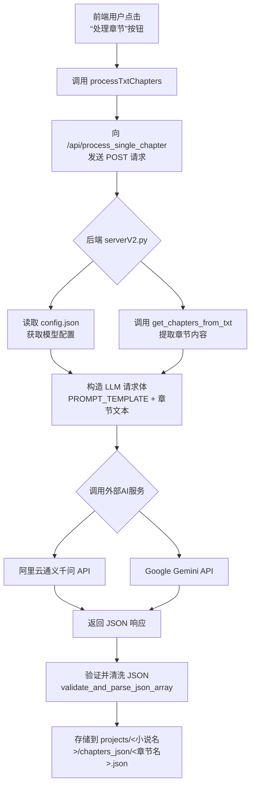

# 章节处理流程

<cite>
**Referenced Files in This Document**   
- [serverV2.py](file://serverV2.py)
- [config.json](file://config.json)
- [index.html](file://index.html)
</cite>

## 目录
1. [流程概述](#流程概述)
2. [前端调用](#前端调用)
3. [后端处理](#后端处理)
4. [LLM模型配置](#llm模型配置)
5. [重试与降级机制](#重试与降级机制)
6. [数据流图](#数据流图)

## 流程概述
本流程描述了用户在前端点击“处理章节”按钮后，系统如何将小说文本智能分割为章节，并通过大语言模型（LLM）进行语义分析，最终生成结构化JSON数据的完整过程。核心步骤包括：前端发起请求、后端调用LLM服务、处理响应并存储结果。该流程确保了对话、旁白、语气等信息被准确识别，并为后续的语音合成提供标准化输入。

## 前端调用
当用户在前端界面选择一个或多个章节并点击“处理章节”按钮时，前端会调用`processTxtChapters`函数。该函数会根据用户选择，逐个或批量地向后端的`/api/process_single_chapter`接口发起POST请求。请求体中包含小说名称（`novel_name`）、章节标题（`chapter_title`）以及用户在界面上选择的LLM模型名称（`model_name`）。此过程实现了用户操作与后端处理的无缝衔接。

**Section sources**
- [index.html](file://index.html#L392)
- [serverV2.py](file://serverV2.py#L1081)

## 后端处理
后端接收到`/api/process_single_chapter`请求后，执行以下核心逻辑：
1.  **章节提取**：通过`get_chapters_from_txt`函数，使用基于启发式规则的智能分割引擎，从`source.txt`文件中提取出所有章节的标题和内容。
2.  **LLM请求构造**：读取`config.json`中的配置，获取所选LLM模型（如Gemini或阿里云）的API密钥和参数。然后，将章节文本与预定义的`PROMPT_TEMPLATE`拼接，构造出符合要求的请求体。
3.  **调用外部AI服务**：根据配置的模型，调用`generate_with_gemini`或`generate_with_qwen`函数，向对应的AI服务（Google Generative Language API 或 阿里云通义千问API）发送请求。
4.  **结果处理与存储**：将AI服务返回的JSON响应进行验证和清洗（`clean_json_content`），然后将结果存储在对应项目的`chapters_json/`目录下，文件名为`<安全化章节标题>.json`。

**Section sources**
- [serverV2.py](file://serverV2.py#L1081-L1229)
- [serverV2.py](file://serverV2.py#L1234-L1373)
- [serverV2.py](file://serverV2.py#L152-L185)

## LLM模型配置
系统通过`config.json`文件管理不同的LLM模型配置。该文件定义了可用的模型（如`gemini`和`aliyun`），并为每个模型指定了显示名称、实际的模型ID（`model_name`）、API密钥、最大字符数（`max_chars`）以及是否使用代理。`process_single_chapter`函数会根据前端传入的`model_name`，从配置中读取相应的参数，确保请求能正确发送到指定的AI服务。

**Section sources**
- [config.json](file://config.json#L26-L40)
- [serverV2.py](file://serverV2.py#L560-L591)

## 重试与降级机制
系统实现了健壮的错误处理和降级策略，以应对网络波动或服务异常：
-   **重试机制**：在调用Gemini或阿里云API时，代码内置了`MAX_RETRIES`（默认3次）的重试逻辑。每次请求失败后，会等待5秒再进行下一次尝试，以提高在短暂网络问题下的成功率。
-   **上下文窗口溢出处理**：对于超过模型`max_chars`限制的长章节，`smart_chunk_text`函数会智能地将文本分割成多个块，在自然停顿处（如句号、换行符）进行切分，然后逐块发送给LLM处理，最后将结果合并。
-   **LLM响应异常降级**：虽然当前代码主要依赖LLM，但`validate_and_parse_json_array`函数的存在为降级提供了基础。如果LLM返回的不是有效JSON，该函数会返回`None`，理论上可以在此处插入备用方案（如基于规则的正则匹配）来生成一个简化的JSON结构，但现有代码中未完全实现此降级路径。

**Section sources**
- [serverV2.py](file://serverV2.py#L264-L314)
- [serverV2.py](file://serverV2.py#L316-L355)
- [serverV2.py](file://serverV2.py#L947-L984)
- [serverV2.py](file://serverV2.py#L511-L518)

## 数据流图
以下流程图展示了从前端用户操作到数据存储的完整数据路径。

**Diagram sources **
- [index.html](file://index.html#L392)
- [serverV2.py](file://serverV2.py#L1081)
- [serverV2.py](file://serverV2.py#L1234)
- [serverV2.py](file://serverV2.py#L152)
- [serverV2.py](file://serverV2.py#L264)
- [serverV2.py](file://serverV2.py#L316)
- [serverV2.py](file://serverV2.py#L511)
- [serverV2.py](file://serverV2.py#L560)

**Section sources**
- [index.html](file://index.html#L392)
- [serverV2.py](file://serverV2.py#L1081-L1229)
- [serverV2.py](file://serverV2.py#L1234-L1373)
- [serverV2.py](file://serverV2.py#L152-L185)
- [serverV2.py](file://serverV2.py#L264-L314)
- [serverV2.py](file://serverV2.py#L316-L355)
- [serverV2.py](file://serverV2.py#L511-L518)
- [serverV2.py](file://serverV2.py#L560-L591)
- [config.json](file://config.json#L26-L40)