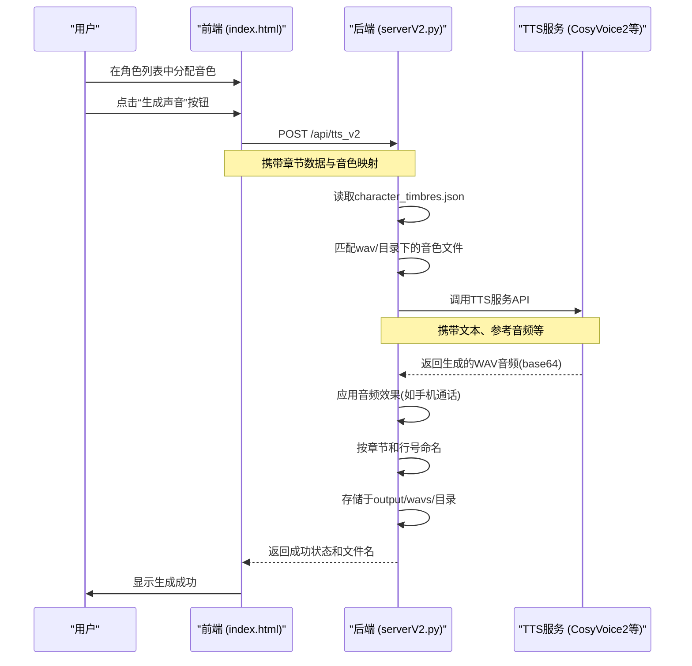

# 语音生成流程

<cite>
**本文档引用的文件**   
- [serverV2.py](file://serverV2.py)
- [index.html](file://index.html)
- [config.json](file://config.json)
</cite>

## 目录
1. [引言](#引言)
2. [端到端生成流程](#端到端生成流程)
3. [TTS模型配置与切换机制](#tts模型配置与切换机制)
4. [音色管理与匹配逻辑](#音色管理与匹配逻辑)
5. [音频生成与预处理](#音频生成与预处理)
6. [性能优化与重试策略](#性能优化与重试策略)
7. [前端音频预览功能](#前端音频预览功能)

## 引言
本文档旨在全面阐述AI有声书工具中从文本到语音的完整生成流程。该流程始于用户在前端界面完成角色音色的分配，终于后端生成并存储音频文件。核心流程涉及前端调用后端API，后端根据配置调用本地或远程TTS服务，并对生成的音频进行预处理和存储。本文档将结合`serverV2.py`中的API端点与`index.html`中的用户交互，详细说明整个系统的实现细节。

## 端到端生成流程

**Diagram sources**
- [serverV2.py](file://serverV2.py#L1728-L1855)
- [index.html](file://index.html#L2541-L2584)

**Section sources**
- [serverV2.py](file://serverV2.py#L1728-L1855)
- [index.html](file://index.html#L2541-L2584)

## TTS模型配置与切换机制

系统支持通过配置文件灵活切换不同的TTS模型。模型的配置和默认设置在`config.json`文件中定义。

**TTS模型配置表**

| 配置项 | 说明 |
| :--- | :--- |
| `general.default_tts_model` | 全局默认TTS模型ID，如`cosyvoice_v2` |
| `tts_models` | TTS模型配置对象，包含多个模型 |
| `tts_models.{model_id}.display_name` | 模型在前端显示的名称 |
| `tts_models.{model_id}.endpoint` | TTS服务的API端点URL |

当接收到`/api/tts_v2`请求时，后端会执行以下模型选择逻辑：
1.  检查请求中是否包含`tts_model`字段。
2.  如果包含且该模型ID存在于`config.json`的`tts_models`配置中，则使用该模型。
3.  否则，使用`general.default_tts_model`中配置的默认模型。
4.  根据选定的模型ID，获取其`endpoint`，并作为目标URL调用TTS微服务。

此机制允许用户在全局设置中更改默认模型，或在生成特定句子时通过API参数指定模型，实现了灵活的模型切换。

**Section sources**
- [config.json](file://config.json#L1-L45)
- [serverV2.py](file://serverV2.py#L1735-L1746)

## 音色管理与匹配逻辑

音色管理是生成个性化语音的关键。系统通过`character_timbres.json`文件来维护角色与音色的映射关系。

**音色匹配流程：**
1.  **前端分配**：用户在前端界面为角色分配音色，此操作会更新`state.characterMapping`对象。
2.  **保存配置**：当用户点击“保存当前配置”时，前端会将`state.characterMapping`作为`config_data`发送到后端的`/api/update_config`端点。
3.  **后端存储**：后端将接收到的配置数据保存为`{novel_name}/character_timbres.json`文件。
4.  **生成时匹配**：当调用`/api/tts_v2`生成语音时，后端会读取`character_timbres.json`文件，根据请求中的`speaker`（说话者）查找对应的`timbre`（音色）。
5.  **音色文件定位**：找到音色名后，后端会去`wav/`目录下查找以该音色名命名的文件夹，并从中读取`1.wav`（参考音频）和`1.txt`（参考文本）作为TTS服务的输入。

**音色缺失处理：**
如果在`character_timbres.json`中找不到某个角色的音色映射，后端在生成该角色的语音时会因缺少必要的参考音频而失败。前端应确保所有需要生成语音的角色都已分配了有效的音色。

**Section sources**
- [serverV2.py](file://serverV2.py#L1715-L1724)
- [serverV2.py](file://serverV2.py#L1847-L1848)
- [index.html](file://index.html#L2541-L2584)

## 音频生成与预处理

音频生成过程由后端`/api/tts_v2`端点驱动，生成后支持多种预处理操作。

**生成与预处理流程：**
1.  **TTS调用**：后端根据选定的TTS模型，将处理后的文本、参考音频（base64编码）、参考文本等信息打包成`payload`，通过HTTP POST请求发送到TTS服务的`endpoint`。
2.  **音频效果应用**：系统支持在已生成的音频上应用效果。通过调用`/api/apply_effect`端点，可以为指定的WAV文件添加“手机通话”、“喇叭喊话”等效果。这些效果通过`pydub`库的滤波、增益、重采样等操作实现。
3.  **文件命名与存储**：生成的音频文件按照`{行号:04d}-{角色名}-{音色名}.wav`的格式命名，例如`0001-张三-青年男声.wav`。文件被存储在`output/wavs/{章节名}/`目录下，便于管理和后续的拼接。

**Section sources**
- [serverV2.py](file://serverV2.py#L1748-L1757)
- [serverV2.py](file://serverV2.py#L1376-L1429)
- [serverV2.py](file://serverV2.py#L1844-L1854)

## 性能优化与重试策略

为确保生成过程的稳定性和效率，系统实现了并发生成、缓存机制和重试策略。

**性能优化建议：**
*   **并发生成**：前端可以并行调用多个`/api/tts_v2`请求，以同时生成不同章节或同一章节内的多行文本，显著缩短总生成时间。
*   **缓存已生成片段**：系统会检查`output/wavs/`目录下是否已存在对应文件。如果存在，可以跳过生成，直接使用缓存的音频，避免重复计算。

**生成失败重试策略：**
后端在`/api/tts_v2`端点内部实现了重试机制：
1.  当调用TTS服务失败时，后端会自动进行重试，最大重试次数由`TTS_GENERATION_MAX_RETRIES`常量定义（默认为5次）。
2.  除了网络错误，系统还通过分析生成音频结尾的能量（dBFS）来判断是否可能被截断。如果结尾能量过高，系统会认为生成不完整，并进行重试。
3.  在多次重试中，系统会记录并保存“最不戛然而止”的音频作为最佳结果，即使最终未能通过所有检查，也能提供一个相对完整的音频文件。

**Section sources**
- [serverV2.py](file://serverV2.py#L1764-L1838)
- [serverV2.py](file://serverV2.py#L53-L55)

## 前端音频预览功能

前端`index.html`实现了音频预览功能，允许用户在生成前试听音色。

**预览功能实现：**
1.  **音色库预览**：在“音色库”面板中，每个音色条目都包含一个“播放”按钮（▶）。点击该按钮会触发`toggleSimpleAudio`函数。
2.  **播放逻辑**：该函数会根据音色名称，构造出`/wav/{音色名}/1.wav`的URL，并使用HTML5 Audio API进行播放。
3.  **用户体验**：此功能使用户能够快速评估不同音色的效果，从而做出更合适的分配决策，是生成流程中重要的交互环节。

**Section sources**
- [index.html](file://index.html#L2541-L2584)
- [index.html](file://index.html#L2429-L2456)