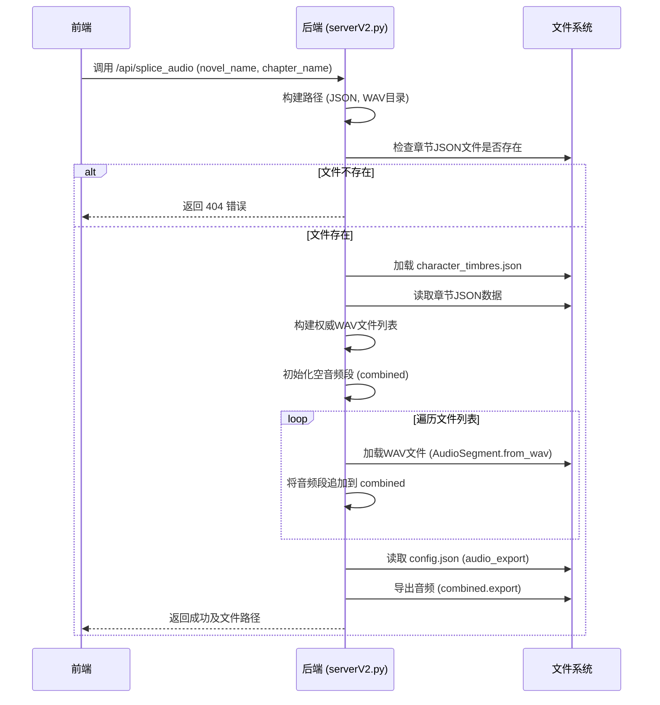

# 音频导出流程

<cite>
**Referenced Files in This Document**   
- [serverV2.py](file://serverV2.py)
- [config.json](file://config.json)
</cite>

## 目录
1. [简介](#简介)
2. [核心组件](#核心组件)
3. [拼接与导出流程](#拼接与导出流程)
4. [内存优化与资源管理](#内存优化与资源管理)
5. [拼接顺序校验机制](#拼接顺序校验机制)
6. [高并发风险与解决方案](#高并发风险与解决方案)

## 简介
本文档详细说明了AI有声书工具中音频拼接与导出的完整流程。当用户在前端点击“拼接并导出”按钮时，系统会触发后端的音频处理逻辑。该流程基于`serverV2.py`中的`splice_audio`函数，利用`pydub`库将已生成的WAV音频片段按章节JSON文件中的时间轴信息（`delay`字段）进行顺序拼接，并最终导出为MP3格式。文档将深入解析其代码级实现，涵盖内存优化、ID3标签写入、拼接校验等关键环节。

## 核心组件

**Section sources**
- [serverV2.py](file://serverV2.py#L1864-L1956)
- [config.json](file://config.json#L12-L15)

## 拼接与导出流程

该流程始于前端调用`/api/splice_audio`接口，后端`splice_audio`函数接收`SpliceRequest`请求，其核心步骤如下：

1.  **路径构建与验证**：函数首先根据请求中的`novel_name`和`chapter_name`构建项目目录、章节JSON文件路径和WAV片段输入目录的路径。它会检查章节JSON文件是否存在，若不存在则抛出404异常。

2.  **配置与数据加载**：函数加载`character_timbres.json`文件以获取角色与音色的映射关系，并读取章节的JSON数据，该数据包含了每个音频片段的说话者、语气、强度和延迟时间等信息。

3.  **权威文件列表构建**：为确保与前端逻辑一致，后端会根据章节JSON数据**重新构建**一个权威的待拼接文件列表。此过程会：
    *   遍历JSON中的每一项。
    *   确定每个片段应使用的音色（优先使用`timbre_override`，否则从`character_timbres`中查找）。
    *   使用索引、说话者和音色名称安全地构建WAV文件名（如`0001-旁白-标准男声.wav`）。
    *   将所有有效文件名加入列表。

4.  **音频拼接**：使用`pydub.AudioSegment.empty()`创建一个空的音频段，然后遍历权威文件列表，将每个存在的WAV文件通过`AudioSegment.from_wav()`加载并使用`+=`操作符追加到空音频段上。此操作会自动处理音频的连接。

5.  **导出与格式化**：拼接完成后，函数从`config.json`中读取`audio_export`配置，确定输出格式（如MP3）和质量（如256k）。随后，调用`combined.export()`方法，将拼接好的音频导出到`output/`目录下的指定路径。导出参数（如比特率）会根据配置动态设置。



**Diagram sources**
- [serverV2.py](file://serverV2.py#L1864-L1956)

**Section sources**
- [serverV2.py](file://serverV2.py#L1864-L1956)
- [config.json](file://config.json#L12-L15)

## 内存优化与资源管理

### 内存优化（分段读写）
在分析的代码中，**并未实现显式的分段读写或流式处理**。当前的`splice_audio`函数会将所有待拼接的WAV文件一次性加载到内存中，形成一个巨大的`AudioSegment`对象，然后再一次性导出。对于非常大的音频文件或包含大量片段的章节，这可能会导致高内存占用。

**改进建议**：为了优化内存，可以采用分段导出策略。例如，可以设置一个缓冲区，当拼接的音频达到一定时长（如5分钟）时，立即将其导出到一个临时文件，然后清空内存中的`combined`对象，继续处理后续片段。最后，再将这些临时文件合并为最终文件。这种方法可以将内存占用控制在一个恒定水平。

### ID3标签写入
在分析的代码中，**当前版本并未实现ID3标签的写入功能**。`pydub`的`export`方法支持通过`tags`参数添加ID3标签，但`splice_audio`函数在调用`export`时并未传递此参数。

**实现方案**：可以在导出前，从`config.json`或章节元数据中提取小说名、章节标题等信息，并将其作为`tags`字典传入`export`方法。例如：
```python
tags = {
    "title": chapter_title,
    "artist": "AI有声书",
    "album": novel_name,
    "track": chapter_number
}
combined.export(output_path, format=output_format, tags=tags, **export_params)
```

## 拼接顺序错乱的校验机制

系统通过**构建权威文件列表**的机制来防止拼接顺序错乱。

1.  **前端与后端逻辑同步**：前端在生成音频时，会根据相同的规则（角色、音色）生成WAV文件名。后端在拼接时，不依赖前端传来的文件列表（`wav_files`字段已被忽略），而是**完全基于章节JSON数据和`character_timbres.json`配置，重新计算并生成文件名**。

2.  **索引驱动的顺序**：文件名中的`{i:04d}`部分（如`0001`）直接来源于JSON数据的索引。这确保了文件是严格按照JSON中定义的顺序被加载和拼接的，从根本上避免了因文件系统排序或前端传参错误导致的顺序问题。

3.  **完整性校验**：在拼接前，函数会检查权威文件列表是否为空。如果为空，则返回错误，提示没有可拼接的文件。在拼接过程中，如果某个文件不存在，会记录警告但跳过该文件，保证流程继续。

## 高并发风险与解决方案

### 资源竞争风险
当多个用户或同一用户多次点击“拼接并导出”时，可能会产生高并发请求，带来以下风险：
1.  **文件写入冲突**：多个`splice_audio`进程可能同时尝试向`output/`目录下的同一个文件写入数据，导致文件损坏或内容混乱。
2.  **磁盘I/O瓶颈**：并发的音频加载和导出操作会产生大量的磁盘读写，可能导致系统I/O负载过高，响应变慢。
3.  **CPU与内存压力**：`pydub`的音频处理是CPU密集型操作，大量并发请求会迅速耗尽CPU资源，并因多个大音频段同时存在于内存而导致内存溢出。

### 解决方案
1.  **请求队列与限流**：在后端引入一个任务队列（如Celery + Redis），将拼接请求放入队列中，由后台工作进程按顺序处理。这可以将并发请求转化为串行处理，从根本上避免资源竞争。
2.  **文件锁机制**：在`splice_audio`函数开始执行时，为每个`novel_name`和`chapter_name`组合创建一个临时的锁文件。如果锁文件已存在，说明有其他进程正在处理同一章节，则新请求应返回“处理中”的状态，而不是立即执行。
3.  **资源监控与降级**：监控服务器的CPU、内存和磁盘I/O使用率。当资源使用超过阈值时，可以拒绝新的拼接请求或将其放入更长的等待队列，防止系统崩溃。

**Section sources**
- [serverV2.py](file://serverV2.py#L1864-L1956)