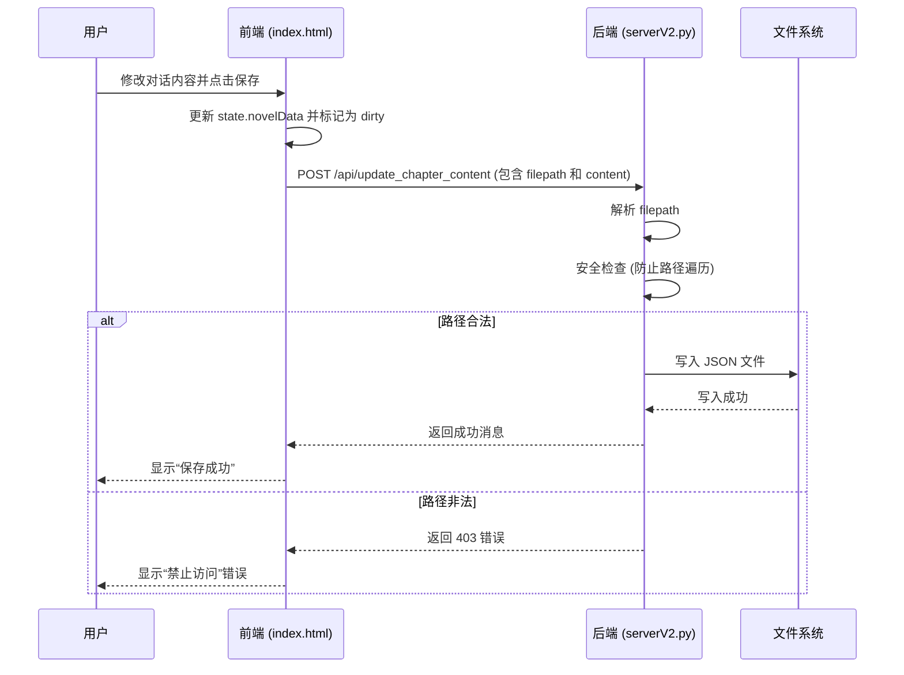

# 内容编辑

<cite>
**本文档引用的文件**   
- [index.html](file://index.html)
- [serverV2.py](file://serverV2.py)
</cite>

## 目录
1. [介绍](#介绍)
2. [表格化编辑器设计](#表格化编辑器设计)
3. [编辑操作流程](#编辑操作流程)
4. [数据安全与完整性](#数据安全与完整性)
5. [数据丢失预防与冲突解决](#数据丢失预防与冲突解决)
6. [快捷键与功能扩展](#快捷键与功能扩展)

## 介绍
本系统为AI有声书制作工具，提供一个集成的Web工作台，用于管理小说项目、处理文本、配置角色音色，并生成高质量的有声书。其核心功能之一是内容编辑，允许用户以表格形式直观地修改已处理章节的对话内容和说话者。本文档将系统性地介绍该功能的实现细节。

## 表格化编辑器设计

内容编辑功能的核心是`renderContentTable`函数，它负责将章节的JSON数据渲染为一个可交互的HTML表格。当用户在左侧章节列表中选择一个已处理的章节时，前端会通过`loadSingleChapterForEditing`函数从服务器获取该章节的JSON内容，并将其存储在全局状态`state.novelData`中。

随后，`renderContentTable`函数遍历`state.novelData`数组，为每一项生成一个HTML表格行（`<tr>`）。每一行包含以下列：
*   **操作**: 包含“删除行”和“插入行”按钮，用于动态修改表格结构。
*   **序号**: 显示该行在章节中的顺序。
*   **角色**: 显示说话者名称。
*   **音色**: 一个下拉选择框，允许用户为该行选择或更改音色。
*   **内容**: 一个可编辑的单元格（`contenteditable="true"`），用户可以直接在此修改对话文本。
*   **TTS模型**: 一个下拉选择框，用于选择生成该行音频所使用的TTS模型。
*   **操作**: 包含“生成音频”、“播放”按钮以及“特效”和“模式”设置。

此设计将结构化的JSON数据转换为用户友好的表格界面，支持动态的行插入和删除，极大地提升了编辑效率。

**Section sources**
- [index.html](file://index.html#L1857-L1971)

## 编辑操作流程

用户的编辑操作遵循一个清晰的流程：修改内容或角色 -> 点击保存按钮 -> 触发后端API更新。

1.  **前端事件绑定**:
    *   **内容修改**: 当用户在“内容”单元格中输入并失去焦点（`blur`事件）时，`dom.contentTableBody`的事件监听器会捕获该事件。它会获取新的文本内容，并与`state.novelData`中的原始内容进行比较。如果内容有变化，则更新`state.novelData`中的对应项，并调用`markChapterAsDirty()`函数。
    *   **行操作**: “删除行”和“插入行”按钮的点击事件会直接修改`state.novelData`数组（使用`splice`方法），然后重新调用`renderContentTable()`刷新视图。
    *   **保存**: “保存对本章节的修改”按钮（`saveChapterBtn`）绑定一个点击事件监听器。当用户点击时，它会收集当前`state.selectedChapterPaths`（文件路径）和`state.novelData`（修改后的内容），并准备发送请求。

2.  **后端文件写入**:
    *   前端通过`fetch`函数向`/api/update_chapter_content`端点发起一个POST请求。
    *   后端由`serverV2.py`中的`update_chapter_content`函数处理此请求。该函数接收一个`UpdateChapterRequest`对象，其中包含`filepath`和`content`。
    *   函数首先解析`filepath`，将其拆分为小说名称和章节文件名，然后构建服务器上的绝对路径。
    *   **安全控制**: 为防止路径遍历攻击，函数会检查构建的绝对路径是否以`PROJECTS_DIR`（即`projects`目录）为根。如果路径试图访问`projects`目录之外的文件，将返回403禁止访问的错误。
    *   最后，函数将`req.content`（即修改后的JSON数组）写入到对应的JSON文件中，完成更新。

**Diagram sources**
- [index.html](file://index.html#L3840-L3857)
- [serverV2.py](file://serverV2.py#L2009-L2046)

**Section sources**
- [index.html](file://index.html#L3818-L3857)
- [serverV2.py](file://serverV2.py#L2009-L2046)

## 数据安全与完整性

系统在数据持久化过程中实施了严格的安全控制，以确保文件系统的安全。

*   **路径遍历防护**: 如上所述，`update_chapter_content`函数通过`os.path.abspath(full_path).startswith(project_root)`来验证文件路径。这确保了所有文件操作都被限制在预定义的`PROJECTS_DIR`（`projects`）目录内，有效防止了恶意用户通过构造特殊路径来读取或覆盖服务器上的任意文件。
*   **输入验证**: 后端API使用Pydantic模型（`UpdateChapterRequest`）进行输入验证，确保`filepath`和`content`字段存在且类型正确。
*   **异常处理**: 文件写入操作被包裹在try-catch块中。如果写入失败（例如，磁盘空间不足或权限问题），后端会捕获异常，记录错误日志，并返回一个500内部服务器错误，告知用户保存失败。

这些措施共同保障了用户数据和服务器环境的安全与完整。

**Section sources**
- [serverV2.py](file://serverV2.py#L2029-L2046)

## 数据丢失预防与冲突解决

为了提升用户体验并防止数据丢失，系统实现了以下机制：

*   **数据丢失预防 (自动保存草稿)**:
    *   系统通过`markChapterAsDirty()`函数来跟踪章节的修改状态。每当用户修改内容、插入或删除行时，该函数都会被调用。
    *   该函数的主要作用是将“保存”按钮（`saveChapterBtn`）的禁用状态解除（`disabled = false`），并在状态栏显示“内容已修改，请记得保存”的提示。
    *   这种机制虽然不是后台自动保存，但通过清晰的UI反馈，有效地提醒用户存在未保存的更改，从而预防了因意外关闭页面而导致的数据丢失。

*   **冲突解决策略**:
    *   该系统当前采用的是“最后写入获胜”（Last Write Wins）的简单冲突解决策略。
    *   当用户点击“保存”时，前端会将`state.novelData`中的**全部内容**发送到后端，覆盖服务器上的整个JSON文件。
    *   这意味着，如果多个用户同时编辑同一个章节，最后保存的用户会覆盖之前所有用户的更改。对于单用户场景，此策略是安全且直接的。对于多用户协作，系统目前未提供更复杂的合并或锁定机制。

## 快捷键与功能扩展

*   **快捷键操作说明**:
    *   **插入新行**: 用户可以点击“添加新行到首行”按钮，将新行插入到表格的最开头。
    *   **删除行**: 点击每行开头的“X”按钮可以删除该行。
    *   **插入行**: 点击每行开头的“+”按钮可以在该行下方插入一个新行。
    *   **生成音频**: 修改音色或内容后，点击“生成音频”按钮即可为该行生成新的语音。
    *   **播放音频**: 如果该行的音频已生成，点击“播放”按钮即可试听。

*   **批量替换功能扩展提示**:
    *   系统已内置“管理替换词典”功能，允许用户为特定小说项目定义批量替换规则（例如，将“行长”替换为“hang长”）。
    *   这些规则在TTS生成阶段通过`apply_replacement_rules`函数自动应用，确保了文本的一致性。
    *   **扩展建议**: 可以将此功能进一步扩展到内容编辑器中。例如，在编辑表格时，提供一个“应用替换规则”的按钮，让用户可以预览或立即应用这些规则到当前章节的所有内容上，实现更强大的批量文本处理能力。