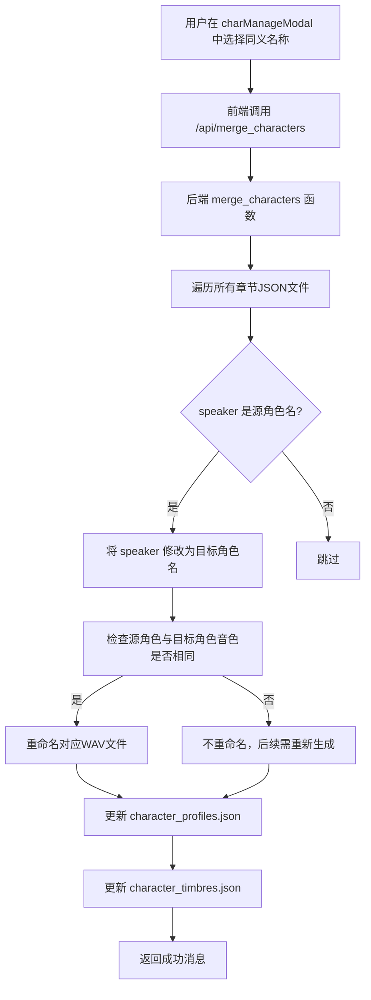

# 角色管理

<cite>
**Referenced Files in This Document**   
- [config.json](file://config.json)
- [serverV2.py](file://serverV2.py)
</cite>

## 目录
1. [角色自动识别与简介生成](#角色自动识别与简介生成)
2. [角色简介查看与深度分析](#角色简介查看与深度分析)
3. [角色名合并流程](#角色名合并流程)
4. [模型配置与数据一致性](#模型配置与数据一致性)

## 角色自动识别与简介生成

系统通过调用大型语言模型（LLM）实现角色的自动识别与简介生成。当用户上传小说文本并选择处理章节时，后端服务会调用`/api/process_single_chapter`接口。该接口的核心逻辑是利用LLM模型分析章节文本，提取对话中的`speaker`字段，从而形成初步的角色列表。

具体流程如下：系统首先将章节文本发送给LLM模型，并附带一个预设的提示词模板（`PROMPT_TEMPLATE`）。该模板要求模型将文本转换为包含`speaker`、`content`、`tone`等字段的JSON数组。通过解析模型返回的JSON数据，系统即可提取出所有`speaker`的值，这些值即为识别出的角色名称。

对于新识别出的角色，系统会调用`analyze_character`函数，通过`/api/deep_analyze_character`接口触发，自动生成角色简介。该函数会从章节文本中提取与该角色相关的上下文，并构造一个专门的分析提示词，要求模型返回一个包含`gender`（性别）、`ageGroup`（年龄段）和`identity`（身份背景）三个键的JSON对象。此过程实现了角色简介的自动化生成。

**Section sources**
- [serverV2.py](file://serverV2.py#L1142-L1226)
- [serverV2.py](file://serverV2.py#L594-L678)

## 角色简介查看与深度分析

用户可以通过前端的`showProfileModal`弹窗来查看AI生成的角色简介。该弹窗的数据来源于后端`character_profiles.json`文件，该文件存储了所有已分析角色的完整JSON简介。当用户在界面上选择一个角色时，前端会向`/api/get_character_profile`接口发起请求，获取该角色的详细信息并展示在弹窗中。

系统还提供了深度分析功能，允许用户主动触发对已有角色简介的补充和完善。用户可以在弹窗中选择一个已存在的角色，并选择一个LLM模型来执行深度分析。此时，系统会调用`deep_analyze_character`函数。该函数的核心逻辑是聚合该角色在所有已处理章节中的所有对话内容，形成一个全面的上下文。然后，它会调用`complete_character_profile`函数，向LLM模型发送一个补全请求，要求模型根据更丰富的上下文信息，补全简介中缺失或不确定的字段（如性别、年龄段等），从而优化输出质量。

**Section sources**
- [serverV2.py](file://serverV2.py#L1667-L1677)
- [serverV2.py](file://serverV2.py#L767-L813)
- [serverV2.py](file://serverV2.py#L680-L763)

## 角色名合并流程

为了处理同一角色在文本中出现多个名称（如别名、昵称）的情况，系统提供了角色名合并功能。用户可以在`charManageModal`模态框中，选择一个目标角色名和一个或多个同义的源角色名。

当用户确认合并操作后，前端会向`/api/merge_characters`接口发送请求。后端的`merge_characters`函数会执行以下关键步骤：
1.  **遍历修改JSON文件**：系统会遍历所有指定的章节JSON文件，查找`speaker`字段值为源角色名的条目，并将其修改为目标角色名。
2.  **智能重命名音频文件**：为了保证数据一致性并避免重新生成音频，系统会检查源角色和目标角色是否使用了相同的音色（`timbre`）。如果音色相同，系统会直接在文件系统中将对应的WAV音频文件从`{index}-{source_name}-{timbre}.wav`重命名为`{index}-{target_name}-{timbre}.wav`。
3.  **清理配置文件**：最后，系统会更新`character_profiles.json`和`character_timbres.json`文件，移除被合并的源角色的简介和音色配置，并确保目标角色继承源角色的音色（如果目标角色尚未配置音色）。

此流程确保了角色名合并后，文本、音频和配置数据的一致性。

**Diagram sources **
- [serverV2.py](file://serverV2.py#L358-L478)

**Section sources**
- [serverV2.py](file://serverV2.py#L358-L478)

## 模型配置与数据一致性

系统的LLM模型配置由`config.json`文件统一管理。该文件定义了可用的模型（如`gemini`和`aliyun`），并为每个模型指定了`display_name`、`model_name`、`api_key`以及是否使用代理等参数。`general.default_model`字段指定了默认使用的模型。

模型的选择直接影响角色识别和简介生成的结果。不同的LLM模型在理解能力、推理能力和生成风格上存在差异，因此切换模型可能会导致角色简介的细节（如性格描述、身份推断）发生变化。用户可以通过前端界面修改`config.json`，从而灵活地调整分析所用的模型。

为了保障角色名合并操作的数据一致性，系统采取了多重措施：
1.  **事务性操作**：整个合并过程在一个`try...except`块中执行，确保任何步骤的失败都会被捕获，避免留下部分修改的脏数据。
2.  **智能音频处理**：通过检查音色配置，系统能智能地决定是否需要重命名音频文件，从而在保证一致性的同时，最大限度地复用已有资源，避免不必要的计算开销。
3.  **配置文件同步更新**：在修改JSON文件和音频文件后，系统会立即同步更新`character_profiles.json`和`character_timbres.json`，确保所有配置信息与实际数据保持一致。

**Section sources**
- [config.json](file://config.json#L1-L45)
- [serverV2.py](file://serverV2.py#L247-L264)
- [serverV2.py](file://serverV2.py#L358-L478)