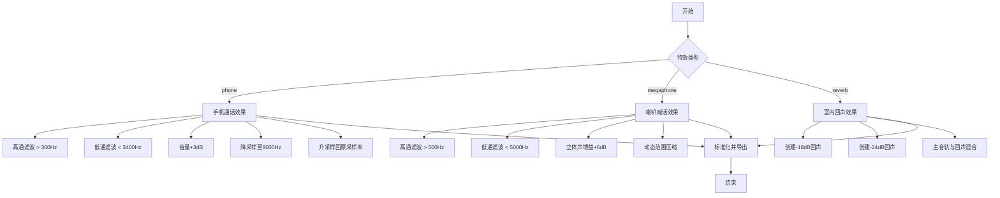
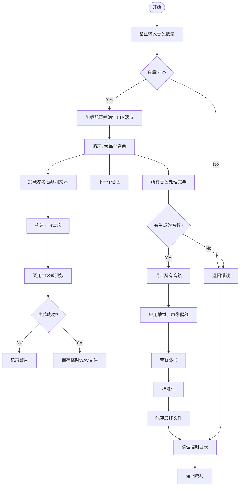

# 语音生成

<cite>
**Referenced Files in This Document**   
- [serverV2.py](file://serverV2.py)
- [config.json](file://config.json)
</cite>

## Table of Contents
1. [单句生成逻辑](#单句生成逻辑)
2. [批量生成机制](#批量生成机制)
3. [音频特效实现](#音频特效实现)
4. [多人同声混音](#多人同声混音)
5. [pydub库应用](#pydub库应用)
6. [重试策略与缓存](#重试策略与缓存)
7. [性能优化建议](#性能优化建议)

## 单句生成逻辑

语音生成的核心功能由 `/api/tts_v2` 接口实现。当客户端调用 `generateSpeech` 函数时，会向该接口发起请求，传递待合成的文本、音色（timbre）和语调等参数。服务器端的 `text_to_speech_v2` 函数负责处理此请求。

该函数首先从 `config.json` 配置文件中读取TTS模型的配置信息，确定要调用的TTS微服务的端点（endpoint）。随后，它会构建一个包含文本、参考音频（prompt_audio）和参考文本（prompt_text）的JSON payload，并通过HTTP POST请求发送给TTS微服务。微服务处理完成后，会返回一个包含Base64编码的WAV音频数据的JSON响应。服务器接收到响应后，将音频数据解码并保存到指定的输出目录（`output`），最后将生成的音频文件名返回给客户端。

**Section sources**
- [serverV2.py](file://serverV2.py#L1728-L1862)
- [config.json](file://config.json#L16-L24)

## 批量生成机制

批量生成并非通过一个独立的API实现，而是由前端或客户端应用通过循环调用单句生成接口（`/api/tts_v2`）来完成。系统本身不直接管理批量请求的并发，但通过以下方式间接实现限流：

1.  **客户端控制**：客户端在循环调用时，可以自行控制并发请求数量，例如使用异步任务池或设置请求间隔。
2.  **服务器端重试**：`text_to_speech_v2` 函数内部实现了重试机制（`TTS_GENERATION_MAX_RETRIES`），这在一定程度上增加了单个请求的耗时，从而自然地降低了高并发下的请求速率。
3.  **资源限制**：TTS微服务自身的处理能力和服务器的网络、CPU资源是天然的并发瓶颈。

因此，批量生成的并发管理主要依赖于外部调用方的实现。

**Section sources**
- [serverV2.py](file://serverV2.py#L1728-L1862)

## 音频特效实现

音频特效通过 `apply_audio_effect` 函数实现，该函数接收一个 `EffectRequest` 对象，包含小说名、章节名、文件名和特效类型。函数根据不同的 `effect_type` 参数，使用 `pydub` 库对指定的WAV文件进行处理。

**Diagram sources**
- [serverV2.py](file://serverV2.py#L1376-L1432)

### 手机通话（滤波）效果
此效果通过模拟电话网络的频带限制来实现：
1.  **滤波**：使用 `high_pass_filter` 和 `low_pass_filter` 将音频频率限制在300Hz到3400Hz之间。
2.  **音量调整**：轻微增加音量，模拟电话的压缩效果。
3.  **采样率变换**：将音频采样率降至8000Hz（电话标准），再升回原始采样率。这个重采样过程会产生独特的“数码感”和失真，增强“电话音”效果。

### 喇叭喊话（失真）效果
此效果通过模拟喇叭的失真和扩音特性来实现：
1.  **滤波**：使用高通和低通滤波器，将频率限制在500Hz到5000Hz之间，模拟喇叭的频响。
2.  **失真**：通过 `apply_gain_stereo` 对音频进行过载（+6dB），然后使用 `compress_dynamic_range` 进行动态范围压缩，产生失真感。

**Section sources**
- [serverV2.py](file://serverV2.py#L1376-L1432)

## 多人同声混音

多人同声效果由 `generate_choral_effect` 函数实现。该函数接收一个 `ChoralRequest` 对象，其中包含要生成的文本、选定的多个音色以及原始角色信息。

**Diagram sources**
- [serverV2.py](file://serverV2.py#L1446-L1536)

其核心流程如下：
1.  **生成单人语音**：函数会为 `selected_timbres` 列表中的每一个音色，分别调用一次TTS微服务，生成对应的单人语音WAV文件。这些文件被临时存储在 `temp_prompts` 目录下。
2.  **混合音轨**：所有生成的单人语音被加载为 `AudioSegment` 对象。程序创建一个静音的“画布”（`canvas`），其时长等于最长的音轨。然后，将每个音轨进行处理（如调整声道、应用随机增益和声像偏移），并以随机的微小延迟（`position=random.randint(5, 30)`）叠加到“画布”上，模拟多人说话时的自然差异。
3.  **导出与清理**：混合后的音频经过标准化处理，导出为最终的WAV文件。最后，函数会自动清理 `temp_prompts` 目录下的所有临时文件。

**Section sources**
- [serverV2.py](file://serverV2.py#L1446-L1536)
- [serverV2.py](file://serverV2.py#L42-L42)

## pydub库应用

`pydub` 库是本项目音频处理的核心工具，其应用贯穿于多个功能模块。

**Section sources**
- [serverV2.py](file://serverV2.py#L18-L21)
- [serverV2.py](file://serverV2.py#L2509-L2512)

### 具体应用点
1.  **音频加载与导出**：使用 `AudioSegment.from_wav()` 加载WAV文件，使用 `export()` 方法导出处理后的音频。
2.  **音频特效**：如上所述，用于实现滤波、增益调整、动态范围压缩等效果。
3.  **音频拼接**：在 `splice_audio` 函数中，使用 `+=` 操作符将多个 `AudioSegment` 对象按顺序拼接成一个长音频。
4.  **音频混合**：在 `generate_choral_effect` 函数中，使用 `overlay()` 方法将多个音轨叠加混合。
5.  **格式转换**：通过 `export()` 方法，可以将音频导出为MP3、M4A、OGG等多种格式，并支持设置比特率等参数。
6.  **FFmpeg集成**：项目通过 `AudioSegment.converter` 指向本地的 `ffmpeg.exe`，使得 `pydub` 能够利用FFmpeg的强大功能进行音频编解码和格式转换。

## 重试策略与缓存

### 重试策略
系统在TTS生成环节实现了稳健的重试策略。`text_to_speech_v2` 函数内部包含一个循环，最多尝试 `TTS_GENERATION_MAX_RETRIES` 次。当TTS微服务调用失败或返回的音频可能被截断（通过分析音频结尾的能量）时，系统会自动进行重试。这种设计有效应对了微服务的瞬时故障或网络波动。

### 缓存机制
本项目主要采用文件系统作为缓存机制：
1.  **生成结果缓存**：所有生成的单句WAV文件和拼接后的完整音频文件都持久化存储在 `output` 目录中。只要文件存在，系统就不会重复生成，实现了结果缓存。
2.  **章节结构缓存**：当上传TXT小说时，系统会解析章节结构，并将结果缓存到 `chapters_cache.json` 文件中，避免每次都需要重新解析大文件。
3.  **配置缓存**：音色配置（`character_timbres.json`）和角色简介（`character_profiles.json`）等信息也以文件形式存储，作为配置缓存。

**Section sources**
- [serverV2.py](file://serverV2.py#L55-L55)
- [serverV2.py](file://serverV2.py#L1764-L1838)
- [serverV2.py](file://serverV2.py#L1588-L1592)

## 性能优化建议

针对高并发场景，可从以下方面进行优化：

1.  **引入消息队列**：将TTS生成请求放入消息队列（如RabbitMQ、Redis Queue），由后台工作进程异步处理。这可以解耦请求接收和处理，防止请求积压导致服务器崩溃。
2.  **实现请求限流**：在API网关或服务器端增加限流中间件（如令牌桶算法），限制单位时间内单个IP或用户的请求数量。
3.  **优化缓存策略**：对于高频访问的静态资源（如音色文件），可部署CDN进行加速。对于生成结果，可使用Redis等内存数据库缓存文件路径和元数据，减少文件系统I/O。
4.  **微服务横向扩展**：TTS微服务本身可以进行集群部署，通过负载均衡器分发请求，提高整体吞吐量。
5.  **异步IO优化**：确保 `serverV2.py` 中的I/O操作（如文件读写、网络请求）尽可能使用异步方式（如 `aiofiles`），以提高服务器的并发处理能力。

**Section sources**
- [serverV2.py](file://serverV2.py#L1728-L1862)