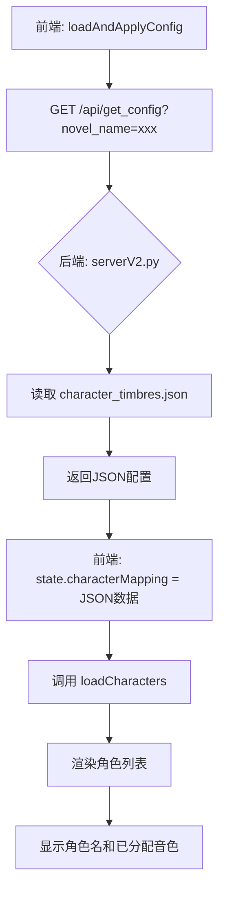
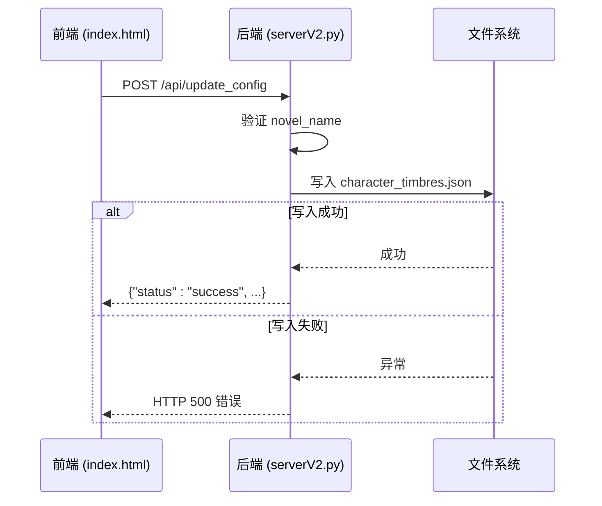

# 音色配置

<cite>
**本文档引用的文件**
- [serverV2.py](file://serverV2.py)
- [index.html](file://index.html)
</cite>

## 目录
1. [音色配置全流程](#音色配置全流程)
2. [角色-音色映射机制](#角色-音色映射机制)
3. [临时覆盖功能](#临时覆盖功能)
4. [保存逻辑](#保存逻辑)
5. [数据验证与错误处理](#数据验证与错误处理)
6. [配置版本管理与最佳实践](#配置版本管理与最佳实践)

## 音色配置全流程

音色配置功能是AI有声书制作工具的核心环节，它允许用户为小说中的不同角色分配特定的语音音色。整个流程始于前端通过`loadAndApplyConfig`函数加载`character_timbres.json`配置文件，该文件存储了角色与音色之间的映射关系。用户在界面上为每个角色从音色库中选择合适的音色。在最终生成语音前，用户还可以临时更改某个角色的音色，此更改不会影响主配置文件。当用户确认所有映射关系后，可以调用`saveConfig`函数，将当前的映射关系持久化保存回`character_timbres.json`文件中，从而完成整个配置流程。

**Section sources**
- [index.html](file://index.html#L1647-L1677)
- [serverV2.py](file://serverV2.py#L1715-L1725)

## 角色-音色映射机制

前端通过`loadAndApplyConfig`函数实现角色-音色映射机制。该函数首先向后端的`/api/get_config` API发起请求，获取当前小说项目的`character_timbres.json`配置文件。为了防止浏览器缓存导致数据不一致，请求中包含了一个时间戳参数作为缓存破坏器。获取到的JSON数据被解析并存储在前端的`state.characterMapping`状态对象中，该对象以角色名为键，音色名为值。随后，`loadCharacters`函数会根据当前选中的章节，从后端获取所有出现的角色名，并结合`state.characterMapping`中的信息，在“角色-音色配置”列中渲染出一个包含角色名、已分配音色以及“分配”和“试听”按钮的列表。用户可以通过点击“分配”按钮，将音色库中的音色指派给特定角色。



**Diagram sources**
- [index.html](file://index.html#L1647-L1665)
- [serverV2.py](file://serverV2.py#L1709-L1714)

**Section sources**
- [index.html](file://index.html#L1647-L1665)
- [serverV2.py](file://serverV2.py#L1709-L1714)

## 临时覆盖功能

临时覆盖功能允许用户在不修改主配置文件的前提下，为单个语音片段指定一个临时的音色。此功能在内容编辑器（第四列）中实现。当用户选中一个已处理的章节时，系统会加载该章节的JSON内容并渲染成一个表格。在表格的每一行中，除了显示角色和原始内容外，还包含一个音色下拉选择框。该下拉框的初始值由`state.characterMapping`中的全局配置决定，但用户可以手动选择一个不同的音色。这个被选中的音色会作为`timbre_override`字段被保存在该行的`state.novelData`对象中。在后续的语音生成流程中，系统会优先使用`timbre_override`的值，如果该值为空，则回退到使用`state.characterMapping`中的全局配置。

```mermaid
flowchart TD
A[用户在内容编辑器中选择章节] --> B[加载章节JSON]
B --> C[渲染表格]
C --> D[为每行设置音色下拉框]
D --> E[下拉框值 = state.characterMapping[角色] 或 timbre_override]
E --> F[用户更改下拉框]
F --> G[更新 state.novelData[row].timbre_override]
G --> H[语音生成时优先使用 timbre_override]
```

**Diagram sources**
- [index.html](file://index.html#L1886-L1915)
- [index.html](file://index.html#L2129-L2137)

## 保存逻辑

保存逻辑由前端的`saveConfig`函数和后端的`/api/update_config` API共同完成。当用户点击“保存当前配置”按钮时，`saveConfig`函数被触发。该函数会构建一个包含`novel_name`（小说名称）和`config_data`（即`state.characterMapping`对象）的请求体，并将其通过POST请求发送到`/api/update_config`接口。后端接收到请求后，首先验证小说项目是否存在，然后将`config_data`以UTF-8编码和2个空格缩进的格式写入到对应项目目录下的`character_timbres.json`文件中。如果写入成功，返回成功消息；如果发生任何错误（如文件系统错误），则返回500错误。



**Diagram sources**
- [index.html](file://index.html#L1667-L1677)
- [serverV2.py](file://serverV2.py#L1715-L1725)

**Section sources**
- [index.html](file://index.html#L1667-L1677)
- [serverV2.py](file://serverV2.py#L1715-L1725)

## 数据验证与错误处理

`/api/update_config` API在处理请求时包含了基本的数据验证和错误处理。其核心验证逻辑是检查`novel_name`对应的项目目录是否存在。如果目录不存在，API会返回404错误，提示“小说项目未找到”。在文件写入阶段，代码使用了try-except块来捕获所有可能的异常。如果在写入`character_timbres.json`文件时发生任何错误（例如权限不足、磁盘已满等），后端会捕获该异常，并返回一个500内部服务器错误，同时在错误信息中包含具体的异常描述，以便于调试。这种处理方式确保了API的健壮性，避免了因单一操作失败而导致服务崩溃。

**Section sources**
- [serverV2.py](file://serverV2.py#L1718-L1726)

## 配置版本管理与最佳实践

为了有效管理音色配置并实现多项目间的音色复用，建议遵循以下最佳实践：

1.  **音色名称一致性**：音色库中的音色文件夹名称必须与`character_timbres.json`配置文件中引用的音色名称完全一致。任何不一致都会导致系统无法找到对应的音色文件，从而在生成语音时失败。
2.  **配置版本管理**：`character_timbres.json`是一个独立的JSON文件，应将其纳入版本控制系统（如Git）。这允许团队成员共享配置、追踪配置变更历史，并在出现问题时轻松回滚到之前的版本。
3.  **多项目音色复用**：音色库（`wav/`目录）是全局共享的。这意味着为一个项目创建的音色可以被所有其他项目直接使用。最佳实践是建立一个中心化的音色库，包含常用角色（如“旁白”、“男青年”、“女老年”）的标准音色，新项目可以直接引用这些音色，避免重复创建，保证音色风格的一致性。
4.  **临时覆盖的用途**：临时覆盖功能应仅用于需要特殊处理的单个句子，例如角色在特定情境下的变声。不应将其作为主要的配置手段，以免造成配置逻辑混乱。