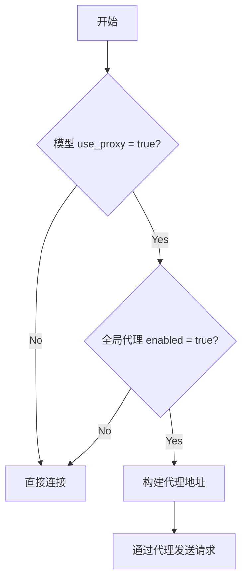
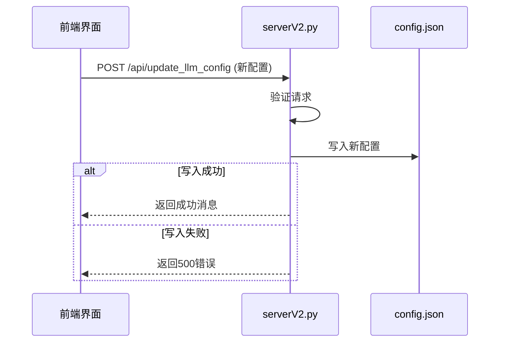

# LLM模型配置

<cite>
**Referenced Files in This Document**   
- [config.json](file://config.json)
- [serverV2.py](file://serverV2.py)
</cite>

## 目录
1. [models字段结构详解](#models字段结构详解)
2. [核心字段说明](#核心字段说明)
3. [API密钥配置与安全实践](#api密钥配置与安全实践)
4. [代理机制详解](#代理机制详解)
5. [配置初始化与更新](#配置初始化与更新)
6. [常见问题排查](#常见问题排查)
7. [配置示例](#配置示例)

## models字段结构详解

`config.json` 文件中的 `models` 字段是整个系统的核心配置，用于定义和管理所有可用的大语言模型（LLM）。该字段是一个JSON对象，其键（key）为模型的内部标识符（如 `gemini`, `aliyun`），其值为包含该模型详细配置的嵌套对象。

每个模型配置对象都遵循统一的结构，包含以下核心属性：`display_name`、`model_name`、`api_key`、`max_chars` 和 `use_proxy`。这些属性共同决定了模型在前端的显示方式、后端的调用逻辑、请求参数以及网络连接策略。

**Section sources**
- [config.json](file://config.json#L26-L40)

## 核心字段说明

`models` 对象下的每个模型都包含一组关键配置字段，这些字段直接控制模型的行为和性能。

- **`display_name`**: 该字段定义了模型在前端用户界面（UI）中显示的名称。例如，`"display_name": "Gemini"` 会在下拉菜单或设置面板中显示为“Gemini”。此字段主要用于提升用户体验，使其更直观易懂。
- **`model_name`**: 此字段指定了向大模型API提供商（如Google或阿里云）发送请求时所使用的具体模型ID。例如，`gemini-2.5-flash` 是Google的Gemini API中的一个特定模型版本。确保此值与API提供商文档中的名称完全一致至关重要。
- **`api_key`**: 这是访问大模型API的身份验证密钥。用户必须在此处填入有效的API密钥才能激活服务。如果该字段为空字符串（`""`），则系统将无法通过身份验证，导致所有相关功能失效。
- **`max_chars`**: 该数值定义了单次API请求所能处理的最大字符数。当需要处理的文本长度超过此限制时，系统会自动将文本分割成多个块（chunks），然后依次发送。例如，Gemini模型的 `max_chars` 为8000，而阿里云模型为6000。设置过高的值可能导致API请求失败，而过低的值则会增加请求次数和处理时间。
- **`use_proxy`**: 这是一个布尔值（`true`/`false`），用于控制该模型是否使用全局代理设置进行网络连接。它与 `general.proxy` 配置联动，是实现精细化网络管理的关键。

**Section sources**
- [config.json](file://config.json#L28-L39)

## API密钥配置与安全实践

正确填写API密钥是激活大模型服务的前提。用户需要从相应的服务提供商（如Google AI Studio获取Gemini密钥，或从阿里云控制台获取通义千问密钥）处获取密钥，并将其粘贴到 `api_key` 字段中。

**安全实践建议**：
1. **避免硬编码**：直接在 `config.json` 中明文存储API密钥存在安全风险。最佳实践是使用环境变量。例如，可以将 `api_key` 的值设置为 `"${GEMINI_API_KEY}"`，然后在运行应用前通过 `export GEMINI_API_KEY=your_actual_key` 命令设置环境变量。
2. **权限管理**：确保 `config.json` 文件的文件系统权限设置得当，避免非授权用户读取。
3. **定期轮换**：定期更换API密钥，并及时更新配置，以降低密钥泄露带来的风险。

**Section sources**
- [config.json](file://config.json#L30-L38)

## 代理机制详解

系统的代理机制采用两级配置模式，实现了灵活性与安全性的平衡。

- **全局代理 (`general.proxy`)**: 此配置位于 `config.json` 的 `general` 节点下，定义了代理服务器的地址、端口和协议（如 `socks5h`）。它本身不决定是否启用代理，而只是一个“代理配置池”。
- **模型级开关 (`use_proxy`)**: 每个模型的 `use_proxy` 字段充当一个开关。只有当一个模型的 `use_proxy` 设置为 `true`，**并且** `general.proxy.enabled` 也设置为 `true` 时，该模型的API请求才会通过代理服务器发送。

这种设计允许用户为不同的模型配置不同的网络策略。例如，在 `config.json` 中，Gemini模型的 `use_proxy` 为 `true`，而阿里云模型的 `use_proxy` 为 `false`，这意味着Gemini的请求会走代理，而阿里云的请求则直接连接。



**Diagram sources**
- [serverV2.py](file://serverV2.py#L574-L580)

**Section sources**
- [config.json](file://config.json#L4-L8)
- [config.json](file://config.json#L32-L33)
- [serverV2.py](file://serverV2.py#L574-L580)

## 配置初始化与更新

系统通过 `serverV2.py` 中的两个核心函数来管理配置的生命周期。

- **`initialize_llm_config()`**: 此函数在应用启动时被调用。它检查 `config.json` 文件是否存在。如果文件不存在，它会根据硬编码在函数内的 `default_config` 对象创建一个全新的配置文件。这个默认配置不仅包含了 `models` 的初始设置，还定义了 `general`、`tts_models` 等其他所有配置项，确保了系统的开箱即用性。

- **`update_llm_config()`**: 此函数通过一个FastAPI路由 (`/api/update_llm_config`) 暴露给前端。当用户在Web界面中修改了模型配置并点击“保存”时，前端会将整个新的配置对象作为JSON发送到此API。后端接收到请求后，会将这个新的配置对象直接写入 `config.json` 文件，从而实现运行时的配置更新。这个过程是原子的，即要么完全成功，要么因异常而失败。



**Diagram sources**
- [serverV2.py](file://serverV2.py#L195-L244)
- [serverV2.py](file://serverV2.py#L256-L262)

**Section sources**
- [serverV2.py](file://serverV2.py#L195-L244)
- [serverV2.py](file://serverV2.py#L256-L263)

## 常见问题排查

1.  **API密钥无效**:
    *   **现象**: 日志中出现 `模型 'gemini' 的 API Key 未在配置文件中设置。` 或类似的身份验证错误。
    *   **排查步骤**: 
        1.  检查 `config.json` 中对应模型的 `api_key` 字段是否为空。
        2.  确认粘贴的密钥是否完整，没有多余的空格。
        3.  登录服务提供商的控制台，确认该密钥是否有效且未被禁用。

2.  **模型连接超时**:
    *   **现象**: 日志中出现 `Request for character 'xxx' profile failed: ... Read timed out` 或 `ConnectionError`。
    *   **排查步骤**:
        1.  检查网络连接是否正常。
        2.  如果使用代理，检查 `general.proxy` 的地址和端口是否正确，并确认代理服务正在运行。
        3.  检查 `use_proxy` 设置是否与网络环境匹配。例如，如果身处需要代理的网络，但 `use_proxy` 设为 `false`，则会导致连接失败。
        4.  尝试在浏览器中直接访问API的URL（如 `https://generativelanguage.googleapis.com/v1beta/models/gemini-2.5-flash:generateContent`），看是否能通。

**Section sources**
- [serverV2.py](file://serverV2.py#L571-L572)
- [serverV2.py](file://serverV2.py#L574-L580)
- [serverV2.py](file://serverV2.py#L655-L658)

## 配置示例

以下是一个完整的 `config.json` 片段，展示了如何启用Gemini模型并配置其通过代理连接：

```json
"models": {
    "gemini": {
        "display_name": "Gemini",
        "model_name": "gemini-2.5-flash",
        "api_key": "your_gemini_api_key_here", 
        "max_chars": 8000,
        "use_proxy": true
    }
}
```

同时，确保全局代理已启用：

```json
"general": {
    "default_model": "gemini",
    "proxy": {
        "enabled": true,
        "protocol": "socks5h",
        "address": "127.0.0.1",
        "port": "1080"
    }
}
```

完成以上配置后，重启服务，Gemini模型即可通过本地的SOCKS5代理（如Clash、V2Ray等）进行调用。

**Section sources**
- [config.json](file://config.json#L26-L33)
- [config.json](file://config.json#L4-L8)