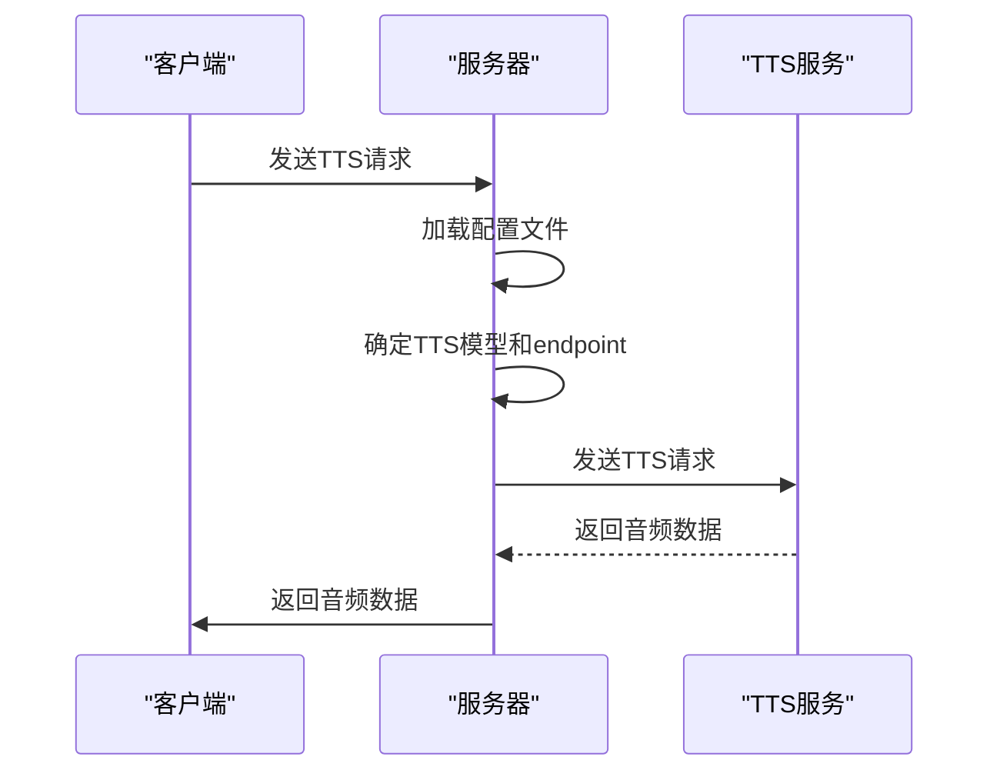

# TTS模型配置

<cite>
**本文档引用文件**   
- [config.json](file://config.json)
- [serverV2.py](file://serverV2.py)
</cite>

## 目录
1. [TTS模型配置详解](#tts模型配置详解)
2. [TTS模型配置示例](#tts模型配置示例)
3. [TTS模型API调用逻辑](#tts模型api调用逻辑)
4. [TTS模型配置调试](#tts模型配置调试)

## TTS模型配置详解

`config.json` 文件中的 `tts_models` 字段用于配置本地TTS服务的集成。每个TTS模型的配置包括 `display_name` 和 `endpoint` 两个关键字段。`display_name` 是模型的显示名称，用于在用户界面中展示。`endpoint` 是TTS服务的API端点，必须是有效的URL格式，包含协议、地址和端口。例如，`http://127.0.0.1:5010/api/tts` 表示TTS服务运行在本地主机的5010端口上。

`general` 字段中的 `default_tts_model` 用于指定默认的TTS模型。当没有明确指定TTS模型时，系统将使用此默认模型。例如，`"default_tts_model": "cosyvoice_v2"` 表示默认使用 `cosyvoice_v2` 模型。

**Section sources**
- [config.json](file://config.json#L16-L24)

## TTS模型配置示例

以下是一个配置 `ElevenLabs` TTS服务的示例。首先，需要在 `tts_models` 字段中添加一个新的模型配置，指定 `display_name` 和 `endpoint`。然后，确保 `general` 字段中的 `default_tts_model` 设置为新添加的模型名称。

```json
{
    "general": {
        "default_model": "gemini",
        "proxy": {
            "enabled": true,
            "protocol": "socks5h",
            "address": "127.0.0.1",
            "port": "1080"
        },
        "default_tts_model": "elevenlabs"
    },
    "audio_export": {
        "format": "mp3",
        "quality": "256k"
    },
    "tts_models": {
        "cosyvoice_v2": {
            "display_name": "CosyVoice2",
            "endpoint": "http://127.0.0.1:5010/api/tts"
        },
        "indextts_v1.5": {
            "display_name": "IndexTTS V1.5",
            "endpoint": "http://127.0.0.1:5020/api/tts"
        },
        "elevenlabs": {
            "display_name": "ElevenLabs",
            "endpoint": "https://api.elevenlabs.io/v1/text-to-speech"
        }
    },
    "models": {
        "gemini": {
            "display_name": "Gemini",
            "model_name": "gemini-2.5-flash",
            "api_key": "",
            "max_chars": 8000,
            "use_proxy": true
        },
        "aliyun": {
            "display_name": "阿里云平台",
            "model_name": "deepseek-r1",
            "api_key": "",
            "max_chars": 6000,
            "use_proxy": false
        }
    },
    "elevenlabs": {
        "api_key": ""
    }
}
```

**Section sources**
- [config.json](file://config.json#L1-L45)

## TTS模型API调用逻辑

`serverV2.py` 文件中的 `text_to_speech_v2` 函数负责处理TTS请求。该函数首先加载配置文件，确定要使用的TTS模型和其 `endpoint`。然后，构建包含 `tts_text`、`prompt_audio`、`prompt_text`、`inference_mode` 和 `instruct_text` 的payload，并发送到指定的 `endpoint`。如果请求成功，返回生成的音频数据；否则，记录错误并返回相应的HTTP状态码。



**Diagram sources**
- [serverV2.py](file://serverV2.py#L1728-L1861)

## TTS模型配置调试

当 `endpoint` 无法访问时，可以按照以下步骤进行调试：
1. **检查网络连通性**：确保客户端和TTS服务之间的网络连接正常。
2. **验证服务状态**：检查TTS服务是否正在运行，并且监听正确的端口。
3. **检查配置文件**：确保 `config.json` 文件中的 `endpoint` 配置正确，没有拼写错误。
4. **查看日志**：检查服务器日志，查找可能的错误信息。

**Section sources**
- [serverV2.py](file://serverV2.py#L1728-L1861)
- [config.json](file://config.json#L16-L24)