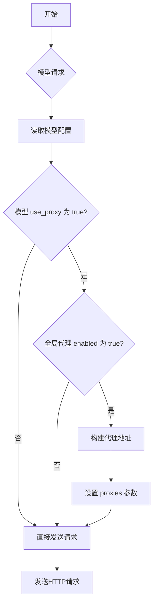
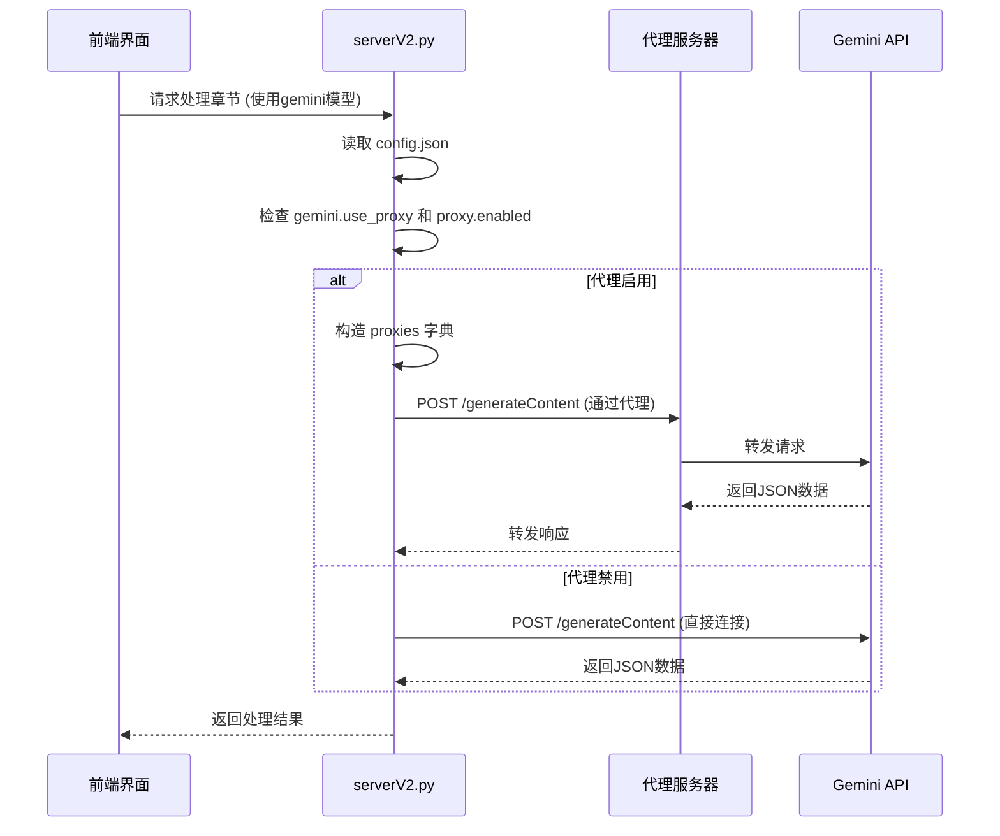

# 代理与安全配置

<cite>
**Referenced Files in This Document**   
- [config.json](file://config.json)
- [serverV2.py](file://serverV2.py)
- [README.md](file://README.md)
</cite>

## 目录
1. [代理配置详解](#代理配置详解)
2. [全局与模型级代理设置](#全局与模型级代理设置)
3. [代理在请求中的实际应用](#代理在请求中的实际应用)
4. [代理配置验证方法](#代理配置验证方法)
5. [安全最佳实践](#安全最佳实践)
6. [常见错误与修复](#常见错误与修复)
7. [多场景配置示例](#多场景配置示例)

## 代理配置详解

`config.json` 文件中的 `proxy` 字段用于定义全局代理设置，这对于访问如Gemini等在特定网络环境下受限的服务至关重要。该字段位于 `general` 配置对象下，包含四个核心属性：

- **enabled**: 布尔值，控制代理功能的全局开关。当设置为 `true` 时，系统将尝试通过代理发送网络请求。
- **protocol**: 字符串，指定代理协议类型。支持 `socks5h`、`http` 和 `https`。`socks5h` 是推荐选项，因为它能正确处理DNS解析，避免潜在的连接问题。
- **address**: 字符串，定义代理服务器的IP地址或主机名。通常为 `127.0.0.1`（本地代理）或远程服务器地址。
- **port**: 字符串，指定代理服务器监听的端口号，例如 `1080`。

**Section sources**
- [config.json](file://config.json#L4-L9)

## 全局与模型级代理设置

代理配置采用分层覆盖机制。`general.proxy` 定义了全局默认行为，但每个模型在 `models` 对象中可以通过 `use_proxy` 字段进行覆盖。

例如，在 `config.json` 中：
- `gemini` 模型的 `use_proxy` 设置为 `true`，表示即使全局代理关闭，该模型仍会尝试使用代理。
- `aliyun` 模型的 `use_proxy` 设置为 `false`，表示即使全局代理开启，该模型的请求也将绕过代理，直接连接。

这种设计提供了极大的灵活性，允许用户为不同服务配置最优的网络策略。例如，当Gemini服务因地域限制需要代理，而阿里云服务在国内可直连时，此混合模式能确保最佳性能和成功率。



**Diagram sources**
- [config.json](file://config.json#L27-L40)
- [serverV2.py](file://serverV2.py#L575-L578)

**Section sources**
- [config.json](file://config.json#L27-L40)

## 代理在请求中的实际应用

在 `serverV2.py` 中，代理的配置被动态应用于所有对外的HTTP请求。核心逻辑位于 `generate_chapter_json` 函数中。

当系统需要调用Gemini或阿里云（Qwen）API时，它会：
1.  从 `config.json` 读取模型和全局代理配置。
2.  检查当前模型的 `use_proxy` 和全局 `proxy.enabled` 是否均为 `true`。
3.  如果条件满足，则根据 `protocol`、`address` 和 `port` 构造代理地址（如 `socks5h://127.0.0.1:1080`）。
4.  将此地址封装成一个字典 `{"http": proxy_addr, "https": proxy_addr}`，并作为 `proxies` 参数传递给 `requests.post()` 方法。

此机制确保了所有依赖代理的模型（如Gemini）都能通过指定的代理通道进行通信，从而绕过网络限制。



**Diagram sources**
- [serverV2.py](file://serverV2.py#L560-L591)
- [serverV2.py](file://serverV2.py#L316-L355)

**Section sources**
- [serverV2.py](file://serverV2.py#L560-L591)

## 代理配置验证方法

在修改 `config.json` 后，应验证代理配置的连通性。推荐使用 `curl` 命令进行测试：

```bash
# 测试SOCKS5代理连通性
curl -v --socks5h 127.0.0.1:1080 https://generativelanguage.googleapis.com/

# 测试HTTP代理连通性
curl -v -x http://127.0.0.1:1080 https://generativelanguage.googleapis.com/
```

如果代理配置正确且服务正常，`curl` 命令应能成功建立连接并返回HTTP状态码（如404或401，表明已到达目标服务器）。若出现 `Connection refused` 或超时，则表明代理地址、端口或代理服务本身存在问题。

## 安全最佳实践

1.  **API密钥保护**：`config.json` 中的 `api_key` 字段包含敏感信息。应确保该文件的权限设置为仅所有者可读写（例如，在Linux/macOS上使用 `chmod 600 config.json`），防止其他用户或进程读取。
2.  **配置文件管理**：避免将 `config.json` 提交到公共代码仓库（如GitHub）。建议将其添加到 `.gitignore` 文件中。
3.  **代理安全**：选择可信的代理服务提供商。避免使用公共或免费的代理，因为它们可能存在日志记录用户流量、窃取数据或注入恶意内容的风险。

**Section sources**
- [config.json](file://config.json#L30)
- [config.json](file://config.json#L37)

## 常见错误与修复

**错误日志**: `Gemini API Call) Chunk 1 Attempt 1 Failed: HTTPSConnectionPool(host='generativelanguage.googleapis.com', port=443): Max retries exceeded with url: ... (Caused by NewConnectionError('<urllib3.connection.VerifiedHTTPSConnection object at 0x...>: Failed to establish a new connection: [Errno 8] nodename nor servname provided, or not known'))`

**原因分析**: 此错误通常表明DNS解析失败。最常见的原因是使用了 `socks5` 协议而非 `socks5h`。`socks5` 协议会将域名发送给代理服务器，但某些代理客户端（如Clash）可能无法正确处理，导致解析失败。

**修复步骤**:
1.  打开 `config.json`。
2.  将 `general.proxy.protocol` 的值从 `socks5` 修改为 `socks5h`。
3.  保存文件并重启 `serverV2.py` 服务。

## 多场景配置示例

以下为 `config.json` 的一个混合模式配置示例：

```json
"general": {
    "default_model": "gemini",
    "proxy": {
        "enabled": true,
        "protocol": "socks5h",
        "address": "127.0.0.1",
        "port": "1080"
    }
},
"models": {
    "gemini": {
        "api_key": "your_gemini_key",
        "use_proxy": true
    },
    "aliyun": {
        "api_key": "your_aliyun_key",
        "use_proxy": false
    }
}
```

在此配置下：
- **全局代理**：已启用，协议为 `socks5h`，地址为 `127.0.0.1:1080`。
- **Gemini模型**：`use_proxy` 为 `true`，其请求将通过上述代理发送。
- **阿里云模型**：`use_proxy` 为 `false`，其请求将直接连接，不经过代理。

这种配置实现了对受限服务（Gemini）的有效访问，同时为可直连服务（阿里云）提供了更低的延迟和更高的可靠性。

**Section sources**
- [config.json](file://config.json#L1-L45)