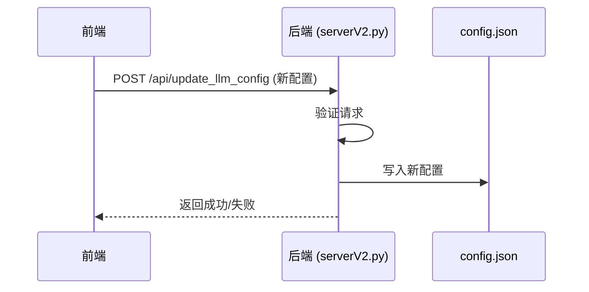

# 环境配置

<cite>
**本文档引用文件**   
- [config.json](file://config.json)
- [serverV2.py](file://serverV2.py)
</cite>

## 目录
1. [配置文件概览](#配置文件概览)
2. [LLM模型配置](#llm模型配置)
3. [TTS模型配置](#tts模型配置)
4. [音频导出设置](#音频导出设置)
5. [全局默认值](#全局默认值)
6. [扩展新模型或服务](#扩展新模型或服务)
7. [安全建议](#安全建议)
8. [配置加载与更新机制](#配置加载与更新机制)
9. [常见配置错误及排查](#常见配置错误及排查)

## 配置文件概览

`config.json` 文件是本项目的核心配置文件，定义了所有可调参数，包括LLM模型、TTS模型、音频导出格式以及全局默认值。该文件采用JSON格式，结构清晰，易于编辑。当文件不存在时，系统会根据 `serverV2.py` 中的 `initialize_llm_config` 函数创建一个包含默认值的配置文件。

**Section sources**
- [config.json](file://config.json)
- [serverV2.py](file://serverV2.py#L195-L244)

## LLM模型配置

LLM模型配置位于 `config.json` 的 `models` 字段下，用于管理文本生成模型的连接和行为。

### 启用开关与API密钥
每个模型（如 `gemini` 和 `aliyun`）都有一个 `api_key` 字段，用于存储访问该模型服务所需的密钥。用户必须在此处填入有效的API密钥才能成功调用模型。例如，`gemini` 模型需要Google AI Studio提供的API密钥。

### 代理设置
代理设置在 `general.proxy` 字段中统一配置，但每个模型可以独立决定是否使用代理。`proxy` 对象包含 `enabled` (开关)、`protocol` (协议)、`address` (地址) 和 `port` (端口)。模型通过 `use_proxy` 字段（如 `gemini.use_proxy`）来启用或禁用代理。例如，`gemini` 模型默认启用代理，而 `aliyun` 模型则禁用。

### 提示词模板（PROMPT_TEMPLATE）
提示词模板是一个预定义的指令字符串，用于指导LLM如何将小说文本转换为有声书JSON格式。此模板在 `serverV2.py` 文件中以 `PROMPT_TEMPLATE` 常量的形式硬编码。它详细规定了输出格式、字段要求、旁白和对话的处理规则、长段落拆分策略以及特殊要求（如引号转义、保持原文顺序等）。该模板在调用 `generate_with_gemini` 或 `generate_with_qwen` 函数时，会与用户提供的章节内容拼接后发送给LLM。

**Section sources**
- [config.json](file://config.json)
- [serverV2.py](file://serverV2.py#L153-L186)

## TTS模型配置

TTS模型配置位于 `config.json` 的 `tts_models` 字段下，用于管理语音合成服务的连接。

### URL与认证信息
每个TTS模型（如 `cosyvoice_v2` 和 `indextts_v1.5`）通过 `endpoint` 字段指定其API的URL。该URL指向一个本地或远程的TTS微服务。认证信息通常不直接存储在 `config.json` 中，而是由TTS微服务自身管理。例如，`cosyvoice_v2` 的 `endpoint` 为 `http://127.0.0.1:5010/api/tts`。

### 语音参数调整
`config.json` 本身不直接包含语速、音调、音量等语音参数。这些参数的调整是通过TTS微服务的API实现的。在 `serverV2.py` 的 `text_to_speech_v2` 函数中，当向TTS微服务发送请求时，会将推理模式（`inference_mode`）和指令文本（`instruct_text`）作为 `payload` 的一部分传递。这些参数由前端传入，最终影响TTS微服务的生成效果。

**Section sources**
- [config.json](file://config.json)
- [serverV2.py](file://serverV2.py#L1729-L1855)

## 音频导出设置

音频导出设置位于 `config.json` 的 `audio_export` 字段下，用于控制最终拼接音频文件的输出质量。

- **format**: 指定输出音频的格式，如 `"mp3"`、`"wav"`、`"m4a"` 或 `"ogg"`。
- **quality**: 指定输出音频的质量。对于MP3和M4A格式，此值为比特率（如 `"256k"`）。对于OGG格式，此值为质量等级（如 `"q5"`）。

这些设置在 `serverV2.py` 的 `splice_audio` 函数中被读取，并用于调用 `pydub` 库的 `export` 方法，从而影响最终音频文件的大小和音质。

**Section sources**
- [config.json](file://config.json)
- [serverV2.py](file://serverV2.py#L1930-L1948)

## 全局默认值

全局默认值在 `config.json` 的 `general` 字段中定义，用于为系统提供初始和备用的配置。

- **default_model**: 定义了默认使用的LLM模型。当系统需要调用LLM但未指定具体模型时，将使用此值。例如，`"gemini"`。
- **default_tts_model**: 定义了默认使用的TTS模型。当 `TTSRequestV2` 请求中未指定 `tts_model` 时，系统将使用此模型。例如，`"cosyvoice_v2"`。

这些默认值简化了用户的操作，确保了系统在缺少明确指令时仍能正常运行。

**Section sources**
- [config.json](file://config.json)

## 扩展新模型或服务

用户可以在不修改代码的情况下，通过编辑 `config.json` 来扩展新的模型或服务。

### 扩展LLM模型
要添加一个新的LLM模型，可以在 `models` 对象中添加一个新的键值对。例如，添加一个名为 `new_model` 的模型：
```json
"new_model": {
    "display_name": "新模型",
    "model_name": "new-model-v1",
    "api_key": "your_api_key_here",
    "max_chars": 5000,
    "use_proxy": false
}
```
只要 `serverV2.py` 中的 `generate_with_qwen` 或 `generate_with_gemini` 函数的逻辑能够适配新模型的API，系统即可支持。

### 扩展TTS服务
要添加一个新的TTS服务，可以在 `tts_models` 对象中添加一个新的键值对。例如，添加一个名为 `new_tts` 的服务：
```json
"new_tts": {
    "display_name": "新TTS服务",
    "endpoint": "http://new-tts-service.com/api/tts"
}
```
然后，前端可以选择此服务，后端会自动将请求转发到新的 `endpoint`。

**Section sources**
- [config.json](file://config.json)

## 安全建议

保护API密钥的安全至关重要。

- **切勿公开**: 绝对不要将包含API密钥的 `config.json` 文件上传到公共代码仓库（如GitHub）。
- **权限管理**: 确保 `config.json` 文件的文件系统权限设置得当，防止未授权访问。
- **定期轮换**: 定期更换API密钥，并在更换后及时更新 `config.json`。
- **使用环境变量（推荐）**: 虽然当前配置直接存储在文件中，但最佳实践是使用环境变量来存储密钥，并在代码中读取。这可以完全避免密钥出现在配置文件里。

**Section sources**
- [config.json](file://config.json)

## 配置加载与更新机制

系统的配置加载与更新由 `serverV2.py` 中的两个核心函数实现。

### 配置加载 (`initialize_llm_config`)
在服务器启动时（`if __name__ == '__main__':` 块中），会调用 `initialize_llm_config` 函数。该函数检查 `config.json` 文件是否存在。如果不存在，它会使用一个包含所有默认值的 `default_config` 字典创建该文件。这确保了系统始终有一个有效的配置文件可用。

### 配置更新 (`update_llm_config`)
系统提供了一个 `/api/update_llm_config` 的API端点，由 `update_llm_config` 函数处理。前端应用可以将修改后的整个配置对象通过此API发送。后端接收到请求后，会直接将 `req.config` 写入 `config.json` 文件，从而实现配置的动态更新。这个过程是原子的，即要么完全成功，要么因异常而失败。



**Diagram sources**
- [serverV2.py](file://serverV2.py#L195-L244)
- [serverV2.py](file://serverV2.py#L256-L262)

## 常见配置错误及排查

### 模型无法连接
- **现象**: 处理章节时，LLM调用失败，日志显示连接超时或认证失败。
- **排查**:
    1. 检查 `api_key` 是否正确且未过期。
    2. 检查 `use_proxy` 设置是否与网络环境匹配。如果需要代理但 `use_proxy` 为 `false`，或反之，则会导致连接失败。
    3. 检查 `proxy` 配置中的地址和端口是否正确。
    4. 确认目标LLM服务（如Gemini API）是否正常运行。

### TTS生成失败
- **现象**: TTS请求返回错误，或生成的音频文件为空。
- **排查**:
    1. 检查 `tts_models` 中对应模型的 `endpoint` URL是否正确，且TTS微服务正在运行。
    2. 检查TTS微服务自身的日志，确认其是否收到请求以及失败原因。
    3. 确认 `inference_mode` 和 `instruct_text` 等参数是否符合TTS微服务的要求。
    4. 检查网络连接，确保后端服务器可以访问TTS微服务。

**Section sources**
- [config.json](file://config.json)
- [serverV2.py](file://serverV2.py#L1729-L1855)