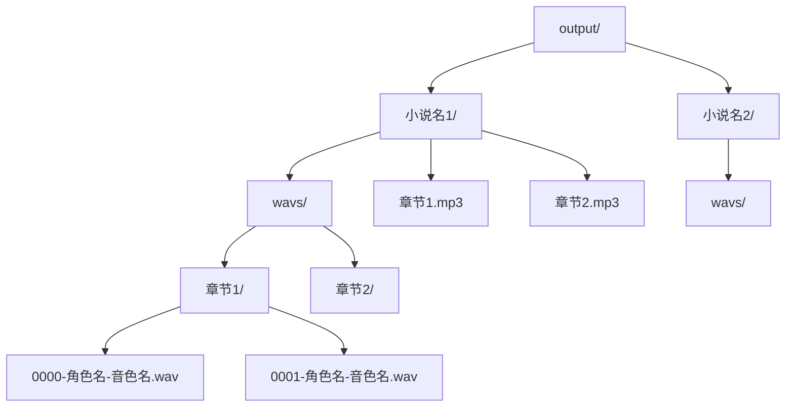
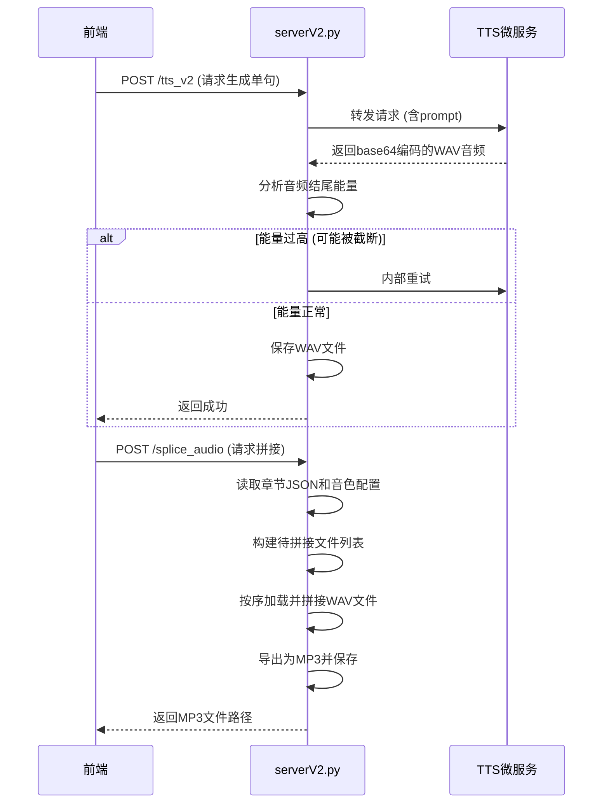
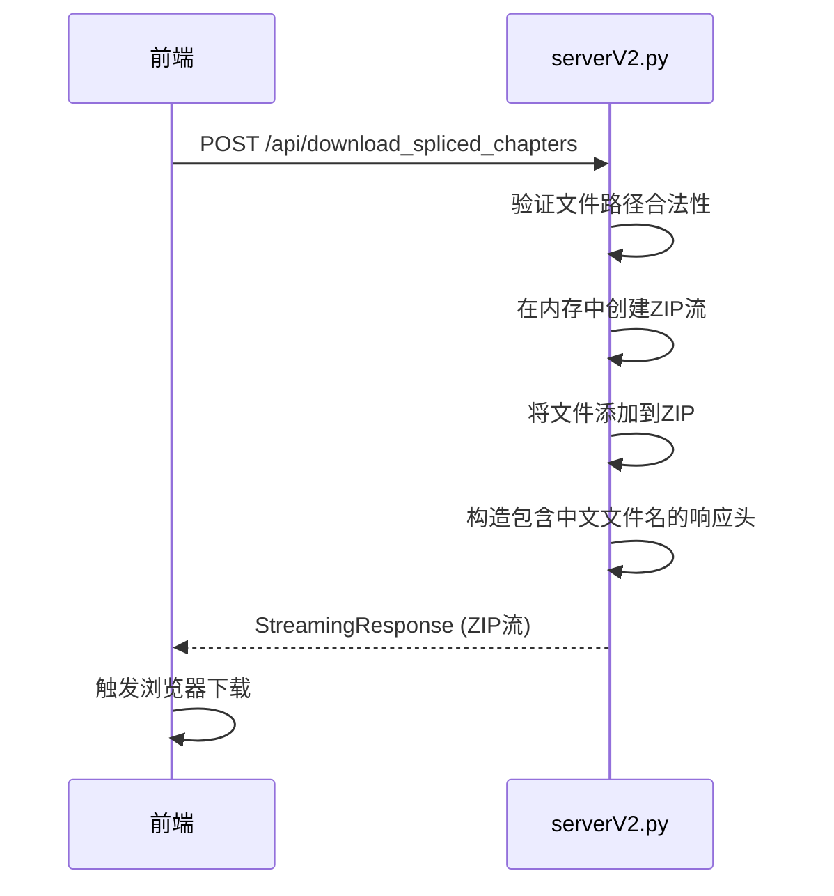

# output/ 输出目录结构

<cite>
**Referenced Files in This Document**   
- [serverV2.py](file://serverV2.py)
</cite>

## 目录
1. [简介](#简介)
2. [核心目录结构](#核心目录结构)
3. [音频生成与拼接流程](#音频生成与拼接流程)
4. [文件命名规则](#文件命名规则)
5. [打包下载功能](#打包下载功能)
6. [清理策略](#清理策略)
7. [性能优化建议](#性能优化建议)

## 简介
`output/` 目录是AI有声书生成工具的核心输出区域，负责存储所有最终生成的音频成品。该目录的设计遵循清晰的分层结构，将最终的有声书文件与生成过程中的临时语音片段进行分离，确保了文件管理的高效性与安全性。通过 `serverV2.py` 中的 `/splice_audio` 和 `/tts_v2` 接口，系统实现了从文本到语音、再到完整有声书的自动化流程。

## 核心目录结构
`output/` 目录采用两级嵌套结构，以小说项目为单位进行组织，确保了不同项目的音频文件完全隔离。

**Diagram sources**
- [serverV2.py](file://serverV2.py#L41)

**Section sources**
- [serverV2.py](file://serverV2.py#L41)

### 最终有声书文件
位于 `output/<小说名>/` 目录下，存放的是经过拼接和特效处理后的最终成品。这些文件的格式和质量由 `config.json` 中的 `audio_export` 配置项决定，通常为 `.mp3` 格式，便于用户直接播放或分享。

### 临时WAV语音片段
位于 `output/<小说名>/wavs/<章节名>/` 目录下，存放的是通过TTS（文本转语音）技术生成的单句语音片段。这些 `.wav` 文件是拼接最终有声书的基础单元，系统在生成最终文件后，可以选择性地保留它们，以便进行局部修改和重新拼接，而无需重新生成所有语音。

## 音频生成与拼接流程
整个音频生成流程由后端 `serverV2.py` 中的两个核心API驱动，实现了从文本到完整有声书的自动化。

**Diagram sources**
- [serverV2.py](file://serverV2.py#L1728)
- [serverV2.py](file://serverV2.py#L1864)

**Section sources**
- [serverV2.py](file://serverV2.py#L1728)
- [serverV2.py](file://serverV2.py#L1864)

### TTS语音生成 (`/tts_v2` 接口)
1.  **请求接收**：前端发送 `TTSRequestV2` 请求，包含文本、角色、音色等信息。
2.  **内部重试**：后端会根据配置的最大重试次数（`TTS_GENERATION_MAX_RETRIES`）进行内部重试，以应对TTS服务的不稳定。
3.  **音频质量判断**：后端会分析生成的WAV音频结尾的能量（`dBFS`），如果能量过高，可能意味着语音被截断，此时会自动触发重试。
4.  **文件保存**：当获得一个能量正常的音频后，系统会将其保存到 `output/<小说名>/wavs/<章节名>/` 目录下，文件名遵循特定的命名规则。

### 音频拼接与特效处理 (`/splice_audio` 接口)
1.  **权威文件列表构建**：后端不会依赖前端传来的文件列表，而是根据 `character_timbres.json` 配置和章节的JSON数据，自行构建一个权威的待拼接文件列表，确保了数据的一致性。
2.  **音频加载与拼接**：系统按序加载 `wavs/` 目录下的所有 `.wav` 文件，并使用 `pydub` 库将它们无缝拼接成一个完整的音频流。
3.  **格式导出**：拼接完成后，系统根据 `config.json` 中的配置，将音频流导出为指定格式（如MP3）并保存到 `output/<小说名>/` 目录下。

## 文件命名规则
为了确保文件系统的稳定性和兼容性，系统对所有生成的文件采用了严格的命名规范。

| 文件类型 | 命名规则 | 示例 | 说明 |
| :--- | :--- | :--- | :--- |
| **WAV语音片段** | `{行号:04d}-{安全角色名}-{安全音色名}.wav` | `0000-张三-温柔女声.wav` | 行号确保了拼接顺序；角色名和音色名中的特殊字符（如`/`, `:`, `*`等）会被移除或替换，以防止文件系统错误。 |
| **最终有声书** | `{安全章节名}.{配置格式}` | `第一章.mp3` | 章节名经过安全化处理，文件扩展名由 `config.json` 中的 `audio_export.format` 决定。 |
| **ZIP打包文件** | `{小说名}_spliced.zip` | `红楼梦_spliced.zip` | 打包文件名以小说名开头，后缀为 `_spliced.zip`。 |

**Section sources**
- [serverV2.py](file://serverV2.py#L1849)
- [serverV2.py](file://serverV2.py#L1933)
- [serverV2.py](file://serverV2.py#L2385)

## 打包下载功能
前端的“打包下载”功能允许用户将已生成的多个有声书章节一次性下载。

**Diagram sources**
- [serverV2.py](file://serverV2.py#L2350)

**Section sources**
- [serverV2.py](file://serverV2.py#L2350)

1.  **请求发起**：前端收集用户选择的章节文件路径，通过 `/api/download_spliced_chapters` 接口发起POST请求。
2.  **安全验证**：后端会检查每个文件路径，确保它们位于 `output/` 目录下，防止目录遍历攻击。
3.  **内存打包**：系统使用 `io.BytesIO` 在内存中创建一个ZIP文件流，将所有指定的文件写入其中。
4.  **流式响应**：后端通过 `StreamingResponse` 将ZIP流直接返回给前端，避免了在服务器上创建临时大文件。
5.  **中文文件名处理**：系统通过 `Content-Disposition` 响应头，智能处理包含中文的文件名，确保在不同浏览器中都能正确下载。

## 清理策略
系统提供了两种主要的清理机制，以管理磁盘空间。

1.  **强制重新生成**：在处理单个章节时，如果用户勾选了“强制重新生成”，系统会先删除该章节对应的所有旧WAV文件和最终的MP3文件，然后重新生成所有内容。
2.  **删除小说项目**：当用户删除一个小说项目时，系统会同时删除 `projects/<小说名>/` 和 `output/<小说名>/` 两个目录，彻底清除该项目的所有数据。

**Section sources**
- [serverV2.py](file://serverV2.py#L1116)
- [serverV2.py](file://serverV2.py#L914)

## 性能优化建议
为了应对大文件存储和处理的挑战，建议采取以下优化措施：

1.  **大文件存储路径分离**：将 `output/` 目录（存储大体积的音频文件）与 `projects/` 目录（存储文本和配置文件）分离。可以将 `OUTPUT_DIR` 的路径配置为指向一个具有更大存储空间的磁盘分区或网络存储（NAS），以避免主系统盘空间不足。
2.  **定期归档**：对于已完成的项目，可以将其 `output/<小说名>/` 目录打包压缩并移动到归档存储中，以释放主工作区的空间。
3.  **清理临时文件**：确保 `temp_prompts/` 等临时目录有定期清理机制，避免临时文件堆积。

**Section sources**
- [serverV2.py](file://serverV2.py#L42)