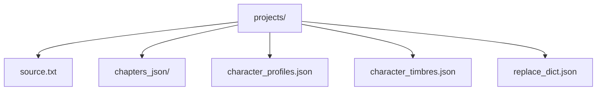
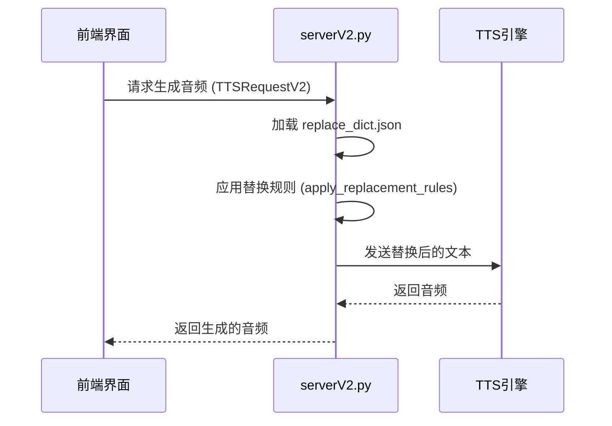

# projects/ 目录结构

<cite>
**本文档引用的文件**
- [serverV2.py](file://serverV2.py)
</cite>

## 目录

1. [项目数据存储设计](#项目数据存储设计)
2. [核心数据文件详解](#核心数据文件详解)
3. [系统功能与文件交互](#系统功能与文件交互)
4. [数据管理实践建议](#数据管理实践建议)

## 项目数据存储设计

`projects/` 目录是本系统的核心数据存储区域，用于存放每个小说项目的独立数据。该目录在系统启动时由 `serverV2.py` 文件中的代码自动创建，确保了数据的集中化和隔离性。

**图示来源**
- [serverV2.py](file://serverV2.py#L36-L45)

## 核心数据文件详解

每个子项目文件夹都包含一组特定的文件，共同构成了一个完整的小说有声书项目。

### 源文本与结构化数据

- **source.txt**: 存储小说的原始文本内容。这是所有处理的起点，系统通过读取此文件来获取章节内容。
- **chapters_json/**: 该目录存储了经过LLM（大语言模型）处理后的结构化对话数据。每个章节对应一个JSON文件，其中包含了对话的说话人（speaker）、内容（content）、语气（tone）、强度（intensity）和延迟（delay）等信息。

### 角色与音色配置

- **character_profiles.json**: 存储角色的性格与背景简介。该文件是一个JSON对象，键为角色名，值为包含角色性别（gender）、年龄段（ageGroup）和身份背景（identity）的字典。
- **character_timbres.json**: 存储角色与音色的映射关系。该文件也是一个JSON对象，键为角色名，值为音色名称，用于在生成音频时为不同角色分配不同的声音。

### 项目级文本替换规则

- **replace_dict.json**: 存储项目级的文本替换规则。该文件定义了一个规则列表，每条规则包含 `original_word`（原词）、`replacement_word`（替换词）和可选的 `description`（描述）。这些规则在TTS（文本转语音）生成前被应用，以修正特定词汇的发音。

**本节来源**
- [serverV2.py](file://serverV2.py#L36-L45)
- [serverV2.py](file://serverV2.py#L1089-L1098)
- [serverV2.py](file://serverV2.py#L1147-L1152)

## 系统功能与文件交互

系统通过 `serverV2.py` 中的 `PROJECTS_DIR` 变量引用 `projects/` 目录，实现了对项目数据的读写操作。

### 章节处理流程

当处理一个章节时，系统会：
1.  从 `source.txt` 读取原始文本。
2.  调用LLM API生成结构化的JSON数据。
3.  将生成的JSON数据写入 `chapters_json/` 目录下的对应文件。
4.  分析新出现的角色，并将其简介写入 `character_profiles.json`。

### 角色分析与音色配置

- **角色分析**: 系统通过 `/api/deep_analyze_character` 接口，聚合角色在所有已处理章节中的对话内容，然后调用LLM进行深度分析，以补全或更新 `character_profiles.json` 中的角色信息。
- **音色配置**: 用户在前端界面为角色分配音色，这一操作会通过 `/api/update_config` 接口将映射关系保存到 `character_timbres.json` 文件中。

### 文本替换规则的应用

在TTS生成音频之前，系统会调用 `apply_replacement_rules` 函数。该函数会加载 `replace_dict.json` 文件中的规则，并按照规则对即将生成的文本进行替换，确保输出的音频发音准确。

**图示来源**
- [serverV2.py](file://serverV2.py#L521-L559)
- [serverV2.py](file://serverV2.py#L767-L814)
- [serverV2.py](file://serverV2.py#L1982-L2007)

## 数据管理实践建议

### 备份与迁移

- **备份**: 建议定期备份整个 `projects/` 目录。由于所有项目数据都集中于此，备份此目录即可完整保存所有项目。
- **迁移**: 迁移项目时，只需将对应的子项目文件夹复制到新环境的 `projects/` 目录下即可。

### 手动编辑

- **谨慎编辑**: 可以手动编辑 `source.txt`、`character_profiles.json` 和 `replace_dict.json` 等文件，但必须确保JSON文件的格式正确。
- **避免直接编辑**: 不建议直接手动编辑 `chapters_json/` 目录下的文件，因为这些文件是系统生成的中间产物，手动修改可能导致数据不一致。

### JSON格式的重要性

JSON文件的格式正确性对系统的稳定性至关重要。任何格式错误（如缺少引号、括号不匹配）都会导致 `json.load()` 函数抛出 `JSONDecodeError` 异常，从而使相关功能（如加载角色简介、应用替换规则）失败。系统虽然有异常处理机制，但会使用默认值或跳过操作，可能导致功能异常。

**本节来源**
- [serverV2.py](file://serverV2.py#L552-L557)
- [serverV2.py](file://serverV2.py#L1964-L1978)
- [serverV2.py](file://serverV2.py#L1149-L1152)