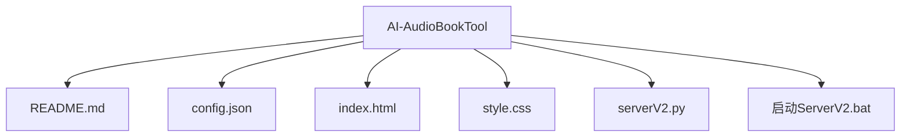

# 目录结构详解

<cite>
**Referenced Files in This Document**   
- [serverV2.py](file://serverV2.py)
- [README.md](file://README.md)
- [config.json](file://config.json)
- [index.html](file://index.html)
- [style.css](file://style.css)
- [启动ServerV2.bat](file://启动ServerV2.bat)
</cite>

## Table of Contents
1. [项目根目录结构](#项目根目录结构)
2. [核心配置与常量定义](#核心配置与常量定义)
3. [小说项目目录 (projects/)](#小说项目目录-projects)
4. [音色文件目录 (wav/)](#音色文件目录-wav)
5. [输出音频目录 (output/)](#输出音频目录-output)
6. [临时文件目录 (temp_prompts/)](#临时文件目录-temp_prompts)
7. [文件系统操作与核心功能](#文件系统操作与核心功能)
8. [用户与开发者最佳实践](#用户与开发者最佳实践)

## 项目根目录结构

项目根目录包含了所有核心的配置文件、前端界面和后端服务程序。其结构清晰，职责分明，是整个有声书制作工具的入口和控制中心。



**Diagram sources**
- [README.md](file://README.md)
- [serverV2.py](file://serverV2.py#L35-L48)

**Section sources**
- [README.md](file://README.md)
- [serverV2.py](file://serverV2.py#L35-L48)

## 核心配置与常量定义

在 `serverV2.py` 文件的开头部分，定义了多个关键的路径常量，这些常量是整个应用文件系统操作的基础。它们指明了项目运行时所需的主要目录。

```python
# --- 基本配置和目录定义 ---
ROOT_DIR = os.path.dirname(os.path.abspath(__file__))
PROJECTS_DIR = "projects"
WAV_DIR = "wav"
OUTPUT_DIR = "output"
TEMP_DIR = "temp_prompts"
for dir_path in [PROJECTS_DIR, WAV_DIR, OUTPUT_DIR, TEMP_DIR]:
    os.makedirs(dir_path, exist_ok=True)
```

这些常量的作用如下：
- **`PROJECTS_DIR`**: 指向 `projects/` 目录，用于存储所有小说项目的数据。
- **`WAV_DIR`**: 指向 `wav/` 目录，用于集中管理所有音色文件。
- **`OUTPUT_DIR`**: 指向 `output/` 目录，用于存放最终生成的音频文件。
- **`TEMP_DIR`**: 指向 `temp_prompts/` 目录，用于存放临时生成的提示文件。

在应用启动时，`os.makedirs(dir_path, exist_ok=True)` 会确保这些目录存在，如果不存在则自动创建，保证了应用的稳定运行。

**Section sources**
- [serverV2.py](file://serverV2.py#L35-L48)

## 小说项目目录 (projects/)

`projects/` 目录是每个小说项目的专属工作区。每当用户上传一本小说，系统就会在此目录下创建一个以小说名称命名的子目录。该子目录的结构如下：

```
projects/
└── <小说名称>/
    ├── source.txt
    ├── .is_txt_project
    ├── chapters_cache.json
    ├── chapters_json/
    │   ├── 第一章.json
    │   ├── 第二章.json
    │   └── ...
    ├── character_profiles.json
    ├── character_timbres.json
    └── replace_dict.json
```

### 核心文件与子目录说明

- **`source.txt`**: 存放用户上传的原始小说文本文件。这是所有处理的起点。
- **`.is_txt_project`**: 一个空的标记文件，用于标识该项目是由纯文本（.txt）创建的，以便后端进行特殊处理。
- **`chapters_cache.json`**: 缓存了从小说文本中解析出的章节列表，用于前端快速加载。
- **`chapters_json/`**: 该子目录存放了经过AI处理后生成的JSON格式的章节文件。每个JSON文件都包含该章节的对话、旁白、语气、强度等详细信息，是生成语音的直接依据。
- **`character_profiles.json`**: 存储了小说中各个角色的简介，包括性别、年龄段、身份背景等信息，用于辅助AI进行更精准的语音合成。
- **`character_timbres.json`**: 这是一个关键的配置文件，它建立了角色与音色之间的映射关系。例如，`{"张三": "男声-沉稳"}` 表示角色“张三”将使用名为“男声-沉稳”的音色。
- **`replace_dict.json`**: 用户自定义的替换词典，用于在TTS（文本转语音）生成前对文本进行预处理。例如，可以将“张真人”替换为“张三丰”，确保发音准确。

**Section sources**
- [serverV2.py](file://serverV2.py#L35-L48)
- [serverV2.py](file://serverV2.py#L1543-L1608)
- [serverV2.py](file://serverV2.py#L1610-L1663)

## 音色文件目录 (wav/)

`wav/` 目录是所有音色文件的中央仓库。每个音色都以一个独立的文件夹形式存在，文件夹的名称即为音色的名称。其结构如下：

```
wav/
├── 男声-沉稳/
│   ├── 1.wav
│   └── 1.txt
├── 女声-甜美/
│   ├── 1.wav
│   └── 1.txt
├── 老年男声/
│   ├── 1.wav
│   └── 1.txt
└── timbre_categories.json
```

### 音色文件结构说明

- **音色文件夹 (`<音色名称>/`)**: 每个文件夹代表一个独立的音色。
- **`1.wav`**: 这是音色的参考音频文件，通常是一段清晰的语音样本，用于训练或驱动TTS模型。
- **`1.txt`**: 这是与 `1.wav` 对应的文本文件，记录了参考音频中的内容，是语音合成的重要参考。
- **`timbre_categories.json`**: 一个特殊的JSON文件，用于管理音色的分类。它允许用户将音色分组（如“男性”、“女性”、“儿童”），便于在前端界面中进行筛选和管理。

通过 `serverV2.py` 中的 `@app.post("/api/upload_timbre")` 接口，用户可以上传新的音色，并通过 `@app.post("/api/timbres/set_category")` 接口为其分配分类。

**Section sources**
- [serverV2.py](file://serverV2.py#L41)
- [serverV2.py](file://serverV2.py#L2226-L2277)
- [serverV2.py](file://serverV2.py#L2194-L2223)

## 输出音频目录 (output/)

`output/` 目录是最终生成音频文件的存放地。其结构与 `projects/` 目录相对应，每个小说项目在 `output/` 下都有一个同名的文件夹。

```
output/
└── <小说名称>/
    ├── wavs/
    │   └── <章节名称>/
    │       ├── 0000-旁白-男声-沉稳.wav
    │       ├── 0001-张三-男声-沉稳.wav
    │       └── ...
    ├── 第一章.mp3
    ├── 第二章.mp3
    └── ...
```

### 输出文件结构说明

- **`wavs/`**: 这是一个二级缓存目录，存放了所有单句生成的WAV音频文件。文件名的格式为 `{序号}-{角色名}-{音色名}.wav`，这种命名方式确保了文件的唯一性和可追溯性。
- **`<章节名称>.mp3`**: 这是最终的拼接结果。系统会将 `wavs/` 目录下属于同一章节的所有单句音频按顺序拼接，并根据 `config.json` 中的设置（如格式、码率）导出为MP3或其他格式的文件，供用户下载和播放。

**Section sources**
- [serverV2.py](file://serverV2.py#L42)
- [serverV2.py](file://serverV2.py#L1729-L1855)
- [serverV2.py](file://serverV2.py#L1864-L1957)

## 临时文件目录 (temp_prompts/)

`temp_prompts/` 目录用于存放运行时生成的临时文件。这些文件通常在一次操作完成后就会被清理，不会长期保留。

例如，在生成“多人同声”效果时，系统会为每个音色调用TTS服务生成一个临时的WAV文件，这些文件会先存放在 `temp_prompts/` 下的一个临时子目录中。当所有音色的音频都生成完毕并混合成最终效果后，这个临时目录就会被 `shutil.rmtree()` 删除。

```python
request_temp_dir = os.path.join(TEMP_DIR, f"choral_{uuid.uuid4()}")
...
finally:
    if os.path.exists(request_temp_dir):
        shutil.rmtree(request_temp_dir)
```

这种设计保证了临时文件不会污染主目录，也避免了磁盘空间的浪费。

**Section sources**
- [serverV2.py](file://serverV2.py#L43)
- [serverV2.py](file://serverV2.py#L1447-L1538)

## 文件系统操作与核心功能

文件系统是支撑本工具所有核心功能的基石。以下通过代码示例，展示文件系统如何与核心功能紧密结合。

### 1. 上传小说并创建项目

当用户上传一个TXT小说时，`@app.post("/api/upload_txt_novel")` 接口会被触发。该接口会执行以下文件操作：

1.  **创建项目目录**: `os.makedirs(project_dir, exist_ok=True)`
2.  **保存源文件**: 将上传的文件内容以UTF-8编码写入 `source.txt`。
3.  **创建标记文件**: 创建 `.is_txt_project` 文件以标记项目类型。
4.  **缓存章节列表**: 解析文本并生成 `chapters_cache.json`。

这确保了新项目的所有基础文件和目录都已正确建立。

### 2. 生成与保存单句音频

在TTS生成过程中，`@app.post("/api/tts_v2")` 接口会：

1.  **确定输出路径**: 根据小说名、章节名、角色名和音色名，构建唯一的输出路径 `output_full_path`。
2.  **创建目录**: 使用 `os.makedirs(wav_output_dir, exist_ok=True)` 确保章节的WAV目录存在。
3.  **保存音频**: 将生成的音频数据写入WAV文件。

```python
output_full_path = os.path.join(wav_output_dir, output_wav_name)
with open(output_full_path, "wb") as f:
    f.write(best_audio_data_for_saving)
```

### 3. 拼接音频并导出

`@app.post("/api/splice_audio")` 接口负责将单句音频拼接成完整的章节音频：

1.  **读取配置**: 从 `character_timbres.json` 中读取角色与音色的映射。
2.  **读取JSON数据**: 从 `chapters_json/` 中读取章节的JSON文件，获取对话顺序。
3.  **构建文件列表**: 根据JSON中的顺序和映射关系，构建需要拼接的WAV文件列表。
4.  **执行拼接**: 使用 `pydub` 库将所有WAV文件按顺序合并。
5.  **导出最终文件**: 根据 `config.json` 中的 `audio_export` 设置，将合并后的音频导出为MP3等格式，并存放到 `output/` 目录下。

**Section sources**
- [serverV2.py](file://serverV2.py#L1543-L1608)
- [serverV2.py](file://serverV2.py#L1729-L1855)
- [serverV2.py](file://serverV2.py#L1864-L1957)

## 用户与开发者最佳实践

为了确保工具的稳定运行和数据安全，遵循以下最佳实践至关重要。

### 用户最佳实践

- **定期备份 `projects/` 目录**: `projects/` 目录包含了所有小说的源文件、配置和处理进度，是最重要的数据。建议定期将其备份到外部存储设备或云盘。
- **手动添加音色**: 除了通过前端上传，用户也可以直接在 `wav/` 目录下创建文件夹，并放入 `1.wav` 和 `1.txt` 文件来手动添加音色。添加后，记得通过前端的“刷新音色库”功能或重启服务来使其生效。
- **管理 `output/` 目录**: `output/` 目录会随着生成的音频文件增多而占用大量磁盘空间。建议定期清理不再需要的成品音频文件。

### 开发者最佳实践

- **路径安全检查**: 在处理用户输入的路径时，必须使用 `os.path.abspath()` 和 `startswith()` 进行校验，防止目录遍历攻击。例如，在删除小说项目时，`@app.delete("/api/delete_novel")` 接口就包含了这样的安全检查。
- **原子化操作**: 在写入关键配置文件（如 `character_timbres.json`）时，应先写入一个临时文件，再将其重命名为目标文件名，以避免在写入过程中文件损坏导致数据丢失。
- **使用唯一标识符**: 在处理临时文件时，使用 `uuid.uuid4()` 生成唯一的临时目录名，可以有效避免并发操作时的命名冲突。

**Section sources**
- [serverV2.py](file://serverV2.py#L907-L911)
- [serverV2.py](file://serverV2.py#L921-L945)
- [serverV2.py](file://serverV2.py#L1469-L1470)