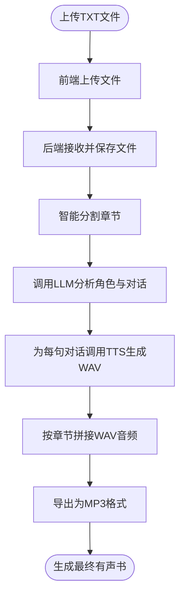

# 系统概述

<cite>
**本文档引用的文件**   
- [serverV2.py](file://serverV2.py)
- [index.html](file://index.html)
- [config.json](file://config.json)
- [style.css](file://style.css)
</cite>

## 目录
1. [项目简介](#项目简介)
2. [系统架构](#系统架构)
3. [核心功能与特性](#核心功能与特性)
4. [工作流程](#工作流程)
5. [用户群体](#用户群体)
6. [技术基础](#技术基础)
7. [使用场景示例](#使用场景示例)

## 项目简介

AI有声书制作工具是一款利用人工智能技术，将文本小说自动转换为高质量有声书的软件。其核心目标是通过集成大语言模型（LLM）和文本转语音（TTS）技术，实现从TXT文本到角色分明、情感丰富的有声书的自动化生产。该工具支持使用Gemini或阿里云平台（Deepseek）等大模型分析文本结构、识别角色对话，并利用CosyVoice2或IndexTTS2等TTS引擎生成语音，极大地简化了有声书的制作流程。

**Section sources**
- [README.md](file://README.md#L1-L5)

## 系统架构

本系统采用前后端分离的架构设计。后端基于Python的FastAPI框架构建，提供一系列RESTful API接口，负责处理核心业务逻辑，包括文本上传、章节分割、角色分析、TTS请求和音频拼接。前端则由HTML、CSS和JavaScript构成，提供一个直观的图形用户界面（GUI），用户可以通过该界面与后端服务进行交互，完成所有操作。

**Diagram sources**
- [serverV2.py](file://serverV2.py#L47-L2526)
- [index.html](file://index.html#L1-L4203)

## 核心功能与特性

### 智能文本分析与处理
系统能够智能地将上传的TXT小说文件分割成独立的章节。后端通过`get_chapters_from_txt`函数，使用基于启发式规则的加权引擎，自动识别并提取章节标题，确保分割的准确性。

### 角色识别与音色配置
利用大语言模型（如Gemini）的强大能力，系统能分析文本内容，自动识别出所有角色的对话，并为每个角色生成包含性别、年龄段和身份背景的简介。用户可以在前端界面为每个角色分配一个独特的音色，实现角色声音的个性化区分。

### 多样化TTS引擎支持
系统支持多种TTS引擎，如CosyVoice2和IndexTTS2。用户可以在`config.json`配置文件中定义不同TTS模型的名称和API端点，实现灵活的语音生成。

### 音频特效与高级功能
系统提供多种音频特效，包括“手机通话”、“喇叭喊话”和“室内回声”，用户可以为特定角色的语音应用这些效果，增强听觉体验。此外，还支持“多人同声”功能，可以将多个音色的语音混合，创造出合唱或群聊的效果。

### 批量导出与管理
用户可以批量选择已生成的章节音频，将其打包下载为ZIP文件。系统还提供了角色名合并、音色库管理、替换词典等高级功能，方便用户进行精细化管理。

**Section sources**
- [serverV2.py](file://serverV2.py#L1234-L1373)
- [serverV2.py](file://serverV2.py#L816-L861)
- [config.json](file://config.json#L1-L45)

## 工作流程

从用户上传TXT文件到最终生成MP3音频，系统的完整数据流如下：

**Diagram sources**
- [serverV2.py](file://serverV2.py#L1543-L1607)
- [serverV2.py](file://serverV2.py#L1081-L1229)
- [serverV2.py](file://serverV2.py#L1864-L1956)

## 用户群体

本工具主要面向两类用户：
1.  **内容创作者**：无需任何编程基础，通过直观的图形界面即可快速将小说转换为有声书，适合自媒体、播客等创作者。
2.  **高级用户**：具备一定技术能力的用户，可以通过修改`config.json`等配置文件，自定义TTS模型、代理设置和音频导出参数，实现更高级的功能扩展。

**Section sources**
- [README.md](file://README.md#L2-L5)

## 技术基础

### 大语言模型（LLM）
LLM是系统的大脑，负责理解文本语义。它接收经过预处理的小说章节内容，根据预设的提示词（Prompt）模板，输出一个包含说话者、内容、语气、强度和延迟时间的JSON数组，为后续的语音生成提供结构化指令。

### 文本转语音（TTS）
TTS引擎是系统的声带，负责将文本转换为语音。系统通过HTTP请求，将角色的文本、参考音频和参考文本发送给TTS微服务，接收并保存生成的WAV音频文件。

### RESTful API与JSON
前后端通过RESTful API进行通信，数据交换格式为JSON。例如，前端通过`/api/upload_txt_novel`接口上传文件，后端返回包含章节列表的JSON数据；通过`/api/tts_v2`接口发送TTS请求，接收包含音频数据的JSON响应。

### 模块化设计
系统采用模块化设计原则，各功能组件（如文件上传、章节处理、TTS生成、音频拼接）相互独立，通过清晰的API接口进行交互。这种设计提高了代码的可维护性和可扩展性，方便未来集成新的LLM或TTS服务。

**Section sources**
- [serverV2.py](file://serverV2.py#L560-L591)
- [serverV2.py](file://serverV2.py#L1729-L1855)
- [config.json](file://config.json#L1-L45)

## 使用场景示例

### 场景一：新用户快速生成
1.  新用户双击`启动ServerV2.bat`启动后端服务。
2.  在浏览器中打开`index.html`。
3.  点击“上传新小说”按钮，选择一篇TXT小说。
4.  在左侧选择章节，点击“处理文本”按钮。
5.  系统自动分析角色并生成对话JSON。
6.  在右侧为角色分配音色，点击“生成声音”按钮。
7.  等待所有章节生成完毕，点击“下载声音”按钮获取最终的MP3文件。

### 场景二：高级用户自定义配置
1.  高级用户打开`config.json`文件。
2.  修改`models`部分，配置Gemini或阿里云平台的API Key。
3.  在`tts_models`部分，添加或修改TTS引擎的端点地址。
4.  保存配置文件并重启服务。
5.  在前端的“全局设置”中，可以进一步调整默认模型、代理和音频导出质量。

**Section sources**
- [serverV2.py](file://serverV2.py#L1543-L1607)
- [config.json](file://config.json#L1-L45)
- [index.html](file://index.html#L1-L4203)